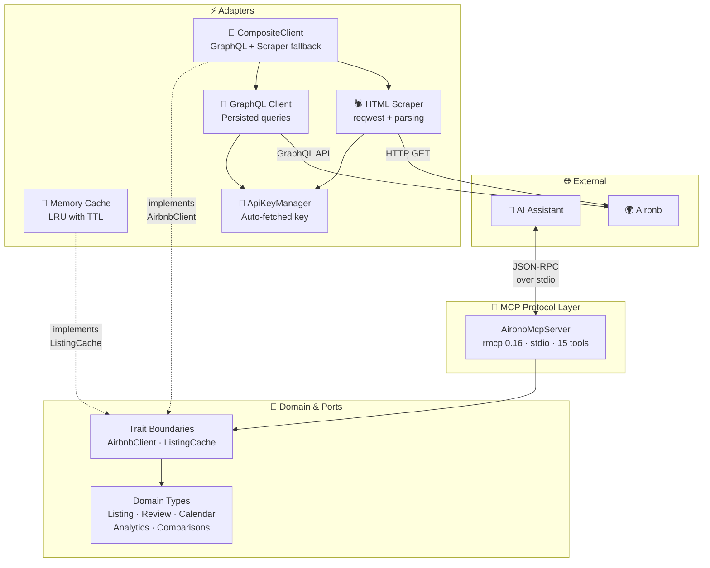
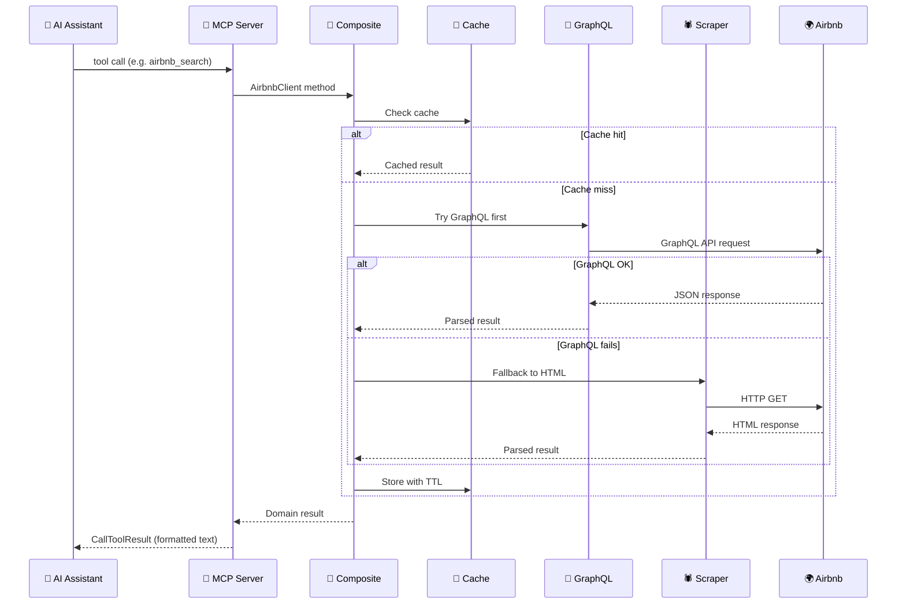

# 🏠 mcp-airbnb

[](https://www.rust-lang.org/)
[](https://modelcontextprotocol.io/)
[](LICENSE)

> **Model Context Protocol server** that enables AI assistants to search and browse Airbnb listings via a dual data source: **GraphQL API** (primary) with **HTML scraping** fallback.

## 🤔 What is this?

[MCP (Model Context Protocol)](https://modelcontextprotocol.io/) is an open standard that lets AI assistants call external tools. This server gives any MCP-compatible AI (Claude, etc.) **15 tools** to search, analyze, and compare Airbnb listings — no API key required.

**Who is it for?**

- 🏡 **Airbnb hosts** — audit your listing, find missing amenities, estimate revenue, optimize pricing
- 💰 **Investors** — compare markets, project revenue, analyze neighborhoods
- 🧳 **Travelers** — search listings, compare options, read reviews via your AI assistant
- 🛠️ **Developers** — extend the server with new tools or integrate it into your own AI workflows

## ✨ Features

### 📡 Data Tools
- 🔍 **Search listings** by location, dates, guests, price range, and property type
- 📋 **Listing details** with description, amenities, house rules, photos, and host info
- ⭐ **Reviews** with aggregate ratings and individual comments, paginated
- 📅 **Price calendar** with daily prices, availability, and minimum night requirements
- 👤 **Host profiles** with superhost status, response rate, languages, and bio
- 📊 **Neighborhood stats** with average/median prices, ratings, and property type distribution
- 📈 **Occupancy estimates** with weekday/weekend pricing and monthly breakdown

### 🧠 Analytical Tools
- 🔄 **Compare listings** side-by-side (2-100+) with percentile rankings
- 📉 **Price trends** — seasonal pricing, weekend premiums, volatility analysis
- 🕳️ **Gap finder** — detect orphan nights and estimate lost revenue
- 💵 **Revenue estimate** — project ADR, occupancy, monthly/annual revenue
- 🏆 **Listing score** — quality audit (0-100) across 6 categories with improvement tips
- 🧩 **Amenity analysis** — missing popular amenities vs neighborhood competition
- 🗺️ **Market comparison** — compare 2-5 neighborhoods side-by-side
- 📂 **Host portfolio** — analyze a host's full property collection

### 🔧 Infrastructure
- 🔗 **Dual data source** — GraphQL API (fast, structured) + HTML scraper (fallback)
- 💾 **In-memory LRU cache** with configurable TTLs per tool
- ⏱️ **Rate limiting** to respect Airbnb (default: 1 request per 2 seconds)
- 📦 **MCP Resources** — fetched data cached as reusable resources (7 templates)
- 🏗️ **Hexagonal architecture** — clean separation of domain, ports, and adapters

## 🏗️ Architecture



## 🔧 MCP Tools

### 📡 Data Tools (7)

| Tool | Description | Key Parameters |
|------|-------------|----------------|
| 🔍 `airbnb_search` | Search listings by location, dates, and guests | `location` (required), `checkin`, `checkout`, `adults`, `min_price`, `max_price`, `property_type` |
| 📋 `airbnb_listing_details` | Full details for a specific listing | `id` |
| ⭐ `airbnb_reviews` | Paginated reviews with ratings summary | `id`, `cursor` |
| 📅 `airbnb_price_calendar` | Price and availability calendar | `id`, `months` (1-12, default: 3) |
| 👤 `airbnb_host_profile` | Host profile with superhost status and bio | `id` |
| 📊 `airbnb_neighborhood_stats` | Aggregated area statistics | `location`, `checkin`, `checkout`, `property_type` |
| 📈 `airbnb_occupancy_estimate` | Occupancy rate and pricing breakdown | `id`, `months` (1-12, default: 3) |

### 🧠 Analytical Tools (8)

These tools compose data from the tools above — no additional scraping required.

| Tool | Description | Key Parameters |
|------|-------------|----------------|
| 🔄 `airbnb_compare_listings` | Compare 2-100+ listings side-by-side with percentile rankings | `ids` or `location`, `max_listings`, `property_type` |
| 📉 `airbnb_price_trends` | Seasonal pricing: monthly averages, weekend premium, volatility | `id`, `months` (1-12, default: 12) |
| 🕳️ `airbnb_gap_finder` | Detect orphan nights and booking gaps with lost revenue estimate | `id`, `months` (1-12, default: 3) |
| 💵 `airbnb_revenue_estimate` | Project ADR, occupancy, monthly/annual revenue vs neighborhood | `id` or `location`, `months` (1-12, default: 12) |
| 🏆 `airbnb_listing_score` | Quality audit (0-100) across 6 categories with improvement suggestions | `id` |
| 🧩 `airbnb_amenity_analysis` | Missing popular amenities vs neighborhood competition | `id`, `location` |
| 🗺️ `airbnb_market_comparison` | Compare 2-5 neighborhoods side-by-side | `locations` (required), `checkin`, `checkout`, `property_type` |
| 📂 `airbnb_host_portfolio` | Analyze a host's full property portfolio | `id` |

## 📦 MCP Resources

Data fetched by tools is automatically cached as MCP resources. Clients can reference previously fetched data without re-scraping.

| Resource | URI Pattern | Source Tool |
|----------|------------|-------------|
| Listing Details | `airbnb://listing/{id}` | `airbnb_listing_details` |
| Price Calendar | `airbnb://listing/{id}/calendar` | `airbnb_price_calendar` |
| Reviews | `airbnb://listing/{id}/reviews` | `airbnb_reviews` |
| Host Profile | `airbnb://listing/{id}/host` | `airbnb_host_profile` |
| Occupancy Estimate | `airbnb://listing/{id}/occupancy` | `airbnb_occupancy_estimate` |
| Search Results | `airbnb://search/{location}` | `airbnb_search` |
| Neighborhood Stats | `airbnb://neighborhood/{location}` | `airbnb_neighborhood_stats` |

## 🚀 Quick Start

### Prerequisites

- **Rust 1.93+** (stable) — install via [rustup](https://rustup.rs/)

### Build & Run

```bash
# Clone the repository
git clone https://github.com/your-username/mcp-airbnb.git
cd mcp-airbnb

# Build
cargo build --release

# Run the MCP server (stdio transport)
cargo run

# Run with debug logging (logs go to stderr)
RUST_LOG=debug cargo run
```

### Integration with Claude Desktop

Add to your Claude Desktop config (`~/.config/claude/claude_desktop_config.json`):

```json
{
  "mcpServers": {
    "airbnb": {
      "command": "/path/to/mcp-airbnb"
    }
  }
}
```

### Integration with Claude Code

Add to your project's `.mcp.json`:

```json
{
  "mcpServers": {
    "mcp-airbnb": {
      "command": "cargo",
      "args": ["run", "--manifest-path", "/path/to/mcp-airbnb/Cargo.toml"]
    }
  }
}
```

## 💡 Usage Examples

Once connected to an MCP-compatible AI assistant, you can ask natural language questions. The AI will automatically call the right tools.

### 🔍 Search & Explore

> *"Search for apartments in Barcelona for 2 adults, August 1-7, under $150/night"*
>
> *"Show me the details and reviews for listing 12345678"*
>
> *"What's the price calendar for that listing over the next 6 months?"*

### 📊 Analyze & Compare

> *"Compare the top 20 listings in Lisbon — which have the best value?"*
>
> *"Score listing 12345678 — what can the host improve?"*
>
> *"What amenities is listing 12345678 missing compared to competitors?"*

### 💰 Investment & Revenue

> *"Estimate the annual revenue for listing 12345678"*
>
> *"Compare the Airbnb markets in Paris, Barcelona, and Lisbon"*
>
> *"Find booking gaps in listing 12345678 and estimate lost revenue"*

### 🏠 Host Optimization

> *"Analyze the seasonal price trends for my listing 12345678 over 12 months"*
>
> *"Show me the full portfolio of the host who owns listing 12345678"*
>
> *"What's the occupancy rate and weekday vs weekend pricing for listing 12345678?"*

### 🔄 Typical Workflow

```
1. airbnb_search       → Find listings, get IDs
2. airbnb_listing_details → Deep dive into a listing
3. airbnb_reviews      → Check guest satisfaction
4. airbnb_price_calendar → Understand pricing & availability
5. airbnb_listing_score → Audit quality (0-100)
6. airbnb_revenue_estimate → Project income potential
```

## ⚙️ Configuration

All settings live in `config.yaml` (optional — sensible defaults are provided):

| Section | Field | Default | Description |
|---------|-------|---------|-------------|
| `scraper` | `rate_limit_per_second` | `0.5` | Max requests/s (0.5 = 1 req per 2s) |
| `scraper` | `request_timeout_secs` | `30` | HTTP timeout in seconds |
| `scraper` | `max_retries` | `2` | Retry count on failure |
| `scraper` | `base_url` | `https://www.airbnb.com` | Airbnb base URL |
| `scraper` | `graphql_enabled` | `true` | Enable GraphQL API (primary data source) |
| `scraper` | `api_key_cache_secs` | `86400` | API key cache TTL (24 hours) |
| `scraper` | `graphql_hashes` | *(built-in)* | Persisted query hashes for GraphQL operations |
| `cache` | `max_entries` | `500` | LRU cache capacity |
| `cache` | `search_ttl_secs` | `900` | Search cache TTL (15 min) |
| `cache` | `detail_ttl_secs` | `3600` | Detail cache TTL (1 hour) |
| `cache` | `reviews_ttl_secs` | `3600` | Reviews cache TTL (1 hour) |
| `cache` | `calendar_ttl_secs` | `1800` | Calendar cache TTL (30 min) |

> See [src/config/README.md](src/config/README.md) for the full configuration reference.

## 📁 Project Structure

```
mcp-airbnb/
├── src/
│   ├── domain/              # 💎 Pure types — Listing, Review, Calendar, Analytics
│   ├── ports/               # 🔌 Traits — AirbnbClient, ListingCache
│   ├── adapters/
│   │   ├── graphql/         # 🔗 GraphQL API client (primary)
│   │   │   ├── client.rs    #    Persisted queries, all AirbnbClient methods
│   │   │   └── parsers/     #    JSON → domain type parsers
│   │   ├── scraper/         # 🕷️ HTML scraper (fallback)
│   │   ├── cache/           # 💾 In-memory LRU cache
│   │   ├── composite.rs     # 🔀 GraphQL + Scraper with auto-fallback
│   │   └── shared.rs        # 🔑 ApiKeyManager (shared auth)
│   ├── mcp/                 # 📡 MCP server (rmcp 0.16, stdio, 15 tools)
│   ├── config/              # ⚙️ YAML configuration
│   ├── error.rs             # ❌ Error types (thiserror)
│   ├── lib.rs               # Module re-exports
│   └── main.rs              # 🚀 Entrypoint & DI wiring
├── tests/                   # 🧪 Integration tests + fixtures
├── config.yaml              # Runtime configuration
├── Cargo.toml               # Rust manifest
└── CLAUDE.md                # Development guide
```

> See [src/README.md](src/README.md) for the detailed architecture breakdown.

## 🔄 Request Flow



## 🧪 Testing

```bash
cargo test                     # 🧪 Run all tests
cargo test --test mcp_server   # 📡 MCP tests only
cargo test --test scraper      # 🕷️ Scraper tests only
cargo clippy                   # 🔍 Lint
cargo fmt --check              # ✅ Check formatting
```

> See [tests/README.md](tests/README.md) for the test architecture and mock infrastructure.

## 📄 License

MIT
