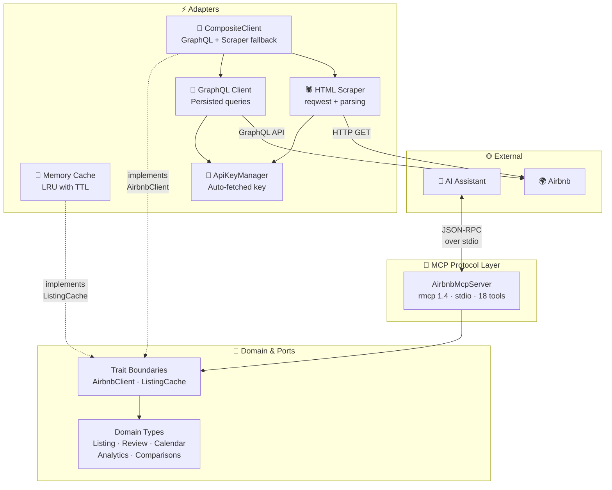
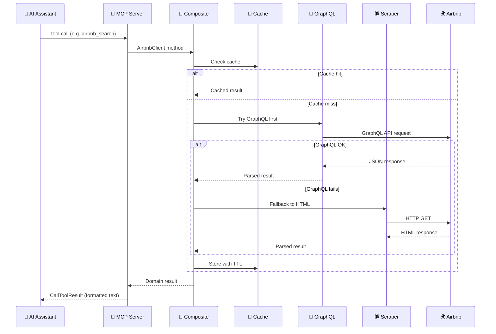

# 🏠 mcp-airbnb

[](https://www.rust-lang.org/)
[](https://modelcontextprotocol.io/)
[](LICENSE)

> **Model Context Protocol server** that enables AI assistants to search and browse Airbnb listings via a dual data source: **GraphQL API** (primary) with **HTML scraping** fallback.

## 🤔 What is this?

[MCP (Model Context Protocol)](https://modelcontextprotocol.io/) is an open standard that lets AI assistants call external tools. This crate ships **two entry points** over one backend (GraphQL API first, HTML scraping fallback), no API key required:

- 📡 `mcp-airbnb` — MCP server over stdio for any MCP-compatible AI (Claude, etc.)
- 🖥️ `airbnb` — standalone CLI binary exposing the same 18 tools as shell subcommands (`airbnb search …`, `airbnb --json listing …`, pipeable into `jq`)

**Who is it for?**

- 🏡 **Airbnb hosts** — audit your listing, find missing amenities, estimate revenue, optimize pricing
- 💰 **Investors** — compare markets, project revenue, analyze neighborhoods
- 🧳 **Travelers** — search listings, compare options, read reviews via your AI assistant
- 🛠️ **Developers** — extend the server with new tools or integrate it into your own AI workflows

## ✨ Features

### 📡 Data Tools
- 🔍 **Search listings** by location, dates, guests, price range, and property type
- 📋 **Listing details** with description, amenities, house rules, photos, and host info
- ⭐ **Reviews** with aggregate ratings and individual comments, paginated
- 📅 **Availability calendar** with daily availability and minimum nights (nightly prices only when Airbnb publishes them; currently it does not)
- 👤 **Host profiles** with superhost status, response rate, languages, and bio
- 📊 **Neighborhood stats** with average/median prices, ratings, and property type distribution
- 📈 **Occupancy estimates** over future nights (past days excluded; an upper bound, since bookings and host blocks look alike) with a monthly breakdown

### 🧠 Analytical Tools
- 🔄 **Compare listings** side-by-side (2-100) with tie-aware percentile ranks (unknown prices excluded)
- 📉 **Price trends** — seasonal pricing, weekend premiums, volatility (needs published nightly prices)
- 🕳️ **Gap finder** — 1-3 night gaps between unavailable nights, minimum-stay advice
- 💵 **Revenue estimate** — ADR, occupancy and revenue projections, each input labelled measured or assumed
- 🏆 **Listing score** — quality audit (0-100) across 6 categories with improvement tips
- 🧩 **Amenity analysis** — missing popular amenities vs neighborhood competition
- 🗺️ **Market comparison** — compare 2-5 neighborhoods side-by-side
- 📂 **Host portfolio** — the host's listings visible in a search of the listing's city
- 💬 **Review sentiment** — English keyword heuristic with negation: breakdown, themes, keywords
- 🎯 **Competitive positioning** — percentile ranks vs comparable listings (price, rating, amenities, reviews)
- 💲 **Optimal pricing** — data-driven pricing recommendation with reasoning

### 🔧 Infrastructure
- 🖥️ **Dual entry point** — MCP server (`mcp-airbnb`) + standalone `airbnb` CLI, same backend
- 🔗 **Dual data source** — GraphQL API (fast, structured) + HTML scraper (fallback)
- 💾 **In-memory LRU cache** with configurable TTLs per tool
- ⏱️ **Rate limiting** to respect Airbnb: one limiter shared by every outbound request (API-key fetch, GraphQL, HTML fallback), default 1 request per 2 seconds; a 429 pauses all requests
- 📦 **MCP Resources** — every tool result cached as a resource (18 resource templates in RFC 6570 form; bounded: 256 entries / 8 MiB / 1 h; `listChanged` notifications)
- 🏗️ **Hexagonal architecture** — clean separation of domain, ports, adapters, and application layer

## 🏗️ Architecture


```mermaid
graph TB
    subgraph External["🌐 External"]
        AI["🤖 AI Assistant"]
        AB["🌍 Airbnb"]
    end

    subgraph MCP["📡 MCP Protocol Layer"]
        Server["AirbnbMcpServer<br/>rmcp 1.4 · stdio · 18 tools"]
    end

    subgraph Core["💎 Domain & Ports"]
        Domain["Domain Types<br/>Listing · Review · Calendar<br/>Analytics · Comparisons"]
        Ports["Trait Boundaries<br/>AirbnbClient · ListingCache"]
    end

    subgraph Infra["⚡ Adapters"]
        Composite["🔀 CompositeClient<br/>GraphQL + Scraper fallback"]
        GQL["🔗 GraphQL Client<br/>Persisted queries"]
        Scraper["🕷️ HTML Scraper<br/>reqwest + parsing"]
        Cache["💾 Memory Cache<br/>LRU with TTL"]
        Shared["🔑 ApiKeyManager<br/>Auto-fetched key"]
    end

    AI <-->|"JSON-RPC<br/>over stdio"| Server
    Server --> Ports
    Ports --> Domain
    Composite -.->|"implements<br/>AirbnbClient"| Ports
    Cache -.->|"implements<br/>ListingCache"| Ports
    Composite --> GQL
    Composite --> Scraper
    GQL --> Shared
    Scraper --> Shared
    GQL -->|"GraphQL API"| AB
    Scraper -->|"HTTP GET"| AB
```

## 🔧 MCP Tools

### 📡 Data Tools (7)

| Tool | Description | Key Parameters |
|------|-------------|----------------|
| 🔍 `airbnb_search` | Search listings by location, dates, and guests | `location` (required), `checkin`, `checkout`, `adults`, `min_price`, `max_price`, `property_type`, `cursor` |
| 📋 `airbnb_listing_details` | Full details for a specific listing | `id` |
| ⭐ `airbnb_reviews` | Paginated reviews with ratings summary | `id`, `cursor` |
| 📅 `airbnb_price_calendar` | Availability calendar (prices only when Airbnb publishes them) | `id`, `months` (1-12, default: 3) |
| 👤 `airbnb_host_profile` | Host profile with superhost status and bio | `id` |
| 📊 `airbnb_neighborhood_stats` | Aggregated area statistics | `location`, `checkin`, `checkout`, `property_type` |
| 📈 `airbnb_occupancy_estimate` | Occupancy of future nights (upper bound) and monthly breakdown | `id`, `months` (1-12, default: 3) |

### 🧠 Analytical Tools (11)

These tools compose data from the tools above — no additional scraping required.

| Tool | Description | Key Parameters |
|------|-------------|----------------|
| 🔄 `airbnb_compare_listings` | Compare 2-100 listings side-by-side with percentile rankings | `ids` (2-10) or `location`, `max_listings` (2-100, default 20), `checkin`, `checkout`, `property_type` |
| 📉 `airbnb_price_trends` | Seasonal pricing (needs published nightly prices): monthly averages, weekend premium, volatility | `id`, `months` (1-12, default: 12) |
| 🕳️ `airbnb_gap_finder` | 1-3 night gaps between unavailable nights, minimum-stay advice | `id`, `months` (1-12, default: 3) |
| 💵 `airbnb_revenue_estimate` | ADR, occupancy and revenue projections, each input labelled measured or assumed | `id` or `location`, `months` (1-12, default: 12) |
| 🏆 `airbnb_listing_score` | Quality audit (0-100) across 6 categories with improvement suggestions | `id` |
| 🧩 `airbnb_amenity_analysis` | Missing popular amenities vs neighborhood competition | `id`, `location` |
| 🗺️ `airbnb_market_comparison` | Compare 2-5 neighborhoods side-by-side | `locations` (2-5, required), `checkin`, `checkout`, `property_type` |
| 📂 `airbnb_host_portfolio` | The host's listings visible in a search of the listing's city | `id` |
| 💬 `airbnb_review_sentiment` | English keyword sentiment with negation: breakdown, themes, keywords | `id`, `max_pages` (1-20, default: 5) |
| 🎯 `airbnb_competitive_positioning` | Percentile ranks vs comparable listings, strengths/weaknesses | `id`, `location` |
| 💲 `airbnb_optimal_pricing` | Pricing recommendation with reasoning (neighborhood median or known price as baseline) | `id`, `location`, `months` (1-12, default: 12) |

### 📏 Input limits

Out-of-range input is rejected with an error (MCP `isError`, CLI exit code 2). It is never clamped. The same limits are declared in the tool JSON schemas (`minimum`/`maximum`, `minItems`/`maxItems`, `maxLength`, `pattern`). Unknown argument names (for example a typo such as `monts`) are refused too: every input schema has `"additionalProperties": false`.

| Input | Accepted |
|---|---|
| Listing `id` | digits, no leading zero, ≤ 20 digits (`^[1-9][0-9]{0,19}$`) |
| `months` | 1–12 |
| `max_pages` (review sentiment) | 1–20, default 5 |
| `ids` (compare) | 2–10 |
| `max_listings` (compare) | 2–100, default 20 |
| `locations` (market comparison) | 2–5 |
| `location` | 1–200 characters |
| `cursor` | ≤ 1024 characters |
| `checkin` / `checkout` | exactly `YYYY-MM-DD`, check-in from yesterday (UTC) to 730 days ahead, 1–365 nights |
| guests | adults ≤ 16 (≥ 1 with dates), adults + children ≤ 16, infants ≤ 5, pets ≤ 5 |

## 📦 MCP Resources

Every successful tool result is kept as an MCP resource, so clients can read it again without re-scraping. `resources/templates/list` advertises one RFC 6570 template per tool (18 in total). Variable parts are percent-encoded (only `A-Z a-z 0-9 - . _ ~` stay literal), so a URI a client expands from a template is byte-for-byte the URI the server stores. For example, `airbnb_search {"location": "Paris, France"}` is stored as `airbnb://search/Paris%2C%20France`. Every input that changes the result is part of the URI (cursor, dates, filters, months, `max_pages`).

The store is bounded: 256 entries and 8 MiB in total, one hour per entry, least recently used out first. `resources/list` returns pages of 100 URIs. The server advertises `listChanged` and sends `notifications/resources/list_changed` when a tool call adds a new URI. Contents are `text/plain`.

#### 📡 Data Resources

| Resource | URI Template | Source Tool |
|---|---|---|
| Listing Details | `airbnb://listing/{id}` | `airbnb_listing_details` |
| Price Calendar | `airbnb://listing/{id}/calendar{?months}` | `airbnb_price_calendar` |
| Reviews | `airbnb://listing/{id}/reviews{?cursor}` | `airbnb_reviews` |
| Host Profile | `airbnb://listing/{id}/host` | `airbnb_host_profile` |
| Occupancy Estimate | `airbnb://listing/{id}/occupancy{?months}` | `airbnb_occupancy_estimate` |
| Search Results | `airbnb://search/{location}{?checkin,checkout,adults,children,infants,pets,min_price,max_price,property_type,cursor}` | `airbnb_search` |
| Neighborhood Stats | `airbnb://neighborhood/{location}{?checkin,checkout,property_type}` | `airbnb_neighborhood_stats` |

#### 🧠 Analytical Resources

| Resource | URI Template | Source Tool |
|---|---|---|
| Comparison | `airbnb://analysis/compare{?ids,location,max_listings,checkin,checkout,property_type}` | `airbnb_compare_listings` |
| Price Trends | `airbnb://analysis/price-trends/{id}{?months}` | `airbnb_price_trends` |
| Booking Gaps | `airbnb://analysis/gaps/{id}{?months}` | `airbnb_gap_finder` |
| Revenue Estimate | `airbnb://analysis/revenue{?id,location,months}` | `airbnb_revenue_estimate` |
| Listing Score | `airbnb://analysis/score/{id}` | `airbnb_listing_score` |
| Amenity Analysis | `airbnb://analysis/amenities/{id}{?location}` | `airbnb_amenity_analysis` |
| Market Comparison | `airbnb://analysis/market/{locations}{?checkin,checkout,property_type}` | `airbnb_market_comparison` |
| Host Portfolio | `airbnb://analysis/portfolio/{id}` | `airbnb_host_portfolio` |
| Review Sentiment | `airbnb://analysis/sentiment/{id}{?max_pages}` | `airbnb_review_sentiment` |
| Competitive Positioning | `airbnb://analysis/positioning/{id}{?location}` | `airbnb_competitive_positioning` |
| Optimal Pricing | `airbnb://analysis/pricing/{id}{?location,months}` | `airbnb_optimal_pricing` |

## 🖥️ CLI

The `airbnb` binary exposes all 18 tools as shell subcommands. Every analytical subcommand calls the same `application::analytical_handlers` function as the matching MCP tool, with the same defaults and limits; `tests/parity_test.rs` runs one recording mock through both entry points and compares the upstream calls. Each CLI run is a new process, so the in-memory cache and the rate limiter start empty on every invocation.

> **Per-process limits.** Each `airbnb` invocation is a new process with its own empty cache, its own API-key fetch and its own rate limiter. Pacing and caching do not carry over between invocations, so shell loops must add their own delay (for example `sleep 2` between calls) to stay within Airbnb's limits.

### Data subcommands (7)

```bash
airbnb search "Paris, France" --adults 2 --max-price 200
airbnb listing 12345678
airbnb reviews 12345678 --cursor <next_page_cursor>
airbnb calendar 12345678 --months 6
airbnb host 12345678
airbnb neighborhood "Barcelona, Spain"
airbnb occupancy 12345678 --months 3
```

### Analytical subcommands (11)

```bash
airbnb compare --location "Lisbon, Portugal" --max-listings 40 --property-type "Entire home"
airbnb compare --ids 12345678,23456789,34567890
airbnb price-trends 12345678                 # 12 months by default, like the MCP tool
airbnb gap-finder 12345678 --months 3
airbnb revenue 12345678 --location "Rome, Italy" --months 12
airbnb revenue --location "Rome, Italy"      # market-level estimate, no listing needed
airbnb listing-score 12345678
airbnb amenities 12345678
airbnb market-comparison "Paris, France" "Lyon, France" "Marseille, France"
airbnb host-portfolio 12345678
airbnb review-sentiment 12345678 --max-pages 5
airbnb competitive 12345678
airbnb optimal-pricing 12345678 --months 12
```

### Global flags

| Flag | Short | Description |
|------|-------|-------------|
| `--json` | `-j` | Output machine-readable JSON (default: human-readable text) |
| `--config <PATH>` | `-c` | Config file; must exist (also read from `AIRBNB_CONFIG`). Without it: `~/.config/mcp-airbnb/config.yaml`, then `config.yaml` next to the binary, then defaults |
| `--verbose` | `-v`, `-vv` | Increase tracing verbosity (`-v` = info, `-vv` = debug) |
| `--help` | `-h` | Print help — also available per-subcommand (e.g. `airbnb search --help`) |
| `--version` | `-V` | Print version |

### Errors and exit codes

| Exit code | Meaning |
|---|---|
| `0` | Success, also when the reader closes the pipe early (`airbnb … \| head`) |
| `1` | Runtime failure: network, Airbnb error, parsing, configuration |
| `2` | Invalid input (bad id, date, range) or usage error |

With `--json`, errors are printed on **stdout** as JSON, so `jq` always receives a document. This includes the argument errors found while parsing the command line (an out-of-range `--months`, a missing argument, conflicting flags), which are reported as `invalid_params` with exit code `2`. Only `--help` and `--version` stay plain text:

```json
{ "error": { "kind": "invalid_params", "message": "Invalid parameters: listing id \"abc\" must contain only ASCII digits" } }
```

`kind` is one of `invalid_params`, `not_found`, `rate_limited`, `upstream_schema`, `http`, `parse`, `insufficient_data`, `config`, `internal`. If a later review page fails, `review-sentiment` still returns the pages it fetched, and adds a `warning` field (JSON) or a `Warning:` line (text). Text output escapes terminal control characters found in scraped text.

### JSON mode example

```bash
# Grab prices from the first 5 Tokyo listings
airbnb --json search "Tokyo" | jq '.listings[:5] | map({id, name, price: .price_per_night})'

# Pretty-print a full listing detail
airbnb --json listing 12345678 | jq .

# Compare a list of IDs and extract the price percentiles (null when a price is unknown)
airbnb --json compare --ids 1111,2222,3333 | jq '.listings[] | {id, price_percentile}'
```

### Note on listing prices

When you fetch a listing via `airbnb listing <id>` without dates, Airbnb's public endpoints return the nightly price as `null` — prices are only populated for dated search results. The CLI surfaces this explicitly: the human-readable output shows `Price: unavailable` instead of a misleading `$0/night`. JSON mode keeps `price_per_night: 0.0` for schema stability; `0.0` always means "unknown". Search results report the **nightly** price even when Airbnb's card shows the stay total (the total is in `total_price`). Every request pins `currency` and `locale` (`config.yaml`, default `USD`/`en`), so all prices of one session share one currency.

### Data limitations

What the analytics can and cannot measure:

- **Calendar prices are not published.** Airbnb's availability calendar currently returns no nightly price for any day. Price trends, gap revenue and calendar-based ADR therefore report "not published" or "unknown", never `$0`.
- **Occupancy is an upper bound.** Only future nights count: days before today (the server's local date) are excluded. Airbnb does not distinguish booked nights from nights the host blocked, so every unavailable future night counts as occupied. Days explicitly marked as host-blocked are excluded.
- **Revenue inputs are labelled.** With a listing ID, occupancy is measured from its calendar. With a location only, occupancy is an explicit 65% assumption. The ADR source is printed (calendar, listing price, or neighborhood average as a proxy). The tool returns an error instead of estimating from no price at all.
- **Currencies are never mixed or invented.** Every price prints in the currency of its data. Statistics use the most common currency in the sample.
- **Percentiles are percentile ranks** against the listings actually compared, and ties share a rank. Competitive positioning ranks price, rating, amenities and review volume against a location search. Occupancy is shown but not ranked, because no neighborhood benchmark exists.
- **Host portfolio covers one search page** of the listing's city, and says how the other listings were matched: by host id, or by host display name as a flagged fallback.
- **Review sentiment is an English keyword heuristic** with simple negation. Non-English reviews are skipped and counted.

## 🔒 Security notes

- Listing names, descriptions, house rules, reviews and host bios are written by third parties. In MCP tool results and resources they sit between `<<<BEGIN UNTRUSTED AIRBNB DATA>>>` and `<<<END UNTRUSTED AIRBNB DATA>>>`, and the server instructions tell the model to treat that text as data only.
- The CLI's text output escapes terminal control characters (ESC/OSC sequences, C1 controls, bidi overrides) found in scraped text. `--json` output is plain JSON.

## 🚀 Quick Start

### Prerequisites

- **Rust 1.93+** — `rust-toolchain.toml` pins 1.93 and [rustup](https://rustup.rs/) installs it on the first build
- **Fuzzing only** — `rustup toolchain install nightly` and `cargo install cargo-fuzz`

### Build & Run

```bash
# Clone the repository
git clone https://github.com/muchiny/mcp-airbnb.git
cd mcp-airbnb

# Build both binaries
cargo build --release --bin mcp-airbnb --bin airbnb

# --- MCP server (stdio transport, for AI assistants) ---
./target/release/mcp-airbnb

# Or via cargo (same result)
cargo run --bin mcp-airbnb

# With debug logging (logs go to stderr, stdout reserved for JSON-RPC)
RUST_LOG=debug cargo run --bin mcp-airbnb

# --- CLI (for terminal, scripts, piping into jq) ---
./target/release/airbnb --help
./target/release/airbnb search "Paris, France" --adults 2
./target/release/airbnb --json optimal-pricing 12345678 | jq .
```

### Integration with Claude Desktop

Add to your Claude Desktop config (`~/.config/claude/claude_desktop_config.json`), pointing at the built server binary:

```json
{
  "mcpServers": {
    "airbnb": {
      "command": "/path/to/mcp-airbnb/target/release/mcp-airbnb"
    }
  }
}
```

### Integration with Claude Code

Add to your project's `.mcp.json`, preferably pointing at a built binary:

```json
{
  "mcpServers": {
    "mcp-airbnb": {
      "command": "/path/to/mcp-airbnb/target/release/mcp-airbnb"
    }
  }
}
```

or let cargo build and start it. The crate has two binaries, so name the server:

```json
{
  "mcpServers": {
    "mcp-airbnb": {
      "command": "cargo",
      "args": ["run", "--quiet", "--release", "--bin", "mcp-airbnb", "--manifest-path", "/path/to/mcp-airbnb/Cargo.toml"]
    }
  }
}
```

The server never reads a `config.yaml` from the project that is open. To use one, add `"env": { "AIRBNB_CONFIG": "/path/to/config.yaml" }` to the entry, or put the file at `~/.config/mcp-airbnb/config.yaml` (lookup order under "⚙️ Configuration" below).

## 💡 Usage Examples

Once connected to an MCP-compatible AI assistant, you can ask natural language questions. The AI will automatically call the right tools.

### 🔍 Search & Explore

> *"Search for apartments in Barcelona for 2 adults, August 1-7, under $150/night"*
>
> *"Show me the details and reviews for listing 12345678"*
>
> *"What's the price calendar for that listing over the next 6 months?"*

### 📊 Analyze & Compare

> *"Compare the top 20 listings in Lisbon — which have the best value?"*
>
> *"Score listing 12345678 — what can the host improve?"*
>
> *"What amenities is listing 12345678 missing compared to competitors?"*

### 💰 Investment & Revenue

> *"Estimate the annual revenue for listing 12345678"*
>
> *"Compare the Airbnb markets in Paris, Barcelona, and Lisbon"*
>
> *"Find 1-3 night booking gaps in listing 12345678"*

### 🏠 Host Optimization

> *"Analyze the seasonal price trends for my listing 12345678 over 12 months"*
>
> *"Which other listings in the same city belong to the host of listing 12345678?"*
>
> *"What share of the next 3 months is already unavailable for listing 12345678?"*

### 🔄 Typical Workflow

```
1. airbnb_search       → Find listings, get IDs
2. airbnb_listing_details → Deep dive into a listing
3. airbnb_reviews      → Check guest satisfaction
4. airbnb_price_calendar → Understand pricing & availability
5. airbnb_listing_score → Audit quality (0-100)
6. airbnb_revenue_estimate → Project income potential
```

## ⚙️ Configuration

All settings live in an optional `config.yaml`. Lookup order: `airbnb --config <path>` or `AIRBNB_CONFIG` (must exist) → `$XDG_CONFIG_HOME/mcp-airbnb/config.yaml` (default `~/.config/mcp-airbnb/config.yaml`) → `config.yaml` next to the binary → built-in defaults. The working directory is not searched. Invalid YAML, unknown keys and out-of-range values stop startup with an error that names the key; they are never replaced by defaults.

| Section | Field | Default | Description |
|---------|-------|---------|-------------|
| `scraper` | `user_agent` | Chrome 120 desktop UA | `User-Agent` header sent with every request |
| `scraper` | `rate_limit_per_second` | `0.5` | Max requests/s for all outbound requests combined (0.5 = 1 req per 2 s) |
| `scraper` | `request_timeout_secs` | `30` | HTTP timeout in seconds |
| `scraper` | `max_retries` | `2` | Extra attempts for 5xx/408/timeouts and for 429 with Retry-After ≤ 60 s (GraphQL and HTML); other 4xx are never retried |
| `scraper` | `base_url` | `https://www.airbnb.com` | Airbnb origin; must be an `https://` origin |
| `scraper` | `currency` | `USD` | Currency requested on every request; prices are reported in it |
| `scraper` | `locale` | `en` | Locale requested on every request (`locale=` and `Accept-Language`) |
| `scraper` | `graphql_enabled` | `true` | GraphQL API as primary source with HTML fallback; `false` = HTML scraper only |
| `scraper` | `api_key_cache_secs` | `86400` | API key cache TTL (24 hours) |
| `scraper` | `graphql_hashes` | *(built-in, refreshed 2026-09)* | Persisted query hashes for GraphQL operations. A rotated hash surfaces as `Airbnb API changed for <operation>` in the logs and the call falls back to HTML scraping — see [GraphQL adapter README](src/adapters/graphql/README.md#-detecting-api-drift) |
| `cache` | `max_entries` | `500` | LRU cache capacity |
| `cache` | `search_ttl_secs` | `900` | Search cache TTL (15 min) |
| `cache` | `detail_ttl_secs` | `3600` | Detail cache TTL (1 hour) |
| `cache` | `reviews_ttl_secs` | `3600` | Reviews cache TTL (1 hour) |
| `cache` | `calendar_ttl_secs` | `1800` | Calendar cache TTL (30 min) |
| `cache` | `host_profile_ttl_secs` | `3600` | Host profile cache TTL (1 hour) |

> See [src/config/README.md](src/config/README.md) for the full configuration reference, including the accepted range of every value.

## ⚠️ Known upstream limitations

These come from Airbnb, not from this crate. The tools say so instead of inventing numbers.

- 📅 **No per-day calendar prices.** As of September 2026 Airbnb's `PdpAvailabilityCalendar` query returns `price.localPriceFormatted: null` for every day (365 of 365 days in the captured response). Availability and minimum stays are real. Price-based calendar analytics (price trends, lost revenue of gaps, weekday/weekend split) report that price data is unavailable instead of `$0`. Nightly prices come from dated searches (`airbnb_search` with `checkin` and `checkout`).
- 🏷️ **Listing details fetched without dates carry no price.** Same rule: search with dates to get a nightly price.
- 🔑 **Persisted-query hashes rotate.** GraphQL calls use Airbnb's persisted-query hashes (`scraper.graphql_hashes`). When Airbnb rotates one, the call reports `Airbnb API changed for <operation>: …` instead of returning empty data. The server logs it and falls back to HTML scraping, and the error reaches the tool result only when the fallback fails too. Copy the current hash from your browser's network panel into `config.yaml`.
- 💱 **One currency per request.** Every request pins `scraper.currency` and `scraper.locale`. Results are reported in that currency and never converted.
- 📈 **Occupancy is inferred.** The calendar only says that a future night is unavailable, not whether it is booked or blocked by the host. Past dates are excluded.
- ⏱️ **The rate limit is per process.** The limiter (default 1 request per 2 s) covers every request of one process. Separate `airbnb` CLI invocations do not share it (see the per-process note under 🖥️ CLI).
- 🧾 **Public pages only.** Anything Airbnb shows only to logged-in users (exact address, guest identities) is out of reach by design.

## 📁 Project Structure

```
mcp-airbnb/
├── src/
│   ├── domain/              # 💎 Pure types, analytics and input limits (no I/O)
│   ├── ports/               # 🔌 Traits — AirbnbClient, ListingCache
│   ├── adapters/
│   │   ├── graphql/         # 🔗 GraphQL API client (primary)
│   │   │   ├── client.rs    #    Persisted queries, all AirbnbClient methods
│   │   │   └── parsers/     #    JSON → domain type parsers
│   │   ├── scraper/         # 🕷️ HTML scraper (fallback)
│   │   ├── cache/           # 💾 In-memory LRU cache
│   │   ├── composite.rs     # 🔀 GraphQL first, scraper fallback
│   │   ├── http.rs          # 🌐 Retry/redirect policy, body cap
│   │   ├── rate_limiter.rs  # ⏱️ Process-wide rate limiter
│   │   └── shared.rs        # 🔑 ApiKeyManager, extract_api_key
│   ├── application/         # 🎼 Wiring + use cases shared by both binaries
│   │   ├── mod.rs           #    build_client(), load_app_config()
│   │   └── analytical_handlers.rs  # Multi-fetch analytical use cases
│   ├── mcp/                 # 📡 MCP server (rmcp 1.4, stdio, 18 tools, 18 resource templates)
│   │   ├── server.rs        #    Tool handlers, ResourceStore
│   │   └── resource_uri.rs  #    RFC 6570 templates + percent-encoded URI builders
│   ├── cli/                 # 🖥️ CLI (clap derive, dispatcher, output)
│   │   ├── args.rs          #    Cli/Commands structs + parsing unit tests
│   │   ├── mod.rs           #    run() + testable dispatch()
│   │   ├── handlers.rs      #    args → domain params conversion
│   │   └── output.rs        #    render<T: Serialize + Display>
│   ├── bin/cli.rs           # 🖥️ `airbnb` binary entrypoint
│   ├── config/              # ⚙️ config.yaml types, loading, validation
│   ├── fuzz_support.rs      # 🎲 Harness shared by the fuzz targets and the seed-replay test
│   ├── error.rs             # ❌ AirbnbError (thiserror)
│   ├── lib.rs               # Module declarations + production lint policy
│   └── main.rs              # 🚀 `mcp-airbnb` binary entrypoint (default-run)
├── tests/                   # 🧪 Integration tests + fixtures/airbnb/2026-09/ (anonymized)
├── fuzz/                    # 🎲 cargo-fuzz crate: 13 fuzz targets, seeds/, airbnb.dict, make_seeds.py
├── scripts/                 # 🔎 live_smoke.py (opt-in, never in CI), check_workflows.py, anonymize_fixtures.py
├── claude-resources/        # 📚 Shareable Claude Code rules/skills/agents (committed,
│   │                        #     copy into ~/.claude/ or symlink as .claude/)
│   ├── rules/               #    mcp-conventions, scraping-conventions, cli-conventions
│   ├── skills/              #    /mcp-smoke, /cli-demo, /fixtures
│   └── agents/              #    mcp-tool-builder, scraper-debugger
├── .github/workflows/       # 🔄 CI (check, fmt, clippy, doc, test, coverage, security, workflow hygiene, nightly fuzz) + release
├── .github/dependabot.yml   # 🔄 Weekly Cargo + GitHub Actions update PRs
├── config.yaml              # Example configuration (pass it with AIRBNB_CONFIG or airbnb --config)
├── justfile                 # Recipes: check, lint, test, fuzz, fuzz-seeds, smoke, …
├── tarpaulin.toml           # Code coverage configuration
├── deny.toml                # cargo-deny: advisories, licenses, bans, sources
├── rust-toolchain.toml      # Pinned toolchain (1.93)
├── Cargo.toml               # 2 binaries: mcp-airbnb (default-run) + airbnb
├── LICENSE                  # MIT
└── CLAUDE.md                # Development guide
```

> See [src/README.md](src/README.md) for the detailed architecture breakdown.

## 🔄 Request Flow


```mermaid
sequenceDiagram
    participant AI as 🤖 AI Assistant
    participant MCP as 📡 MCP Server
    participant Composite as 🔀 Composite
    participant Cache as 💾 Cache
    participant GQL as 🔗 GraphQL
    participant Scraper as 🕷️ Scraper
    participant AB as 🌍 Airbnb

    AI->>MCP: tool call (e.g. airbnb_search)
    MCP->>Composite: AirbnbClient method
    Composite->>Cache: Check cache
    alt Cache hit
        Cache-->>Composite: Cached result
    else Cache miss
        Composite->>GQL: Try GraphQL first
        GQL->>AB: GraphQL API request
        alt GraphQL OK
            AB-->>GQL: JSON response
            GQL-->>Composite: Parsed result
        else GraphQL fails
            Composite->>Scraper: Fallback to HTML
            Scraper->>AB: HTTP GET
            AB-->>Scraper: HTML response
            Scraper-->>Composite: Parsed result
        end
        Composite->>Cache: Store with TTL
    end
    Composite-->>MCP: Domain result
    MCP-->>AI: CallToolResult (formatted text)
```

## 🧪 Testing

```bash
cargo test --all-targets                          # 🧪 everything (unit + integration)
cargo test --lib                                  # unit tests only
cargo test --test mcp_server_test                 # 📡 MCP protocol over a duplex transport
cargo test --test mcp_resources_test              # 📦 resource URIs, 18 templates, list_changed
cargo test --test functional_verification_test    # 🔄 all 18 tools end to end with a mock
cargo test --test parity_test                     # ⚖️ CLI and MCP make the same upstream calls
cargo test --test cancellation_test               # 🛑 cancelled tool calls stop upstream work
cargo test --test scraper_test                    # 🕷️ HTML scraper
cargo test --test graphql_test                    # 🔗 GraphQL client and parsers
cargo test --test analytical_tools_test           # 🧠 analytics
cargo test --test analytics_fixture_test          # 📅 analytics on the anonymized 2026-09 calendar
cargo test --test cli_test                        # 🖥️ CLI dispatcher and binary
cargo test --test proptest_tests                  # 🎲 property-based tests
cargo test --test fuzz_seed_replay_test           # 🎲 replays the committed fuzz seeds on stable
cargo test --test docs_consistency_test           # 📚 docs vs code (counts, commands, config keys)
cargo clippy --all-targets -- -D warnings         # 🔍 lint (CI gate, MSRV 1.93 toolchain)
cargo +stable clippy --all-targets -- -D warnings # 🔭 preview newer lints (advisory)
RUSTDOCFLAGS="-D warnings" cargo doc --no-deps    # 📚 docs
cargo fmt --all -- --check                        # ✅ formatting
cargo deny check && cargo audit                   # 🛡️ supply chain
python3 scripts/check_workflows.py                # 🔄 CI workflow hygiene
```

Run cargo commands one at a time: two concurrent builds of this crate can exhaust the memory of a small VM.

### 🎲 Fuzzing

13 fuzz targets live in `fuzz/` (nightly + `cargo install cargo-fuzz`). Seeds are committed in `fuzz/seeds/<target>/`, generated from the anonymized fixtures:

```bash
just fuzz fuzz_calendar_analytics 60              # one target, 60 s, seeds + dictionary
cargo +nightly fuzz run fuzz_api_key              # plain cargo-fuzz, empty corpus
python3 fuzz/make_seeds.py                        # regenerate seeds (just fuzz-seeds)
```

The nightly CI job fuzzes every target for 120 s and uploads crash reproducers as the `fuzz-artifacts` artifact.

### 🔎 Live smoke test (opt-in)

Never run in CI. It calls each of the 18 tools once against the real site, which means a few dozen upstream requests spaced by the rate limiter. It flags suspicious output ($0 prices, empty reviews, placeholder locations, occupancy counting past dates, …):

```bash
cargo build --release --bin mcp-airbnb
python3 scripts/live_smoke.py --live --location "Lyon, France"
python3 -m unittest discover -s scripts -p 'test_live_smoke.py'   # offline self-test
```

> See [tests/README.md](tests/README.md) for the test architecture and mock infrastructure.

## 📄 License

MIT — see [LICENSE](LICENSE).
