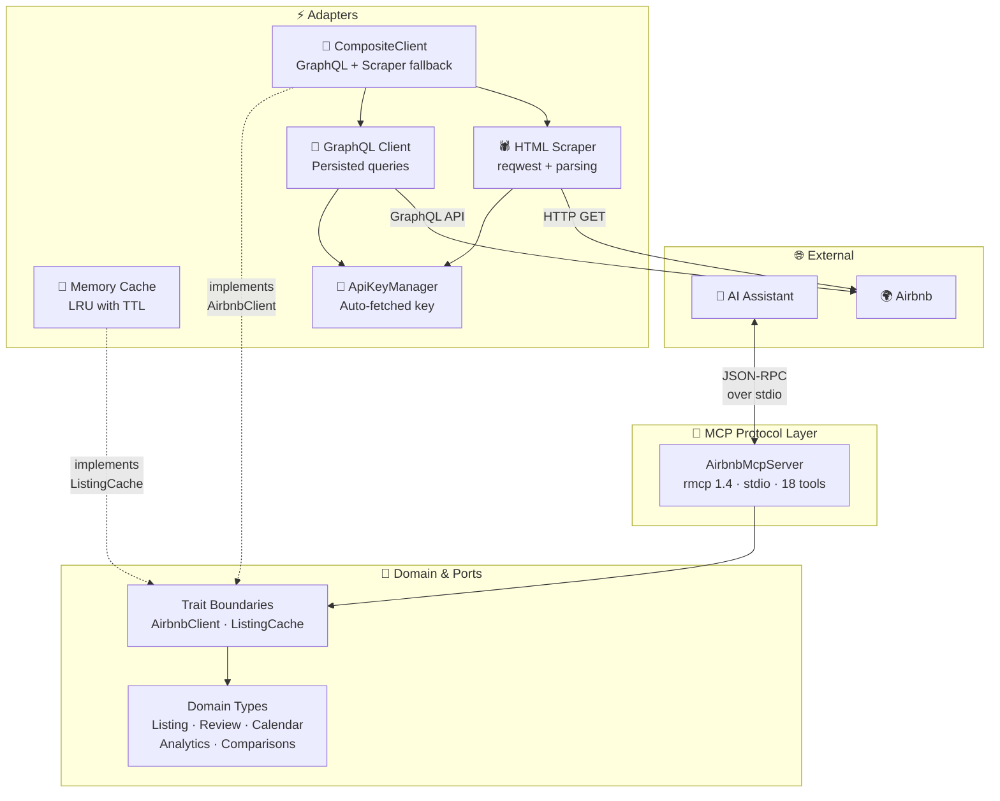
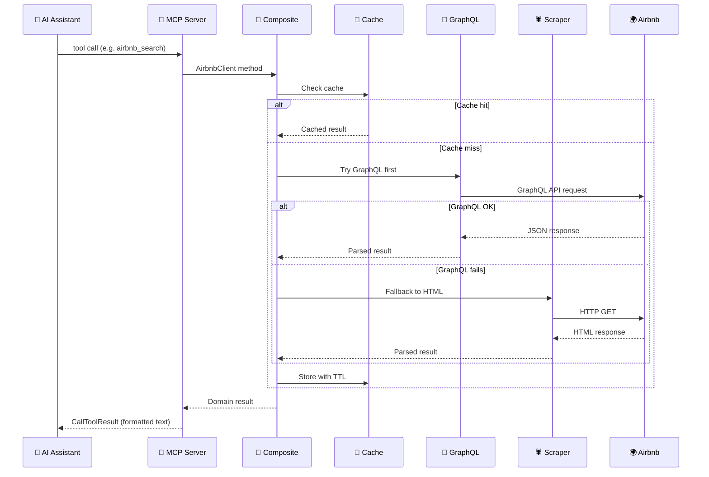

# 🏠 mcp-airbnb

[](https://www.rust-lang.org/)
[](https://modelcontextprotocol.io/)
[](LICENSE)

> **Model Context Protocol server** that enables AI assistants to search and browse Airbnb listings via a dual data source: **GraphQL API** (primary) with **HTML scraping** fallback.

## 🤔 What is this?

[MCP (Model Context Protocol)](https://modelcontextprotocol.io/) is an open standard that lets AI assistants call external tools. This crate ships **two entry points** sharing the same 18-tool backend (GraphQL API + HTML scraping fallback), no API key required:

- 📡 `mcp-airbnb` — MCP server over stdio for any MCP-compatible AI (Claude, etc.)
- 🖥️ `airbnb` — standalone CLI binary exposing the same 18 tools as shell subcommands (`airbnb search …`, `airbnb --json listing …`, pipeable into `jq`)

**Who is it for?**

- 🏡 **Airbnb hosts** — audit your listing, find missing amenities, estimate revenue, optimize pricing
- 💰 **Investors** — compare markets, project revenue, analyze neighborhoods
- 🧳 **Travelers** — search listings, compare options, read reviews via your AI assistant
- 🛠️ **Developers** — extend the server with new tools or integrate it into your own AI workflows

## ✨ Features

### 📡 Data Tools
- 🔍 **Search listings** by location, dates, guests, price range, and property type
- 📋 **Listing details** with description, amenities, house rules, photos, and host info
- ⭐ **Reviews** with aggregate ratings and individual comments, paginated
- 📅 **Price calendar** with daily prices, availability, and minimum night requirements
- 👤 **Host profiles** with superhost status, response rate, languages, and bio
- 📊 **Neighborhood stats** with average/median prices, ratings, and property type distribution
- 📈 **Occupancy estimates** with weekday/weekend pricing and monthly breakdown

### 🧠 Analytical Tools
- 🔄 **Compare listings** side-by-side (2-100+) with percentile rankings
- 📉 **Price trends** — seasonal pricing, weekend premiums, volatility analysis
- 🕳️ **Gap finder** — detect orphan nights and estimate lost revenue
- 💵 **Revenue estimate** — project ADR, occupancy, monthly/annual revenue
- 🏆 **Listing score** — quality audit (0-100) across 6 categories with improvement tips
- 🧩 **Amenity analysis** — missing popular amenities vs neighborhood competition
- 🗺️ **Market comparison** — compare 2-5 neighborhoods side-by-side
- 📂 **Host portfolio** — analyze a host's full property collection
- 💬 **Review sentiment** — positive/negative/neutral breakdown, recurring themes, keywords
- 🎯 **Competitive positioning** — 5-axis competitive score (0-100) vs neighborhood
- 💲 **Optimal pricing** — data-driven pricing recommendation with reasoning

### 🔧 Infrastructure
- 🖥️ **Dual entry point** — MCP server (`mcp-airbnb`) + standalone `airbnb` CLI, same backend
- 🔗 **Dual data source** — GraphQL API (fast, structured) + HTML scraper (fallback)
- 💾 **In-memory LRU cache** with configurable TTLs per tool
- ⏱️ **Rate limiting** to respect Airbnb (default: 1 request per 2 seconds)
- 📦 **MCP Resources** — fetched data cached as reusable resources (18 templates)
- 🏗️ **Hexagonal architecture** — clean separation of domain, ports, adapters, and application layer

## 🏗️ Architecture


```mermaid
graph TB
    subgraph External["🌐 External"]
        AI["🤖 AI Assistant"]
        AB["🌍 Airbnb"]
    end

    subgraph MCP["📡 MCP Protocol Layer"]
        Server["AirbnbMcpServer<br/>rmcp 1.4 · stdio · 18 tools"]
    end

    subgraph Core["💎 Domain & Ports"]
        Domain["Domain Types<br/>Listing · Review · Calendar<br/>Analytics · Comparisons"]
        Ports["Trait Boundaries<br/>AirbnbClient · ListingCache"]
    end

    subgraph Infra["⚡ Adapters"]
        Composite["🔀 CompositeClient<br/>GraphQL + Scraper fallback"]
        GQL["🔗 GraphQL Client<br/>Persisted queries"]
        Scraper["🕷️ HTML Scraper<br/>reqwest + parsing"]
        Cache["💾 Memory Cache<br/>LRU with TTL"]
        Shared["🔑 ApiKeyManager<br/>Auto-fetched key"]
    end

    AI <-->|"JSON-RPC<br/>over stdio"| Server
    Server --> Ports
    Ports --> Domain
    Composite -.->|"implements<br/>AirbnbClient"| Ports
    Cache -.->|"implements<br/>ListingCache"| Ports
    Composite --> GQL
    Composite --> Scraper
    GQL --> Shared
    Scraper --> Shared
    GQL -->|"GraphQL API"| AB
    Scraper -->|"HTTP GET"| AB
```

## 🔧 MCP Tools

### 📡 Data Tools (7)

| Tool | Description | Key Parameters |
|------|-------------|----------------|
| 🔍 `airbnb_search` | Search listings by location, dates, and guests | `location` (required), `checkin`, `checkout`, `adults`, `min_price`, `max_price`, `property_type` |
| 📋 `airbnb_listing_details` | Full details for a specific listing | `id` |
| ⭐ `airbnb_reviews` | Paginated reviews with ratings summary | `id`, `cursor` |
| 📅 `airbnb_price_calendar` | Price and availability calendar | `id`, `months` (1-12, default: 3) |
| 👤 `airbnb_host_profile` | Host profile with superhost status and bio | `id` |
| 📊 `airbnb_neighborhood_stats` | Aggregated area statistics | `location`, `checkin`, `checkout`, `property_type` |
| 📈 `airbnb_occupancy_estimate` | Occupancy rate and pricing breakdown | `id`, `months` (1-12, default: 3) |

### 🧠 Analytical Tools (11)

These tools compose data from the tools above — no additional scraping required.

| Tool | Description | Key Parameters |
|------|-------------|----------------|
| 🔄 `airbnb_compare_listings` | Compare 2-100+ listings side-by-side with percentile rankings | `ids` or `location`, `max_listings`, `property_type` |
| 📉 `airbnb_price_trends` | Seasonal pricing: monthly averages, weekend premium, volatility | `id`, `months` (1-12, default: 12) |
| 🕳️ `airbnb_gap_finder` | Detect orphan nights and booking gaps with lost revenue estimate | `id`, `months` (1-12, default: 3) |
| 💵 `airbnb_revenue_estimate` | Project ADR, occupancy, monthly/annual revenue vs neighborhood | `id` or `location`, `months` (1-12, default: 12) |
| 🏆 `airbnb_listing_score` | Quality audit (0-100) across 6 categories with improvement suggestions | `id` |
| 🧩 `airbnb_amenity_analysis` | Missing popular amenities vs neighborhood competition | `id`, `location` |
| 🗺️ `airbnb_market_comparison` | Compare 2-5 neighborhoods side-by-side | `locations` (required), `checkin`, `checkout`, `property_type` |
| 📂 `airbnb_host_portfolio` | Analyze a host's full property portfolio | `id` |
| 💬 `airbnb_review_sentiment` | Sentiment analysis of guest reviews: themes, keywords, breakdown | `id`, `max_pages` (1-20, default: 5) |
| 🎯 `airbnb_competitive_positioning` | 5-axis competitive score (0-100) with strengths/weaknesses | `id`, `location` |
| 💲 `airbnb_optimal_pricing` | Data-driven pricing recommendation with reasoning | `id`, `location` |

## 📦 MCP Resources

Data fetched by tools is automatically cached as MCP resources. Clients can reference previously fetched data without re-scraping.

#### 📡 Data Resources

| Resource | URI Pattern | Source Tool |
|----------|------------|-------------|
| Listing Details | `airbnb://listing/{id}` | `airbnb_listing_details` |
| Price Calendar | `airbnb://listing/{id}/calendar` | `airbnb_price_calendar` |
| Reviews | `airbnb://listing/{id}/reviews` | `airbnb_reviews` |
| Host Profile | `airbnb://listing/{id}/host` | `airbnb_host_profile` |
| Occupancy Estimate | `airbnb://listing/{id}/occupancy` | `airbnb_occupancy_estimate` |
| Search Results | `airbnb://search/{location}` | `airbnb_search` |
| Neighborhood Stats | `airbnb://neighborhood/{location}` | `airbnb_neighborhood_stats` |

#### 🧠 Analytical Resources

| Resource | URI Pattern | Source Tool |
|----------|------------|-------------|
| Comparison | `airbnb://analysis/compare/{key}` | `airbnb_compare_listings` |
| Price Trends | `airbnb://analysis/price-trends/{id}` | `airbnb_price_trends` |
| Booking Gaps | `airbnb://analysis/gaps/{id}` | `airbnb_gap_finder` |
| Revenue Estimate | `airbnb://analysis/revenue/{key}` | `airbnb_revenue_estimate` |
| Listing Score | `airbnb://analysis/score/{id}` | `airbnb_listing_score` |
| Amenity Analysis | `airbnb://analysis/amenities/{id}` | `airbnb_amenity_analysis` |
| Market Comparison | `airbnb://analysis/market/{key}` | `airbnb_market_comparison` |
| Host Portfolio | `airbnb://analysis/portfolio/{id}` | `airbnb_host_portfolio` |
| Review Sentiment | `airbnb://analysis/sentiment/{id}` | `airbnb_review_sentiment` |
| Competitive Positioning | `airbnb://analysis/positioning/{id}` | `airbnb_competitive_positioning` |
| Optimal Pricing | `airbnb://analysis/pricing/{id}` | `airbnb_optimal_pricing` |

## 🖥️ CLI

The `airbnb` binary exposes all 18 tools as shell subcommands. It reuses the exact same `AirbnbClient` implementation as the MCP server — same GraphQL-first strategy with HTML scraper fallback, same cache, same config — so parity is guaranteed.

### Data subcommands (7)

```bash
airbnb search "Paris, France" --adults 2 --max-price 200
airbnb listing 12345678
airbnb reviews 12345678 --cursor <next_page_cursor>
airbnb calendar 12345678 --months 6
airbnb host 12345678
airbnb neighborhood "Barcelona, Spain"
airbnb occupancy 12345678 --months 3
```

### Analytical subcommands (11)

```bash
airbnb compare --location "Lisbon, Portugal"
airbnb compare --ids 12345678,23456789,34567890
airbnb price-trends 12345678 --months 12
airbnb gap-finder 12345678 --months 3
airbnb revenue 12345678 --location "Rome, Italy" --months 12
airbnb listing-score 12345678
airbnb amenities 12345678
airbnb market-comparison "Paris,Lyon,Marseille"
airbnb host-portfolio 12345678
airbnb review-sentiment 12345678 --max-pages 5
airbnb competitive 12345678
airbnb optimal-pricing 12345678 --months 12
```

### Global flags

| Flag | Short | Description |
|------|-------|-------------|
| `--json` | `-j` | Output machine-readable JSON (default: human-readable text) |
| `--config <PATH>` | `-c` | Override config.yaml path (also reads `AIRBNB_CONFIG` env var) |
| `--verbose` | `-v`, `-vv` | Increase tracing verbosity (`-v` = info, `-vv` = debug) |
| `--help` | `-h` | Print help — also available per-subcommand (e.g. `airbnb search --help`) |
| `--version` | `-V` | Print version |

### JSON mode example

```bash
# Grab prices from the first 5 Tokyo listings
airbnb --json search "Tokyo" | jq '.listings[:5] | map({id, name, price: .price_per_night})'

# Pretty-print a full listing detail
airbnb --json listing 12345678 | jq .

# Compare a list of IDs and extract the price percentiles
airbnb --json compare --ids 1111,2222,3333 | jq '.listings[] | {id, price_percentile}'
```

### Note on listing prices

When you fetch a listing via `airbnb listing <id>` without dates, Airbnb's public endpoints return the nightly price as `null` — prices are only populated for dated search results. The CLI surfaces this explicitly: the human-readable output shows `Price: unavailable — fetch via 'airbnb search' with --checkin/--checkout for dated pricing` instead of a misleading `$0/night`. JSON mode keeps `price_per_night: 0.0` for schema stability.

## 🚀 Quick Start

### Prerequisites

- **Rust 1.93+** (stable) — install via [rustup](https://rustup.rs/)

### Build & Run

```bash
# Clone the repository
git clone https://github.com/muchiny/mcp-airbnb.git
cd mcp-airbnb

# Build both binaries
cargo build --release --bin mcp-airbnb --bin airbnb

# --- MCP server (stdio transport, for AI assistants) ---
./target/release/mcp-airbnb

# Or via cargo (same result)
cargo run --bin mcp-airbnb

# With debug logging (logs go to stderr, stdout reserved for JSON-RPC)
RUST_LOG=debug cargo run --bin mcp-airbnb

# --- CLI (for terminal, scripts, piping into jq) ---
./target/release/airbnb --help
./target/release/airbnb search "Paris, France" --adults 2
./target/release/airbnb --json optimal-pricing 12345678 | jq .
```

### Integration with Claude Desktop

Add to your Claude Desktop config (`~/.config/claude/claude_desktop_config.json`):

```json
{
  "mcpServers": {
    "airbnb": {
      "command": "/path/to/mcp-airbnb"
    }
  }
}
```

### Integration with Claude Code

Add to your project's `.mcp.json`:

```json
{
  "mcpServers": {
    "mcp-airbnb": {
      "command": "cargo",
      "args": ["run", "--manifest-path", "/path/to/mcp-airbnb/Cargo.toml"]
    }
  }
}
```

## 💡 Usage Examples

Once connected to an MCP-compatible AI assistant, you can ask natural language questions. The AI will automatically call the right tools.

### 🔍 Search & Explore

> *"Search for apartments in Barcelona for 2 adults, August 1-7, under $150/night"*
>
> *"Show me the details and reviews for listing 12345678"*
>
> *"What's the price calendar for that listing over the next 6 months?"*

### 📊 Analyze & Compare

> *"Compare the top 20 listings in Lisbon — which have the best value?"*
>
> *"Score listing 12345678 — what can the host improve?"*
>
> *"What amenities is listing 12345678 missing compared to competitors?"*

### 💰 Investment & Revenue

> *"Estimate the annual revenue for listing 12345678"*
>
> *"Compare the Airbnb markets in Paris, Barcelona, and Lisbon"*
>
> *"Find booking gaps in listing 12345678 and estimate lost revenue"*

### 🏠 Host Optimization

> *"Analyze the seasonal price trends for my listing 12345678 over 12 months"*
>
> *"Show me the full portfolio of the host who owns listing 12345678"*
>
> *"What's the occupancy rate and weekday vs weekend pricing for listing 12345678?"*

### 🔄 Typical Workflow

```
1. airbnb_search       → Find listings, get IDs
2. airbnb_listing_details → Deep dive into a listing
3. airbnb_reviews      → Check guest satisfaction
4. airbnb_price_calendar → Understand pricing & availability
5. airbnb_listing_score → Audit quality (0-100)
6. airbnb_revenue_estimate → Project income potential
```

## ⚙️ Configuration

All settings live in `config.yaml` (optional — sensible defaults are provided):

| Section | Field | Default | Description |
|---------|-------|---------|-------------|
| `scraper` | `rate_limit_per_second` | `0.5` | Max requests/s (0.5 = 1 req per 2s) |
| `scraper` | `request_timeout_secs` | `30` | HTTP timeout in seconds |
| `scraper` | `max_retries` | `2` | Retry count on failure |
| `scraper` | `base_url` | `https://www.airbnb.com` | Airbnb base URL |
| `scraper` | `graphql_enabled` | `true` | Enable GraphQL API (primary data source) |
| `scraper` | `api_key_cache_secs` | `86400` | API key cache TTL (24 hours) |
| `scraper` | `graphql_hashes` | *(built-in)* | Persisted query hashes for GraphQL operations |
| `cache` | `max_entries` | `500` | LRU cache capacity |
| `cache` | `search_ttl_secs` | `900` | Search cache TTL (15 min) |
| `cache` | `detail_ttl_secs` | `3600` | Detail cache TTL (1 hour) |
| `cache` | `reviews_ttl_secs` | `3600` | Reviews cache TTL (1 hour) |
| `cache` | `calendar_ttl_secs` | `1800` | Calendar cache TTL (30 min) |
| `cache` | `host_profile_ttl_secs` | `3600` | Host profile cache TTL (1 hour) |

> See [src/config/README.md](src/config/README.md) for the full configuration reference.

## 📁 Project Structure

```
mcp-airbnb/
├── src/
│   ├── domain/              # 💎 Pure types — Listing, Review, Calendar, Analytics
│   ├── ports/               # 🔌 Traits — AirbnbClient, ListingCache
│   ├── adapters/
│   │   ├── graphql/         # 🔗 GraphQL API client (primary)
│   │   │   ├── client.rs    #    Persisted queries, all AirbnbClient methods
│   │   │   └── parsers/     #    JSON → domain type parsers
│   │   ├── scraper/         # 🕷️ HTML scraper (fallback)
│   │   ├── cache/           # 💾 In-memory LRU cache
│   │   ├── composite.rs     # 🔀 GraphQL + Scraper with auto-fallback
│   │   └── shared.rs        # 🔑 ApiKeyManager (shared auth)
│   ├── application/         # 🎼 Orchestration shared by both binaries
│   │   ├── mod.rs           #    build_client(), find_config_path()
│   │   └── analytical_handlers.rs  # Multi-fetch helpers (compare, revenue, …)
│   ├── mcp/                 # 📡 MCP server (rmcp 1.4, stdio, 18 tools)
│   ├── cli/                 # 🖥️ CLI module (clap derive, dispatcher, output)
│   │   ├── args.rs          #    Cli/Commands structs + parsing unit tests
│   │   ├── mod.rs           #    run() + testable dispatch()
│   │   ├── handlers.rs      #    args → domain params conversion
│   │   └── output.rs        #    render<T: Serialize + Display>
│   ├── bin/cli.rs           # 🖥️ `airbnb` binary entrypoint (shim)
│   ├── config/              # ⚙️ YAML configuration
│   ├── error.rs             # ❌ Error types (thiserror)
│   ├── lib.rs               # Module re-exports
│   └── main.rs              # 🚀 `mcp-airbnb` binary entrypoint
├── tests/                   # 🧪 Integration tests + fixtures
├── fuzz/                    # 🎲 Fuzzing targets (8 targets)
├── claude-resources/        # 📚 Shareable Claude Code rules/skills/agents (committed,
│   │                        #     copy into ~/.claude/ or symlink as .claude/)
│   ├── rules/               #    mcp-conventions, scraping-conventions, cli-conventions
│   ├── skills/              #    /mcp-smoke, /cli-demo, /fixtures
│   └── agents/              #    mcp-tool-builder, scraper-debugger
├── .github/workflows/       # 🔄 CI/CD (check, test, coverage, security, release)
├── config.yaml              # Runtime configuration
├── justfile                 # Just task runner recipes
├── tarpaulin.toml           # Code coverage configuration
├── deny.toml                # Dependency security audit config
├── Cargo.toml               # Rust manifest (2 [[bin]]: mcp-airbnb + airbnb)
└── CLAUDE.md                # Development guide
```

> See [src/README.md](src/README.md) for the detailed architecture breakdown.

## 🔄 Request Flow


```mermaid
sequenceDiagram
    participant AI as 🤖 AI Assistant
    participant MCP as 📡 MCP Server
    participant Composite as 🔀 Composite
    participant Cache as 💾 Cache
    participant GQL as 🔗 GraphQL
    participant Scraper as 🕷️ Scraper
    participant AB as 🌍 Airbnb

    AI->>MCP: tool call (e.g. airbnb_search)
    MCP->>Composite: AirbnbClient method
    Composite->>Cache: Check cache
    alt Cache hit
        Cache-->>Composite: Cached result
    else Cache miss
        Composite->>GQL: Try GraphQL first
        GQL->>AB: GraphQL API request
        alt GraphQL OK
            AB-->>GQL: JSON response
            GQL-->>Composite: Parsed result
        else GraphQL fails
            Composite->>Scraper: Fallback to HTML
            Scraper->>AB: HTTP GET
            AB-->>Scraper: HTML response
            Scraper-->>Composite: Parsed result
        end
        Composite->>Cache: Store with TTL
    end
    Composite-->>MCP: Domain result
    MCP-->>AI: CallToolResult (formatted text)
```

## 🧪 Testing

```bash
cargo test                     # 🧪 Run all tests
cargo test --test mcp_server   # 📡 MCP tests only
cargo test --test scraper      # 🕷️ Scraper tests only
cargo test --test graphql      # 🔗 GraphQL parser tests only
cargo test --test analytical   # 🧠 Analytical tools tests only
cargo clippy                   # 🔍 Lint
cargo fmt --check              # ✅ Check formatting
```

### 🎲 Fuzzing

8 fuzz targets are available in the `fuzz/` directory:

```bash
cargo +nightly fuzz run fuzz_search_parser      # 🕷️ Search parser
cargo +nightly fuzz run fuzz_detail_parser      # 🕷️ Detail parser
cargo +nightly fuzz run fuzz_graphql_search     # 🔗 GraphQL search parser
cargo +nightly fuzz run fuzz_graphql_detail     # 🔗 GraphQL detail parser
```

### 🎲 Property-Based Testing

```bash
cargo test --test proptest_tests   # Run proptest-based tests
```

> See [tests/README.md](tests/README.md) for the test architecture and mock infrastructure.

## 📄 License

MIT
