# 🏠 mcp-airbnb

[](https://www.rust-lang.org/)
[](https://modelcontextprotocol.io/)
[](LICENSE)

> **Model Context Protocol server** that enables AI assistants to search and browse Airbnb listings via web scraping of public pages.

## ✨ Features

- 🔍 **Search listings** by location, dates, guests, price range, and property type
- 📋 **Listing details** with description, amenities, house rules, photos, and host info
- ⭐ **Reviews** with aggregate ratings and individual comments, paginated
- 📅 **Price calendar** with daily prices, availability, and minimum night requirements
- 💾 **In-memory LRU cache** with configurable TTLs per tool
- ⏱️ **Rate limiting** to respect Airbnb (default: 1 request per 2 seconds)
- 🏗️ **Hexagonal architecture** — clean separation of domain, ports, and adapters

## 🏗️ Architecture

```mermaid
graph TB
    subgraph External["🌐 External"]
        AI["🤖 AI Assistant<br/>(Claude, GPT, etc.)"]
        AB["🌍 Airbnb Website"]
    end

    subgraph MCP["📡 MCP Protocol Layer"]
        Server["AirbnbMcpServer<br/>rmcp 0.16 · stdio"]
    end

    subgraph Core["💎 Domain & Ports"]
        Domain["Domain Types<br/>Listing · Review · Calendar<br/>SearchParams"]
        Ports["Trait Boundaries<br/>AirbnbClient · ListingCache"]
    end

    subgraph Infra["⚡ Adapters"]
        Scraper["🕷️ Web Scraper<br/>reqwest + HTML parsing"]
        Cache["💾 Memory Cache<br/>LRU with TTL"]
    end

    AI <-->|"JSON-RPC<br/>over stdio"| Server
    Server --> Ports
    Ports --> Domain
    Scraper -.->|"implements<br/>AirbnbClient"| Ports
    Cache -.->|"implements<br/>ListingCache"| Ports
    Scraper -->|"HTTP GET"| AB
```



## 🔧 MCP Tools

| Tool | Description | Key Parameters |
|------|-------------|----------------|
| `airbnb_search` | Search listings by location, dates, and guests | `location` (required), `checkin`, `checkout`, `adults`, `min_price`, `max_price`, `property_type` |
| `airbnb_listing_details` | Full details for a specific listing | `id` |
| `airbnb_reviews` | Paginated reviews with ratings summary | `id`, `cursor` |
| `airbnb_price_calendar` | Price and availability calendar | `id`, `months` (1–12, default: 3) |

## 🚀 Quick Start

### Prerequisites

- **Rust 1.93+** (stable) — install via [rustup](https://rustup.rs/)

### Build & Run

```bash
# Build
cargo build --release

# Run the MCP server (stdio transport)
cargo run

# Run with debug logging (logs go to stderr)
RUST_LOG=debug cargo run
```

### Integration with Claude Desktop

Add to your Claude Desktop config (`~/.config/claude/claude_desktop_config.json`):

```json
{
  "mcpServers": {
    "airbnb": {
      "command": "/path/to/mcp-airbnb"
    }
  }
}
```

### Integration with Claude Code

Add to your project's `.mcp.json`:

```json
{
  "mcpServers": {
    "mcp-airbnb": {
      "command": "cargo",
      "args": ["run", "--manifest-path", "/path/to/mcp-airbnb/Cargo.toml"]
    }
  }
}
```

## ⚙️ Configuration

All settings live in `config.yaml` (optional — sensible defaults are provided):

| Section | Field | Default | Description |
|---------|-------|---------|-------------|
| `scraper` | `rate_limit_per_second` | `0.5` | Max requests/s (0.5 = 1 req per 2s) |
| `scraper` | `request_timeout_secs` | `30` | HTTP timeout in seconds |
| `scraper` | `max_retries` | `2` | Retry count on failure |
| `scraper` | `base_url` | `https://www.airbnb.com` | Airbnb base URL |
| `cache` | `max_entries` | `500` | LRU cache capacity |
| `cache` | `search_ttl_secs` | `900` | Search cache TTL (15 min) |
| `cache` | `detail_ttl_secs` | `3600` | Detail cache TTL (1 hour) |
| `cache` | `reviews_ttl_secs` | `3600` | Reviews cache TTL (1 hour) |
| `cache` | `calendar_ttl_secs` | `1800` | Calendar cache TTL (30 min) |

> See [src/config/README.md](src/config/README.md) for the full configuration reference.

## 📁 Project Structure

```
mcp-airbnb/
├── src/
│   ├── domain/           # 💎 Pure types — Listing, Review, Calendar, SearchParams
│   ├── ports/            # 🔌 Traits — AirbnbClient, ListingCache
│   ├── adapters/
│   │   ├── scraper/      # 🕷️ Web scraping (reqwest + HTML parsing)
│   │   └── cache/        # 💾 In-memory LRU cache
│   ├── mcp/              # 📡 MCP server (rmcp 0.16, stdio)
│   ├── config/           # ⚙️ YAML configuration
│   ├── error.rs          # ❌ Error types (thiserror)
│   ├── lib.rs            # Module re-exports
│   └── main.rs           # 🚀 Entrypoint
├── config.yaml           # Runtime configuration
├── Cargo.toml            # Rust manifest
└── CLAUDE.md             # Development guide
```

> See [src/README.md](src/README.md) for the detailed architecture breakdown.

## 🔄 Request Flow

```mermaid
sequenceDiagram
    participant AI as 🤖 AI Assistant
    participant MCP as 📡 MCP Server
    participant Cache as 💾 Cache
    participant RL as ⏱️ Rate Limiter
    participant Scraper as 🕷️ Scraper
    participant AB as 🌍 Airbnb

    AI->>MCP: airbnb_search(location, dates, guests)
    MCP->>MCP: Validate SearchParams
    MCP->>Cache: Check cache key
    alt Cache hit
        Cache-->>MCP: Cached result
    else Cache miss
        MCP->>RL: Acquire token
        RL-->>MCP: Ready
        MCP->>Scraper: Build URL & fetch
        Scraper->>AB: HTTP GET /s/{location}/homes
        AB-->>Scraper: HTML response
        Scraper->>Scraper: Parse __NEXT_DATA__ JSON
        alt JSON extraction OK
            Scraper-->>MCP: SearchResult
        else Fallback
            Scraper->>Scraper: Try deferred state / CSS selectors
            Scraper-->>MCP: SearchResult
        end
        MCP->>Cache: Store (key, result, TTL)
    end
    MCP-->>AI: CallToolResult (formatted text)
```



## 🧪 Testing

```bash
cargo test                     # Run all tests
cargo clippy                   # Lint
cargo fmt --check              # Check formatting
```

## 📄 License

MIT
