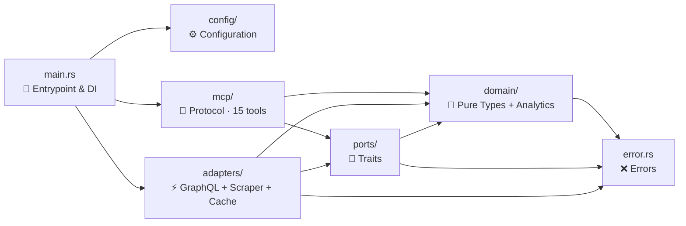

# 📦 Source Code

The source code follows a **hexagonal architecture** (ports & adapters), ensuring the domain core stays pure and testable while all I/O is isolated in adapter implementations.

## 🏛️ Architecture Layers



**Dependency rule**: arrows point inward. Domain depends on nothing (except error types). Ports depend on domain. Adapters and MCP depend on ports + domain. `main.rs` wires everything together.

## 📂 Module Overview

| Module | Layer | Role | README |
|--------|-------|------|--------|
| [`domain/`](domain/) | 💎 Core | Pure types — `Listing`, `Review`, `PriceCalendar`, `SearchParams`, analytics (comparisons, trends, scoring, revenue) | [💎 Domain](domain/README.md) |
| [`ports/`](ports/) | 🔌 Core | Trait boundaries — `AirbnbClient` (7 methods), `ListingCache` | [🔌 Ports](ports/README.md) |
| [`adapters/`](adapters/) | ⚡ Infrastructure | GraphQL API, HTML scraping, in-memory caching, composite client | [⚡ Adapters](adapters/README.md) |
| [`mcp/`](mcp/) | 📡 Interface | MCP protocol server with 15 tools (7 data + 8 analytical) | [📡 MCP](mcp/README.md) |
| [`config/`](config/) | ⚙️ Infrastructure | YAML configuration loading | [⚙️ Config](config/README.md) |
| `error.rs` | ❌ Core | `AirbnbError` enum via `thiserror` | — |
| `lib.rs` | 📦 Root | Module re-exports | — |
| `main.rs` | 🚀 Entrypoint | Tracing setup, config loading, DI wiring (composite vs scraper-only), stdio serve | — |

## 🔗 Dependency Rule

```
main.rs (wires everything)
  ├── config/        → standalone
  ├── adapters/      → ports/ + domain/ + config/
  │   ├── graphql/   → 🔗 Primary data source
  │   ├── scraper/   → 🕷️ Fallback data source
  │   ├── cache/     → 💾 LRU caching
  │   ├── composite  → 🔀 Auto-fallback orchestration
  │   └── shared     → 🔑 API key management
  └── mcp/           → ports/ + domain/
        ↓
      ports/         → domain/
        ↓
      domain/        → error.rs (only)
```

The domain layer has **zero** outward dependencies. This guarantees that business types can be tested in isolation without mocks, HTTP clients, or async runtimes.
