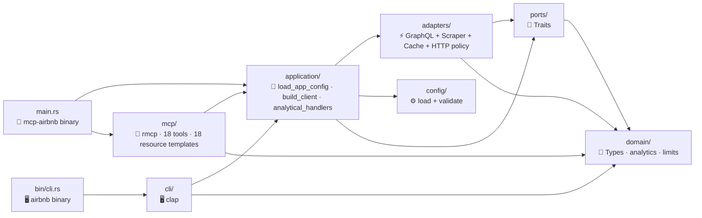

# 📦 Source Code

Hexagonal architecture (ports & adapters). The domain core is pure and testable, all I/O lives in adapters, and the application layer wires adapters to ports for the two front ends (MCP server and CLI).

## 🏛️ Architecture Layers

```mermaid
graph LR
    main["main.rs<br/>🚀 mcp-airbnb binary"] --> application
    main --> mcp
    clibin["bin/cli.rs<br/>🖥️ airbnb binary"] --> cli
    mcp["mcp/<br/>📡 rmcp · 18 tools · 18 resource templates"] --> application
    mcp --> domain
    cli["cli/<br/>🖥️ clap"] --> application
    cli --> domain
    application["application/<br/>🎼 load_app_config · build_client · analytical_handlers"] --> adapters
    application --> config
    application --> ports
    adapters["adapters/<br/>⚡ GraphQL + Scraper + Cache + HTTP policy"] --> ports
    adapters --> domain
    ports["ports/<br/>🔌 Traits"] --> domain
    config["config/<br/>⚙️ load + validate"]
    domain["domain/<br/>💎 Types · analytics · limits"]
```

**Dependency rule**: arrows point inward. `domain/` depends only on `error.rs`. `ports/` depends on `domain/`. `adapters/` implement `ports/`. `application/` is the only layer that may import every other layer; `mcp/` and `cli/` call it instead of building adapters themselves. `main.rs` and `bin/cli.rs` stay thin: logging setup, `load_app_config`, `build_client`, then serve or dispatch.

## 📂 Module Overview

| Module | Layer | Role | README |
|--------|-------|------|--------|
| [`domain/`](domain/) | 💎 Core | Pure types (`Listing`, `Review`, `PriceCalendar`, `SearchParams`), input limits (`limits`) and `analytics::compute_*` | [💎 Domain](domain/README.md) |
| [`ports/`](ports/) | 🔌 Core | `AirbnbClient` (7 required methods), `ListingCache` | [🔌 Ports](ports/README.md) |
| [`adapters/`](adapters/) | ⚡ Infrastructure | GraphQL (primary), HTML scraper (fallback), composite client, LRU cache, API key manager, process-wide `RateLimiter`, HTTP retry/redirect policy | [⚡ Adapters](adapters/README.md) |
| [`application/`](application/) | 🎼 Orchestration | `load_app_config` (config lookup), `build_client` (one shared `RateLimiter`, cache, `ApiKeyManager`), `analytical_handlers` (used by MCP and CLI) | — |
| [`mcp/`](mcp/) | 📡 Interface | MCP server: 18 tools (7 data + 11 analytical), 18 resource templates (`resource_uri.rs`) | [📡 MCP](mcp/README.md) |
| [`cli/`](cli/) | 🖥️ Interface | `airbnb` CLI: clap args, `dispatch`, handlers, output | — |
| [`config/`](config/) | ⚙️ Infrastructure | `config.yaml` types, `load_config`, `Config::validate` | [⚙️ Config](config/README.md) |
| `fuzz_support.rs` | 🎲 Test support | Hidden fuzz harness shared by `fuzz/` and `tests/fuzz_seed_replay_test.rs` | — |
| `error.rs` | ❌ Core | `AirbnbError` (`thiserror`), including `UpstreamSchema` for Airbnb API drift | — |
| `lib.rs` | 📦 Root | Module declarations; `clippy::unwrap_used` / `expect_used` policy for production code | — |
| `main.rs` | 🚀 Entrypoint | stderr logging, `load_app_config`, `build_client`, stdio serve | — |
| `bin/cli.rs` | 🖥️ Entrypoint | Calls `cli::run()` | — |

The domain layer has **zero** outward dependencies, so business types can be tested in isolation without mocks, HTTP clients or async runtimes.
