# 📦 Source Code

The source code follows a **hexagonal architecture** (ports & adapters), ensuring the domain core stays pure and testable while all I/O is isolated in adapter implementations.

## 🏛️ Architecture Layers

```mermaid
graph LR
    main["main.rs<br/>🚀 Entrypoint"] --> config
    main --> mcp
    main --> adapters

    mcp["mcp/<br/>📡 Protocol"] --> ports
    mcp --> domain

    adapters["adapters/<br/>⚡ Implementations"] --> ports
    adapters --> domain

    ports["ports/<br/>🔌 Traits"] --> domain

    config["config/<br/>⚙️ Configuration"]
    domain["domain/<br/>💎 Pure Types"]
    error["error.rs<br/>❌ Errors"]

    domain --> error
    ports --> error
    adapters --> error
```



**Dependency rule**: arrows point inward. Domain depends on nothing (except error types). Ports depend on domain. Adapters and MCP depend on ports + domain. `main.rs` wires everything together.

## 📂 Module Overview

| Module | Layer | Role | README |
|--------|-------|------|--------|
| [`domain/`](domain/) | Core | Pure types — `Listing`, `Review`, `PriceCalendar`, `SearchParams` | [💎 Domain](domain/README.md) |
| [`ports/`](ports/) | Core | Trait boundaries — `AirbnbClient`, `ListingCache` | [🔌 Ports](ports/README.md) |
| [`adapters/`](adapters/) | Infrastructure | HTTP scraping + in-memory caching | [⚡ Adapters](adapters/README.md) |
| [`mcp/`](mcp/) | Interface | MCP protocol server with 4 tools | [📡 MCP](mcp/README.md) |
| [`config/`](config/) | Infrastructure | YAML configuration loading | [⚙️ Config](config/README.md) |
| `error.rs` | Core | `AirbnbError` enum via `thiserror` | — |
| `lib.rs` | Root | Module re-exports | — |
| `main.rs` | Entrypoint | Tracing setup, config loading, DI wiring, stdio serve | — |

## 🔗 Dependency Rule

```
main.rs (wires everything)
  ├── config/        → standalone
  ├── adapters/      → ports/ + domain/ + config/
  └── mcp/           → ports/ + domain/
        ↓
      ports/         → domain/
        ↓
      domain/        → error.rs (only)
```

The domain layer has **zero** outward dependencies. This guarantees that business types can be tested in isolation without mocks, HTTP clients, or async runtimes.
