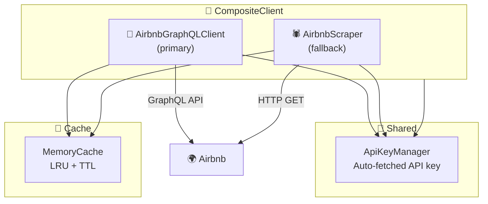
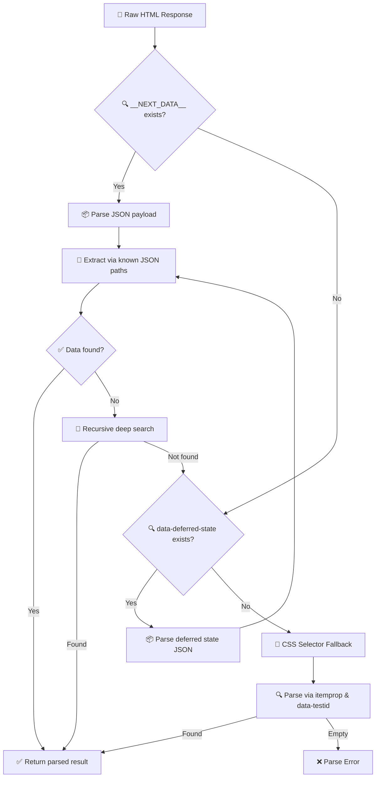

# ⚡ Adapters Layer

The **adapters layer** provides concrete implementations of the port traits. This is where all I/O happens — HTTP requests to Airbnb (via GraphQL API or HTML scraping) and in-memory caching.

## 📂 Structure

```
adapters/
├── graphql/             # 🔗 GraphQL API — primary data source
│   ├── client.rs        #    AirbnbGraphQLClient — persisted queries, all 7 methods
│   └── parsers/         #    JSON → domain type parsers
│       ├── search.rs    #    🔍 StaysSearch → SearchResult
│       ├── detail.rs    #    📋 StaysPdpSections → ListingDetail
│       ├── review.rs    #    ⭐ StaysPdpReviewsQuery → ReviewsPage
│       └── host.rs      #    👤 StaysPdpSections → HostProfile
├── scraper/             # 🕷️ HTML scraper — fallback data source
│   ├── client.rs        #    AirbnbScraper — HTTP client, retry, cache-aside
│   ├── search_parser.rs #    🔍 Search HTML → SearchResult
│   ├── detail_parser.rs #    📋 Detail HTML → ListingDetail
│   ├── review_parser.rs #    ⭐ Review HTML → ReviewsPage
│   ├── calendar_parser.rs #  📅 Calendar HTML → PriceCalendar
│   └── rate_limiter.rs  #    ⏱️ Token-bucket rate limiter
├── cache/               # 💾 In-memory LRU cache
│   └── memory_cache.rs  #    MemoryCache — LRU eviction + TTL
├── composite.rs         # 🔀 CompositeClient — GraphQL + Scraper auto-fallback
├── shared.rs            # 🔑 ApiKeyManager — auto-fetched API key with TTL
└── mod.rs
```

> See [graphql/README.md](graphql/README.md), [scraper/README.md](scraper/README.md), [cache/README.md](cache/README.md) for detailed documentation.

## 🏛️ Architecture



## 🔀 Composite Client

`CompositeClient` orchestrates the dual data source strategy:

1. 🔗 **Try GraphQL first** — fast, structured JSON responses
2. 🕷️ **Fallback to HTML scraper** — if GraphQL fails (rate limit, format change, etc.)
3. 🔄 **Smart merging** — for detail and reviews, merges results from both sources

Uses the `with_fallback!` macro for consistent error handling across all methods.

## 🔑 API Key Manager (`shared.rs`)

- 🌐 Fetches `X-Airbnb-Api-Key` from the Airbnb homepage
- 💾 Caches the key with configurable TTL (default: 24 hours)
- 🔗 Shared between GraphQL and Scraper via `Arc<ApiKeyManager>`
- 🔒 Thread-safe with `RwLock`-based caching

## 🗝️ Cache Key Strategy

| Tool | Cache Key Pattern | Default TTL |
|------|-------------------|-------------|
| 🔍 Search | `search:{location}:{checkin}:{checkout}:{adults}:{cursor}` | 15 min (900s) |
| 📋 Detail | `detail:{id}` | 1 hour (3600s) |
| ⭐ Reviews | `reviews:{id}:{cursor\|"first"}` | 1 hour (3600s) |
| 📅 Calendar | `calendar:{id}:m={months}` | 30 min (1800s) |

GraphQL adapter prefixes keys with `gql:` (e.g., `gql:detail:{id}`), while the scraper uses unprefixed keys.

## 🔄 Parsing Strategy

All HTML parsers follow the same multi-tier extraction strategy:


