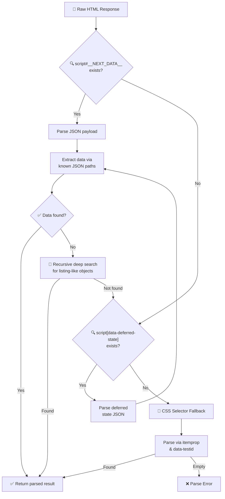

# ⚡ Adapters Layer

The **adapters layer** provides concrete implementations of the port traits. This is where all I/O happens — HTTP requests to Airbnb and in-memory caching.

## 📂 Structure

```
adapters/
├── scraper/          # 🕷️ Web scraping — implements AirbnbClient
│   ├── client.rs     #    HTTP client, retry logic, cache-aside
│   ├── search_parser.rs
│   ├── detail_parser.rs
│   ├── review_parser.rs
│   ├── calendar_parser.rs
│   └── rate_limiter.rs
├── cache/            # 💾 Caching — implements ListingCache
│   └── memory_cache.rs
└── mod.rs
```

> See [scraper/README.md](scraper/README.md) for detailed scraper documentation.

## 🌐 Scraper Adapter

`AirbnbScraper` implements `AirbnbClient` by scraping public Airbnb HTML pages. It uses `reqwest` with cookie support, applies rate limiting, and caches results with configurable TTLs.

## 💾 Cache Adapter

`MemoryCache` implements `ListingCache` using an in-memory LRU cache (`lru` crate) protected by `RwLock`. Each entry stores the serialized JSON value alongside its expiration timestamp. Expired entries are evicted on access.

## 🔄 Parsing Strategy

All parsers follow the same multi-tier extraction strategy:



## 🗝️ Cache Key Strategy

| Tool | Cache Key Pattern | Default TTL |
|------|-------------------|-------------|
| Search | `search:{location}:{checkin}:{checkout}:{adults}:{cursor}` | 15 min (900s) |
| Detail | `detail:{id}` | 1 hour (3600s) |
| Reviews | `reviews:{id}:{cursor\|"first"}` | 1 hour (3600s) |
| Calendar | `calendar:{id}` | 30 min (1800s) |
