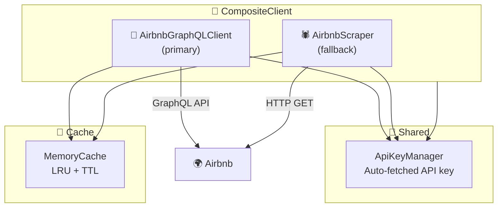
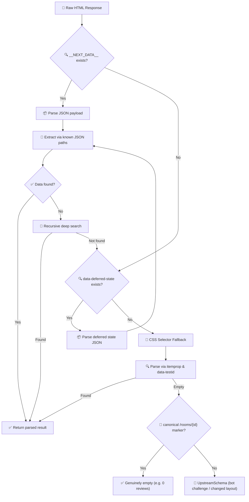

# ⚡ Adapters Layer

The **adapters layer** provides concrete implementations of the port traits. This is where all I/O happens — HTTP requests to Airbnb (via GraphQL API or HTML scraping) and in-memory caching.

## 📂 Structure

```
adapters/
├── graphql/             # 🔗 GraphQL API — primary data source
│   ├── client.rs        #    AirbnbGraphQLClient — persisted queries, all AirbnbClient methods
│   └── parsers/         #    JSON → domain type parsers
│       ├── search.rs    #    🔍 StaysSearch → SearchResult
│       ├── detail.rs    #    📋 StaysPdpSections → ListingDetail
│       ├── review.rs    #    ⭐ StaysPdpReviewsQuery → ReviewsPage
│       ├── host.rs      #    👤 StaysPdpSections → HostProfile
│       └── pdp.rs       #    🧩 Shared StaysPdpSections helpers (SBUI blocks, metadata)
├── scraper/             # 🕷️ HTML scraper — fallback data source
│   ├── client.rs        #    AirbnbScraper — HTTP client, retry, cache-aside
│   ├── page_markers.rs  #    🔖 Genuine listing page vs bot challenge / consent wall / error page
│   ├── search_parser.rs #    🔍 Search HTML → SearchResult
│   ├── detail_parser.rs #    📋 Detail HTML → ListingDetail
│   ├── review_parser.rs #    ⭐ Review HTML → ReviewsPage
│   ├── calendar_parser.rs #  📅 Calendar HTML/JSON → PriceCalendar (ISO dates, sorted, unique)
│   └── deferred_state.rs #   📦 __NEXT_DATA__ / niobe(Minimal)ClientData payloads, one DOM parse
├── cache/               # 💾 In-memory LRU cache
│   └── memory_cache.rs  #    MemoryCache — LRU eviction + TTL
├── composite.rs         # 🔀 CompositeClient — GraphQL + Scraper auto-fallback
├── http.rs              # 🌐 Client builder, retry policy, same-origin redirects, body cap
├── price.rs             # 💱 Locale-aware amounts, currency labels, structuredDisplayPrice
├── rate_limiter.rs      # ⏱️ Process-wide reservation-based rate limiter
├── request_locale.rs    # 🌐 currency/locale pinned on every request
├── shared.rs            # 🔑 ApiKeyManager — auto-fetched API key with TTL
├── stay_search.rs       # 🔍 StaySearchResult item parser (GraphQL + HTML)
├── text.rs              # 🔤 HTML text, ratings, host labels/ids, room counts
└── mod.rs
```

> See [graphql/README.md](graphql/README.md), [scraper/README.md](scraper/README.md), [cache/README.md](cache/README.md) for detailed documentation.

## 🏛️ Architecture


```mermaid
flowchart TD
    subgraph Composite["🔀 CompositeClient"]
        direction TB
        GQL["🔗 AirbnbGraphQLClient<br/>(primary)"]
        Scraper["🕷️ AirbnbScraper<br/>(fallback)"]
    end

    subgraph Shared["🔑 Shared"]
        Keys["ApiKeyManager<br/>Auto-fetched API key"]
    end

    subgraph Cache["💾 Cache"]
        LRU["MemoryCache<br/>LRU + TTL"]
    end

    Composite --> Keys
    GQL --> Keys
    Scraper --> Keys
    GQL --> LRU
    Scraper --> LRU

    GQL -->|"GraphQL API"| AB["🌍 Airbnb"]
    Scraper -->|"HTTP GET"| AB
```

## 🔀 Composite Client

`CompositeClient` orchestrates the dual data source strategy:

1. 🔗 **Try GraphQL first** — fast, structured JSON responses.
2. 🕷️ **Fall back to the HTML scraper only when the GraphQL source is broken**: `Http`, `UpstreamStatus`, `Parse`, `UpstreamSchema` or `Json` errors (`composite::should_fall_back`). `RateLimited`, `InvalidParams`, `ListingNotFound`, `InsufficientData` and configuration errors are returned as-is: a second request cannot help and, after a 429, would be impolite.
3. 🧾 **Both failed** → `AllSourcesFailed { primary, fallback }`, so the GraphQL root cause (for example a stale persisted-query hash) is not lost.
4. 🔄 **Detail completion**: after a GraphQL success the scraper is called only when name, location, description, amenities or photos are missing. A missing price, rating or house rules never triggers a second request. A price is copied only if the page has a known one (`known_price()`).
5. 📄 **Reviews**: a later page (`cursor` set) never falls back, because GraphQL cursors mean nothing to the scraper. A first page without review text is never a success while either source's summary claims reviews (`total_reviews > 0`): the listing page's rating block alone, or an empty GraphQL first page, ends as `AllSourcesFailed` with an `UpstreamSchema` cause. Only a listing that no source says has reviews returns an empty page.

## ⏱️ Rate limiting and retries (`rate_limiter.rs`, `http.rs`)

- One `RateLimiter` is built in `application::build_client` and shared by `ApiKeyManager`, the GraphQL client and the scraper, so `rate_limit_per_second` is the **total** rate. Slots are reserved under a lock and slept outside it, so concurrent callers are spaced by the interval.
- `http::send_with_retries` (GraphQL, which then classifies the final response) and `http::send_with_policy` (HTML and the API-key fetch, 2xx only) wait for a slot before every attempt:
  - 5xx, 408, timeouts and connection errors are retried up to `max_retries` times (backoff 2 s, 4 s, 8 s …, capped at 30 s);
  - 429 is retried only with a `Retry-After` of at most 60 s; otherwise it returns `RateLimited` and pauses every caller, including callers already waiting for a slot;
  - other 4xx are never retried.
- Redirects are followed only on the original origin, so the API key and cookies never leave Airbnb. Bodies over 16 MiB are refused.

## 🔑 API Key Manager (`shared.rs`)

- 🌐 Fetches `X-Airbnb-Api-Key` from the Airbnb homepage through the shared rate limiter, checking the HTTP status
- 💾 Caches the key for `api_key_cache_secs` (default: 24 hours); a failed fetch is remembered for 2 minutes
- 🔁 Single-flight: concurrent callers wait for one fetch (`tokio::sync::Mutex`)
- ♻️ A 401/403 from GraphQL invalidates the key; the request is retried once with a fresh key
- 🔗 Shared between GraphQL and Scraper via `Arc<ApiKeyManager>`

## 🗝️ Cache Key Strategy

| Tool | Cache Key Pattern | Default TTL |
|------|-------------------|-------------|
| 🔍 Search | `search:{SearchParams::cache_key()}`, i.e. `{location}:ci=…:co=…:a=…:ch=…:inf=…:p=…:min=…:max=…:pt=…:cur=…` (only the fields that are set) | 15 min (900s) |
| 📋 Detail | `detail:{id}` | 1 hour (3600s) |
| ⭐ Reviews | scraper `reviews:{id}:{cursor\|"first"}`, GraphQL `gql:reviews:{id}:o={offset}` | 1 hour (3600s) |
| 📅 Calendar | scraper `calendar:{id}:{YYYY-MM}:m={months}`, GraphQL `gql:calendar:{id}:{YYYY-MM}:m={months}` (`YYYY-MM` = month the window starts) | 30 min (1800s) |
| 👤 Host profile | scraper `host:{listing_id}`, GraphQL `gql:host:{listing_id}` | 1 hour (3600s) |

GraphQL adapter prefixes keys with `gql:` (e.g., `gql:detail:{id}`, `gql:search:{SearchParams::cache_key()}`), while the scraper uses unprefixed keys. Errors, including `UpstreamSchema`, are never cached.

## 🔄 Parsing Strategy

All HTML parsers follow the same multi-tier extraction strategy:


```mermaid
flowchart TD
    HTML["📄 Raw HTML Response"]
    HTML --> ND{"🔍 __NEXT_DATA__ exists?"}
    ND -->|Yes| ParseJSON["📦 Parse JSON payload"]
    ND -->|No| DS{"🔍 data-deferred-state exists?"}
    ParseJSON --> Extract["🎯 Extract via known JSON paths"]
    Extract --> Found{"✅ Data found?"}
    Found -->|Yes| Result["✅ Return parsed result"]
    Found -->|No| Deep["🔎 Recursive deep search"]
    Deep -->|Found| Result
    Deep -->|Not found| DS
    DS -->|Yes| ParseDeferred["📦 Parse deferred state JSON"]
    ParseDeferred --> Extract
    DS -->|No| CSS["🎨 CSS Selector Fallback"]
    CSS --> CSSParse["🔍 Parse via itemprop & data-testid"]
    CSSParse -->|Found| Result
    CSSParse -->|Empty| Markers{"🔖 canonical /rooms/{id} marker?"}
    Markers -->|Yes| Empty["✅ Genuinely empty (e.g. 0 reviews)"]
    Markers -->|No| Drift["🚨 UpstreamSchema (bot challenge / changed layout)"]
```

The marker check applies to listing detail and review pages. A search page with no listing data and no listing cards has no marker check and returns `UpstreamSchema`.

## 🎯 Parser Guarantees

- 💵 **Prices** — `price_per_night` is the nightly price or `0.0` (unknown; read it with `known_price()`). A stay total shown as the primary price is never taken as nightly; `total_price` is never the struck-through `originalPrice`. All amounts go through `price::parse_price_amount` (locale-aware separators).
- 💱 **Currency** — every request pins `currency`/`locale` (`ScraperConfig`). `currency` is the display label printed with the amount (ISO codes are normalized to symbols); an amount without a label gets the pinned currency's symbol, never an invented `$`.
- 📍 **Location** — a place name (LOCATION subtitle, SBUI overview "Type in Place", `sharingConfig.location`), never a section heading.
- 👤 **Host** — `MEET_YOUR_HOST` wins; labels such as "Response rate:" are stripped; base64 `DemandUser:<n>` ids are decoded to `<n>`; business listings return `HostProfileUnavailable`.
- 📅 **Calendar** — days have ISO dates and an explicit availability flag, one per date, sorted; `PriceCalendar::contiguous_runs()` splits them at missing dates.
- 🧩 **One document, one parser** — the HTML scraper parses the embedded `StaysPdpSections` payload with `graphql::parsers::{detail, host}`, and search cards of both sources with `stay_search`; a listing's PDP is fetched once for detail and host.
