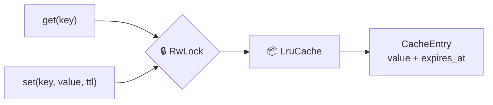

# 💾 Cache Adapter

Implements the `ListingCache` port using an **in-memory LRU cache** with TTL-based expiration.

## 📂 Files

| File | Responsibility |
|------|---------------|
| `memory_cache.rs` | 🏗️ `MemoryCache` struct — LRU eviction, TTL expiration, thread-safe access |

## 🔧 `MemoryCache`

### 🏛️ Architecture

### 📋 How It Works

- 📦 Wraps `lru::LruCache<String, CacheEntry>` inside a `RwLock`
- ⏰ Each `CacheEntry` stores `value: String` + `expires_at: Instant`
- 🔍 On `get()`: checks expiration, evicts if expired, returns `None`
- 💾 On `set()`: inserts/overwrites with computed `expires_at = now + ttl`
- 🗑️ LRU eviction occurs automatically when capacity is reached
- 🔒 Thread-safe: `RwLock` allows concurrent reads, exclusive writes

### ⚙️ Configuration

| Field | Default | Description |
|-------|---------|-------------|
| `max_entries` | `500` | Maximum LRU cache capacity |
| `search_ttl_secs` | `900` (15 min) | TTL for search results |
| `detail_ttl_secs` | `3600` (1 hour) | TTL for listing details |
| `reviews_ttl_secs` | `3600` (1 hour) | TTL for reviews |
| `calendar_ttl_secs` | `1800` (30 min) | TTL for price calendars |

### 🧪 Tests

- ✅ Get returns `None` for missing keys
- ✅ Set then get returns the value
- ✅ Expired entries return `None`
- ✅ LRU eviction at capacity
- ✅ Key overwrite works correctly
- ✅ Zero capacity fallback (defaults to 100)
- ✅ Concurrent access from multiple threads
