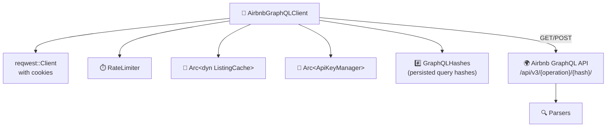

# 🔗 GraphQL Adapter

Implements `AirbnbClient` using Airbnb's **internal GraphQL API** with persisted query hashes. This is the primary data source — faster and more structured than HTML scraping.

## 📂 Files

| File | Responsibility |
|------|---------------|
| `client.rs` | 🏗️ `AirbnbGraphQLClient` — HTTP requests, caching, all 7 `AirbnbClient` methods |
| `parsers/` | 🔍 Response parsers for each GraphQL operation |

## 🔧 `AirbnbGraphQLClient`

### 🏛️ Architecture

### 📡 GraphQL Operations

| Operation | HTTP Method | Hash Config Key | Used By |
|-----------|------------|----------------|---------|
| `StaysSearch` | POST | `stays_search` | 🔍 `search_listings()` |
| `StaysPdpSections` | GET | `stays_pdp_sections` | 📋 `get_listing_detail()`, 👤 `get_host_profile()` |
| `StaysPdpReviewsQuery` | GET | `stays_pdp_reviews` | ⭐ `get_reviews()` |
| `PdpAvailabilityCalendar` | GET | `pdp_availability_calendar` | 📅 `get_price_calendar()` |

### 🔑 Authentication

- Uses `X-Airbnb-Api-Key` header for all requests
- API key is fetched automatically from the Airbnb homepage via `ApiKeyManager`
- Key is cached with a configurable TTL (default: 24h)

### 📊 Computed Methods

`get_neighborhood_stats()` and `get_occupancy_estimate()` are **not separate GraphQL operations** — they reuse existing methods:

- 📊 `get_neighborhood_stats()` → calls `search_listings()` then `compute_neighborhood_stats()`
- 📈 `get_occupancy_estimate()` → calls `get_price_calendar()` then `compute_occupancy_estimate()`

### 💾 Caching

All methods follow the cache-aside pattern with `gql:` prefixed keys:
- `gql:search:{location}`
- `gql:detail:{id}`
- `gql:reviews:{id}:{cursor}`
- `gql:calendar:{id}:m={months}`
