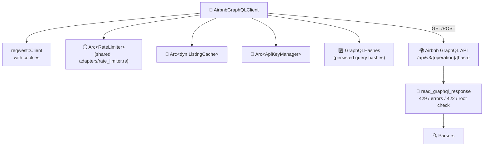

# 🔗 GraphQL Adapter

Implements `AirbnbClient` using Airbnb's **internal GraphQL API** with persisted query hashes. This is the primary data source — faster and more structured than HTML scraping.

## 📂 Files

| File | Responsibility |
|------|---------------|
| `client.rs` | 🏗️ `AirbnbGraphQLClient` — HTTP requests, response classification, caching, all `AirbnbClient` methods |
| `parsers/` | 🔍 Request builders and response parsers for each GraphQL operation |

## 🔧 `AirbnbGraphQLClient`

### 🏛️ Architecture

```mermaid
flowchart TD
    Client["🔗 AirbnbGraphQLClient"]
    Client --> HTTP["reqwest::Client<br/>with cookies"]
    Client --> RL["⏱️ Arc&lt;RateLimiter&gt;<br/>(shared, adapters/rate_limiter.rs)"]
    Client --> Cache["💾 Arc&lt;dyn ListingCache&gt;"]
    Client --> Keys["🔑 Arc&lt;ApiKeyManager&gt;"]
    Client --> Hashes["#️⃣ GraphQLHashes<br/>(persisted query hashes)"]

    Client --> |"GET/POST"| API["🌍 Airbnb GraphQL API<br/>/api/v3/{operation}/{hash}"]
    API --> Classify["🚦 read_graphql_response<br/>429 / errors / 422 / root check"]
    Classify --> Parsers["🔍 Parsers"]
```

### 📡 GraphQL Operations (hashes refreshed 2026-09)

| Operation | Request | Hash config key (default) | Used by |
|-----------|---------|---------------------------|---------|
| `StaysSearch` | POST `/api/v3/StaysSearch/{hash}?operationName=StaysSearch` | `stays_search` (`0afc7d44…`) | 🔍 `search_listings()` |
| `StaysPdpSections` | GET `/api/v3/StaysPdpSections/{hash}/` | `stays_pdp_sections` (`80c7889b…`) | 📋 `get_listing_detail()`, 👤 `get_host_profile()` |
| `StaysPdpReviewsQuery` | GET `/api/v3/StaysPdpReviewsQuery/{hash}/` | `stays_pdp_reviews` (`cfdc3ffb…`) | ⭐ `get_reviews()` |
| `PdpAvailabilityCalendar` | GET `/api/v3/PdpAvailabilityCalendar/{hash}/` | `pdp_availability_calendar` (`be60714e…`) | 📅 `get_price_calendar()` |

Every request carries `X-Airbnb-Api-Key`, `X-Airbnb-GraphQL-Platform: web` and `X-Airbnb-GraphQL-Platform-Client: minimalist-niobe`, like the airbnb.com web client. The request and response shapes are pinned by the anonymized captures in `tests/fixtures/airbnb/2026-09/`.

Every request also pins `currency` and `locale` from `ScraperConfig` (query parameters `currency=` / `locale=` and `Accept-Language`), so all prices of one process come back in one currency.

- 🔍 **Search**: the free-text location is sent as the `query` raw param (no Google `placeId`). The request also carries `checkin`/`checkout`, `adults`/`children`/`infants`/`pets`, `priceMin`/`priceMax`, the property-type filter and the page `cursor`. `property_type` maps to the web client's "Type of place" filter: Entire home → `roomTypes=Entire home/apt`, Private room → `roomTypes=Private room`, Hotel room → `kgAndTags=Tag:9613`. Other values (including "Shared room", which Airbnb no longer offers) are rejected with `InvalidParams`.
- ⭐ **Reviews**: relay id `base64("StayListing:{id}")`, 24 reviews per page, `BEST_QUALITY` order.
- 📅 **Calendar**: since 2026-09 Airbnb returns `price.localPriceFormatted: null` for every day, so calendar prices are reported as unavailable.

### 🚨 Detecting API drift

Airbnb rotates persisted queries without notice. The client turns every sign of drift into `AirbnbError::UpstreamSchema`, displayed as `Airbnb API changed for <operation>: …`:

- a non-empty top-level GraphQL `errors` array, whatever the HTTP status (for example `Sorry, something went wrong. [ValidationError]` from a stale hash);
- HTTP 422 on a persisted query;
- a response without the node the parser starts from (`searchResults`, `reviews`, `sections.sections`, `calendarMonths`);
- search results in which no item has a recognizable listing id.

The message names the `scraper.graphql_hashes.<key>` to refresh. `UpstreamSchema` results are never cached, and `CompositeClient` falls back to the HTML scraper.

To refresh a hash:
1. Open airbnb.com in a browser and filter the DevTools Network tab on `api/v3/<Operation>`.
2. Copy the 64-hex `sha256Hash` and put it in `config.yaml` and in the default in `src/config/types.rs`.
3. Re-capture and re-anonymize the fixtures with `scripts/anonymize_fixtures.py`.

### 📄 Pagination

- 🔍 **Search**: the response lists every page cursor (`paginationInfo.pageCursors`), and the next page is the cursor after the requested one. An unknown cursor or the last cursor ends pagination.
- ⭐ **Reviews**: the cursor is the numeric offset. The next offset is the requested offset plus the items returned, and is only offered while it stays below `reviewsCount`. Non-numeric cursors are rejected with `InvalidParams`.

Callers paginate through `application::analytical_handlers::{collect_search_pages, collect_review_pages}`. These de-duplicate listings and stop when a cursor repeats.

### 🔑 Authentication

- Uses `X-Airbnb-Api-Key` header for all requests
- API key is fetched automatically from the Airbnb homepage via `ApiKeyManager`
- Key is cached with a configurable TTL (default: 24h)
- A 401/403 invalidates the cached key; the request is retried once with a fresh key
- Requests go through `adapters::http::send_with_retries` (shared rate limiter, `max_retries`, 429/`Retry-After` handling); the final response, whatever its status, is classified by `read_graphql_response`, so GraphQL `errors` bodies and a 422 on a persisted query are reported as `UpstreamSchema` ("update scraper.graphql_hashes.…")

### 📊 Computed Methods

`get_neighborhood_stats()` and `get_occupancy_estimate()` are **not separate GraphQL operations** — they reuse existing methods:

- 📊 `get_neighborhood_stats()` → calls `search_listings()` then `compute_neighborhood_stats()`
- 📈 `get_occupancy_estimate()` → calls `get_price_calendar()` then `compute_occupancy_estimate()`

### 💾 Caching

All methods follow the cache-aside pattern with `gql:` prefixed keys (errors are never cached):
- `gql:search:{SearchParams::cache_key()}`: location, dates, guests, prices, property type, cursor
- `gql:detail:{id}`
- `gql:reviews:{id}:o={offset}`
- `gql:calendar:{id}:{YYYY-MM}:m={months}` (`YYYY-MM` = month the window starts)
- `gql:host:{id}`
