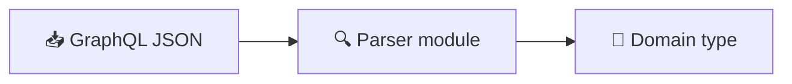

# 🔍 GraphQL Parsers

Parsers that transform raw GraphQL JSON responses into domain types.

## 📂 Files

| File | Input Operation | Output Type |
|------|----------------|-------------|
| `search.rs` | 🔍 `StaysSearch` | `SearchResult` |
| `detail.rs` | 📋 `StaysPdpSections` | `ListingDetail` |
| `review.rs` | ⭐ `StaysPdpReviewsQuery` | `ReviewsPage` |
| `host.rs` | 👤 `StaysPdpSections` | `HostProfile` |
| `pdp.rs` | 🧩 shared `StaysPdpSections` helpers | — |

## 🏛️ Design

```mermaid
flowchart LR
    JSON["📥 GraphQL JSON"] --> Parser["🔍 Parser module"]
    Parser --> Domain["💎 Domain type"]
```

Each parser module exposes pure functions:

- 🔍 `search::build_search_variables(params)` → `Result<Value>` (`StaysSearch` variables; rejects an unsupported `property_type`)
- 🔍 `search::parse_search_page(json, base_url, request_cursor)` → `SearchResult`. Current `StaySearchResult` items go through `adapters::stay_search::listing_from_stay_search_result` (shared with the HTML scraper); legacy `listing` items are still accepted; the next cursor is the `pageCursors` entry after the requested one.
- 🔍 `search::parse_search_response(json, base_url)` → first-page wrapper (`request_cursor = None`), kept for the fuzz target
- 📋 `detail::parse_detail_response(json, id, base_url)` → `ListingDetail`
- ⭐ `review::build_reviews_variables(listing_id, offset)` → `Value`
- ⭐ `review::parse_reviews_page(json, id, request_offset)` → `ReviewsPage` (next offset = requested offset + items returned, strictly below `reviewsCount`)
- ⭐ `review::parse_reviews_response(json, id)` → first-page wrapper (`request_offset = 0`), kept for the fuzz target
- 👤 `host::parse_host_response(json)` → `HostProfile`

A missing response root returns `AirbnbError::UpstreamSchema`, never an empty success. Parsers are tested against the anonymized captures in `tests/fixtures/airbnb/2026-09/` (`crate::test_helpers::fixture_json`).

## 🎯 Principles

- ✅ Each parser navigates the nested GraphQL response structure
- 🛡️ Graceful handling of missing/null fields with `Option` types
- 📦 No side effects — pure JSON → domain type transformation
- 🔗 Base URL is passed in to construct listing URLs
- 🧩 `detail.rs` and `host.rs` are the single `StaysPdpSections` implementation: the HTML scraper calls them on the payload embedded in the listing page
- ❓ Unknown stays unknown: `price_per_night = 0.0` (`known_price()` → `None`), empty `currency`, `None` fields — never a section heading, a guessed type or `$`/`USD`
- 🏨 Business listings (`pdpType: HOTEL`) have no host section → `AirbnbError::HostProfileUnavailable`
