# 🔍 GraphQL Parsers

Parsers that transform raw GraphQL JSON responses into domain types.

## 📂 Files

| File | Input Operation | Output Type |
|------|----------------|-------------|
| `search.rs` | 🔍 `StaysSearch` | `SearchResult` |
| `detail.rs` | 📋 `StaysPdpSections` | `ListingDetail` |
| `review.rs` | ⭐ `StaysPdpReviewsQuery` | `ReviewsPage` |
| `host.rs` | 👤 `StaysPdpSections` | `HostProfile` |

## 🏛️ Design

```mermaid
flowchart LR
    JSON["📥 GraphQL JSON"] --> Parser["🔍 Parser module"]
    Parser --> Domain["💎 Domain type"]
```

Each parser module exposes a `parse_*_response()` function:

- 🔍 `search::parse_search_response(json, base_url)` → `SearchResult`
- 📋 `detail::parse_detail_response(json, id, base_url)` → `ListingDetail`
- ⭐ `review::parse_reviews_response(json, id)` → `ReviewsPage`
- 👤 `host::parse_host_response(json)` → `HostProfile`

Additionally, `search.rs` exports `build_search_variables()` to construct the GraphQL variables from `SearchParams`.

## 🎯 Principles

- ✅ Each parser navigates the nested GraphQL response structure
- 🛡️ Graceful handling of missing/null fields with `Option` types
- 📦 No side effects — pure JSON → domain type transformation
- 🔗 Base URL is passed in to construct listing URLs
