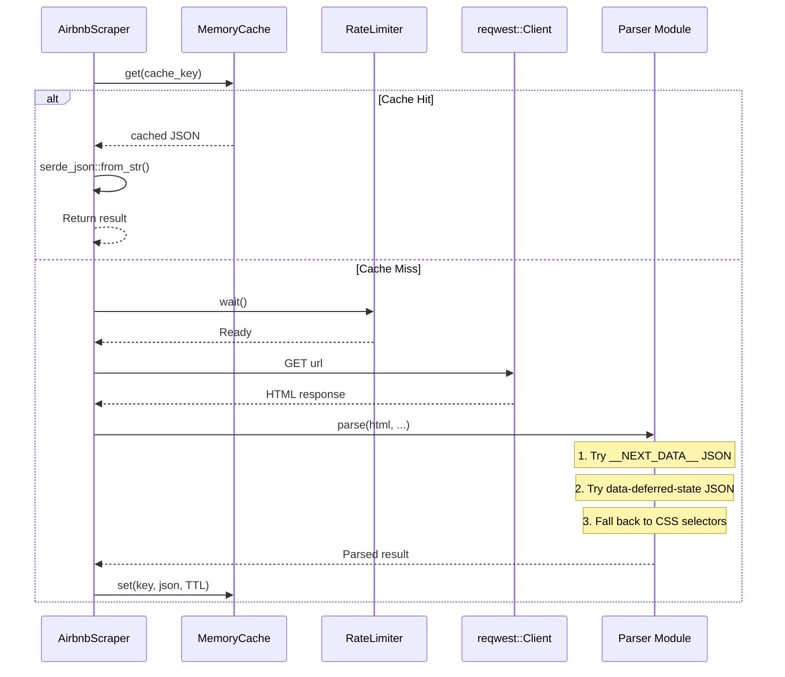

# 🕷️ Web Scraper Adapter

Implements `AirbnbClient` by scraping public Airbnb pages. This is the primary data source for the MCP server — it fetches HTML pages, extracts structured JSON from embedded scripts, and falls back to CSS selectors when needed.

## 📂 Files

| File | Responsibility |
|------|---------------|
| `client.rs` | `AirbnbScraper` struct — HTTP fetching, retry with exponential backoff, cache-aside pattern |
| `search_parser.rs` | Parses search results page → `SearchResult` |
| `detail_parser.rs` | Parses listing detail page → `ListingDetail` |
| `review_parser.rs` | Parses reviews from listing page → `ReviewsPage` |
| `calendar_parser.rs` | Parses price calendar from listing page → `PriceCalendar` |
| `rate_limiter.rs` | Tokio-compatible rate limiter with configurable interval |

## 🔧 `AirbnbScraper`

The main client struct owns:

- **`reqwest::Client`** — HTTP client with cookie jar and custom User-Agent
- **`RateLimiter`** — Throttles requests to respect Airbnb's rate limits
- **`Arc<dyn ListingCache>`** — Shared cache reference for the cache-aside pattern
- **`ScraperConfig` + `CacheConfig`** — Runtime configuration

### Cache-Aside Pattern

Every `AirbnbClient` method follows the same flow:

1. Build cache key (e.g., `detail:{id}`)
2. Check cache — if hit, deserialize and return
3. Rate-limit, then fetch HTML via `fetch_html()`
4. Parse HTML with the appropriate parser
5. Serialize and store in cache with TTL
6. Return the parsed result

### Retry Logic

`fetch_html()` retries on failure with exponential backoff:

- Up to `max_retries` attempts (default: 2)
- Delay: `attempt * 2` seconds between retries
- Re-acquires rate limiter token before each retry
- Returns `RateLimited` error on HTTP 429
- Returns `Parse` error on HTTP 404 (no retry)

## 📊 Parser Architecture

Each parser follows a three-tier strategy to maximize extraction success:

### Parsing Tiers

1. **`__NEXT_DATA__`** — Airbnb embeds a `<script id="__NEXT_DATA__">` tag containing the full page data as JSON. This is the most reliable source.
2. **`data-deferred-state`** — Some pages use `<script>` tags with `data-deferred-state` attributes containing deferred JSON payloads.
3. **CSS Selectors** — Last resort fallback. Extracts data from HTML elements using `itemprop`, `data-testid`, and other attributes.

## ⏱️ Rate Limiter

Token-bucket style limiter (`rate_limiter.rs`):

- Calculates `min_interval` from `rate_limit_per_second` (e.g., 0.5 req/s → 2 second interval)
- Tracks last request time via `Mutex<Option<Instant>>`
- Calls `tokio::time::sleep()` when throttled — fully async-compatible
- Applied before every HTTP request, including retries
