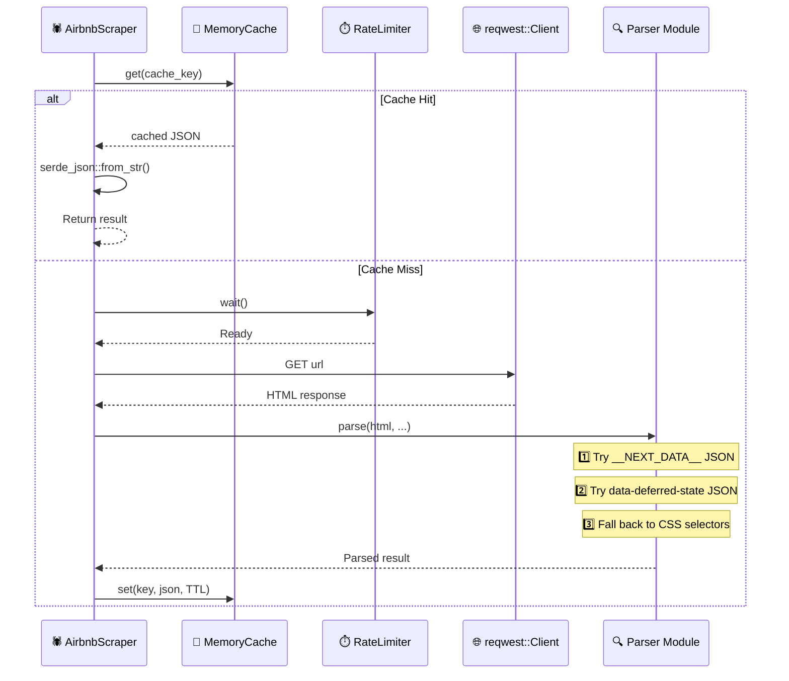

# 🕷️ Web Scraper Adapter

Implements `AirbnbClient` by scraping public Airbnb pages. This adapter serves as the **fallback data source** behind the GraphQL client — it fetches HTML pages, extracts structured JSON from embedded scripts, and falls back to CSS selectors when needed.

## 📂 Files

| File | Responsibility |
|------|---------------|
| `client.rs` | 🏗️ `AirbnbScraper` struct — HTTP fetching, retry with exponential backoff, cache-aside pattern |
| `search_parser.rs` | 🔍 Parses search results page → `SearchResult` |
| `detail_parser.rs` | 📋 Parses listing detail page → `ListingDetail` |
| `review_parser.rs` | ⭐ Parses reviews from listing page → `ReviewsPage` |
| `calendar_parser.rs` | 📅 Parses price calendar from listing page → `PriceCalendar` |
| `deferred_state.rs` | 📦 Reads `__NEXT_DATA__` and the `niobeClientData` / `niobeMinimalClientData` payloads from a page parsed once |
| `page_markers.rs` | 🔖 Tells a genuine listing page from a bot challenge, consent wall or error page served with HTTP 200 |

## 🔧 `AirbnbScraper`

The main client struct owns:

- **`reqwest::Client`** — 🌐 HTTP client with cookie jar and custom User-Agent
- **`Arc<RateLimiter>`** — ⏱️ The process-wide limiter shared with the GraphQL client and the API-key manager
- **`Arc<dyn ListingCache>`** — 💾 Shared cache reference for the cache-aside pattern
- **`Arc<ApiKeyManager>`** — 🔑 Shared API key manager
- **`ScraperConfig` + `CacheConfig`** — ⚙️ Runtime configuration

### 💾 Cache-Aside Pattern

Every `AirbnbClient` method follows the same flow:

1. 🔑 Build cache key (e.g., `detail:{id}`)
2. 🔍 Check cache — if hit, deserialize and return
3. ⏱️ Rate-limit, then fetch HTML via `fetch_html()`
4. 🔧 Parse HTML with the appropriate parser
5. 💾 Serialize and store in cache with TTL
6. ✅ Return the parsed result

### 🔄 Retry Logic

`fetch_html()` delegates to `adapters::http::send_with_policy()`, whose retry loop (`send_with_retries`) the GraphQL client shares:

- ⏱️ Every attempt waits for a slot on the shared `RateLimiter`
- 🔁 5xx, 408, timeouts and connection failures: up to `max_retries` extra attempts, backoff 2 s, 4 s, 8 s … capped at 30 s
- 🚦 429: retried only if `Retry-After` is present and ≤ 60 s; otherwise `RateLimited` is returned at once and every caller pauses (for `Retry-After`, or 30 s)
- 🚫 Other 4xx (400, 401, 403, 404, 410, 422): never retried. A 404 on `/rooms/{id}` becomes `ListingNotFound`; anything else becomes `UpstreamStatus`
- 🧱 Redirects are followed only on the same origin; bodies over 16 MiB are refused

## 📊 Parser Architecture

```mermaid
sequenceDiagram
    participant Client as 🕷️ AirbnbScraper
    participant Cache as 💾 MemoryCache
    participant RL as ⏱️ RateLimiter
    participant HTTP as 🌐 reqwest::Client
    participant Parser as 🔍 Parser Module

    Client->>Cache: get(cache_key)
    alt Cache Hit
        Cache-->>Client: cached JSON
        Client->>Client: serde_json::from_str()
        Client-->>Client: Return result
    else Cache Miss
        Client->>RL: wait()
        RL-->>Client: Ready
        Client->>HTTP: GET url
        HTTP-->>Client: HTML response
        Client->>Parser: parse(html, ...)
        Note over Parser: 1️⃣ Try __NEXT_DATA__ JSON
        Note over Parser: 2️⃣ Try data-deferred-state JSON
        Note over Parser: 3️⃣ Fall back to CSS selectors
        Parser-->>Client: Parsed result
        Client->>Cache: set(key, json, TTL)
    end
```

### 🎯 Parsing Tiers

Each page is parsed into a DOM **once**; every tier reads that document.

1. **`__NEXT_DATA__`** — legacy pages embed the page data in `<script id="__NEXT_DATA__">`.
2. **`data-deferred-state`** — current pages wrap query results in `niobeClientData` or `niobeMinimalClientData` (`[query_key, payload]` pairs). Structured payloads are tried on every entry before any heuristic search. The listing page's `StaysPdpSections` payload is parsed by the GraphQL PDP parsers (`graphql::parsers::{detail, host}`), and search cards by `adapters::stay_search`, so both sources agree.
3. **🎨 CSS Selectors** — last resort; returns an `UpstreamSchema` error when the page has no listing data at all.

## ⏱️ Rate Limiter

The limiter lives in `src/adapters/rate_limiter.rs` and is built once in `application::build_client`. The scraper, the GraphQL client and the API-key manager share it, so `rate_limit_per_second` bounds the total request rate. Slots are reserved under a lock and slept outside it, so concurrent callers are spaced by the interval instead of firing together.
