# 🕷️ Web Scraper Adapter

Implements `AirbnbClient` by scraping public Airbnb pages. This adapter serves as the **fallback data source** behind the GraphQL client — it fetches HTML pages, extracts structured JSON from embedded scripts, and falls back to CSS selectors when needed.

## 📂 Files

| File | Responsibility |
|------|---------------|
| `client.rs` | 🏗️ `AirbnbScraper` struct — HTTP fetching, retry with exponential backoff, cache-aside pattern |
| `search_parser.rs` | 🔍 Parses search results page → `SearchResult` |
| `detail_parser.rs` | 📋 Parses listing detail page → `ListingDetail` |
| `review_parser.rs` | ⭐ Parses reviews from listing page → `ReviewsPage` |
| `calendar_parser.rs` | 📅 Parses price calendar from listing page → `PriceCalendar` |
| `rate_limiter.rs` | ⏱️ Tokio-compatible rate limiter with configurable interval |

## 🔧 `AirbnbScraper`

The main client struct owns:

- **`reqwest::Client`** — 🌐 HTTP client with cookie jar and custom User-Agent
- **`RateLimiter`** — ⏱️ Throttles requests to respect Airbnb's rate limits
- **`Arc<dyn ListingCache>`** — 💾 Shared cache reference for the cache-aside pattern
- **`Arc<ApiKeyManager>`** — 🔑 Shared API key manager
- **`ScraperConfig` + `CacheConfig`** — ⚙️ Runtime configuration

### 💾 Cache-Aside Pattern

Every `AirbnbClient` method follows the same flow:

1. 🔑 Build cache key (e.g., `detail:{id}`)
2. 🔍 Check cache — if hit, deserialize and return
3. ⏱️ Rate-limit, then fetch HTML via `fetch_html()`
4. 🔧 Parse HTML with the appropriate parser
5. 💾 Serialize and store in cache with TTL
6. ✅ Return the parsed result

### 🔄 Retry Logic

`fetch_html()` retries on failure with exponential backoff:

- 🔢 Up to `max_retries` attempts (default: 2)
- ⏳ Delay: `attempt * 2` seconds between retries
- ⏱️ Re-acquires rate limiter token before each retry
- 🚫 Returns `RateLimited` error on HTTP 429 (no retry)
- 🚫 Returns `Parse` error on HTTP 404 (no retry)

## 📊 Parser Architecture

```mermaid
sequenceDiagram
    participant Client as 🕷️ AirbnbScraper
    participant Cache as 💾 MemoryCache
    participant RL as ⏱️ RateLimiter
    participant HTTP as 🌐 reqwest::Client
    participant Parser as 🔍 Parser Module

    Client->>Cache: get(cache_key)
    alt Cache Hit
        Cache-->>Client: cached JSON
        Client->>Client: serde_json::from_str()
        Client-->>Client: Return result
    else Cache Miss
        Client->>RL: wait()
        RL-->>Client: Ready
        Client->>HTTP: GET url
        HTTP-->>Client: HTML response
        Client->>Parser: parse(html, ...)
        Note over Parser: 1️⃣ Try __NEXT_DATA__ JSON
        Note over Parser: 2️⃣ Try data-deferred-state JSON
        Note over Parser: 3️⃣ Fall back to CSS selectors
        Parser-->>Client: Parsed result
        Client->>Cache: set(key, json, TTL)
    end
```

### 🎯 Parsing Tiers

1. **`__NEXT_DATA__`** — Airbnb embeds a `<script id="__NEXT_DATA__">` tag containing the full page data as JSON. This is the most reliable source.
2. **`data-deferred-state`** — Some pages use `<script>` tags with `data-deferred-state` attributes containing deferred JSON payloads.
3. **🎨 CSS Selectors** — Last resort fallback. Extracts data from HTML elements using `itemprop`, `data-testid`, and other attributes.

## ⏱️ Rate Limiter

Token-bucket style limiter (`rate_limiter.rs`):

- 📏 Calculates `min_interval` from `rate_limit_per_second` (e.g., 0.5 req/s → 2 second interval)
- 🔒 Tracks last request time via `Mutex<Option<Instant>>`
- 😴 Calls `tokio::time::sleep()` when throttled — fully async-compatible
- ⏱️ Applied before every HTTP request, including retries
