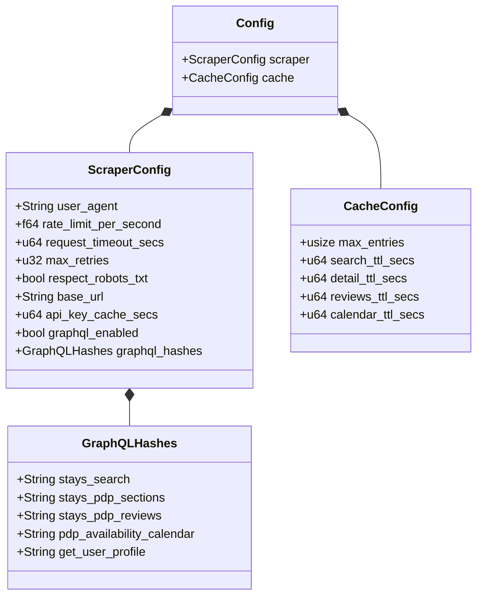

# ⚙️ Configuration

YAML-based configuration loaded at startup from `config.yaml`. All fields have sensible defaults — the config file is optional.

## 📋 Config Structure



Both `ScraperConfig` and `CacheConfig` implement `Default`, so missing sections or fields gracefully fall back to defaults.

## 📝 Example `config.yaml`

```yaml
scraper:
  user_agent: "Mozilla/5.0 (Macintosh; ...) Chrome/120.0.0.0 Safari/537.36"
  rate_limit_per_second: 0.5    # 1 request every 2 seconds
  request_timeout_secs: 30
  max_retries: 2
  respect_robots_txt: true
  base_url: "https://www.airbnb.com"
  graphql_enabled: true          # 🔗 Use GraphQL API as primary source
  api_key_cache_secs: 86400      # 🔑 Cache API key for 24 hours
  graphql_hashes:                # #️⃣ Persisted query hashes
    stays_search: "d4d9503616dc..."
    stays_pdp_sections: "80c7889b4b..."
    stays_pdp_reviews: "dec1c80614..."
    pdp_availability_calendar: "8f08e03c7b..."
    get_user_profile: "a56d8909f2..."

cache:
  max_entries: 500
  search_ttl_secs: 900          # 15 minutes
  detail_ttl_secs: 3600         # 1 hour
  reviews_ttl_secs: 3600        # 1 hour
  calendar_ttl_secs: 1800       # 30 minutes
```

## 🔢 Default Values

### 🕷️ Scraper

| Field | Default | Description |
|-------|---------|-------------|
| `user_agent` | Chrome 120 UA string | 🌐 HTTP `User-Agent` header sent with every request |
| `rate_limit_per_second` | `0.5` | ⏱️ Maximum requests per second (0.5 = 1 request per 2s) |
| `request_timeout_secs` | `30` | ⏳ HTTP request timeout in seconds |
| `max_retries` | `2` | 🔄 Number of retry attempts on failure |
| `respect_robots_txt` | `true` | 🤖 Honor Airbnb's `robots.txt` |
| `base_url` | `https://www.airbnb.com` | 🌍 Airbnb base URL for all requests |
| `graphql_enabled` | `true` | 🔗 Use GraphQL API as primary data source |
| `api_key_cache_secs` | `86400` (24h) | 🔑 TTL for the auto-fetched API key |

### #️⃣ GraphQL Hashes

| Field | Description |
|-------|-------------|
| `stays_search` | 🔍 Hash for `StaysSearch` operation (search listings) |
| `stays_pdp_sections` | 📋 Hash for `StaysPdpSections` (detail + host profile) |
| `stays_pdp_reviews` | ⭐ Hash for `StaysPdpReviewsQuery` (reviews) |
| `pdp_availability_calendar` | 📅 Hash for `PdpAvailabilityCalendar` (pricing) |
| `get_user_profile` | 👤 Hash for `GetUserProfile` (host details) |

> Hashes reference Airbnb's internal **persisted queries**. They may change when Airbnb updates their frontend — update them in `config.yaml` if needed.

### 💾 Cache

| Field | Default | Description |
|-------|---------|-------------|
| `max_entries` | `500` | 📦 Maximum number of entries in the LRU cache |
| `search_ttl_secs` | `900` (15 min) | 🔍 Time-to-live for search results |
| `detail_ttl_secs` | `3600` (1 hour) | 📋 Time-to-live for listing details |
| `reviews_ttl_secs` | `3600` (1 hour) | ⭐ Time-to-live for reviews |
| `calendar_ttl_secs` | `1800` (30 min) | 📅 Time-to-live for price calendars |
| `host_profile_ttl_secs` | `3600` (1 hour) | 👤 Time-to-live for host profiles |

## 🔍 Config Loading

The `load_config()` function in `mod.rs`:

1. 📂 Searches for `config.yaml` in the current working directory
2. 📖 If found, parses it with `serde_yaml`
3. 🔄 If not found or if parsing fails, returns `Config::default()`
4. ✅ Any missing fields use their individual defaults (thanks to `#[serde(default = "...")]`)
