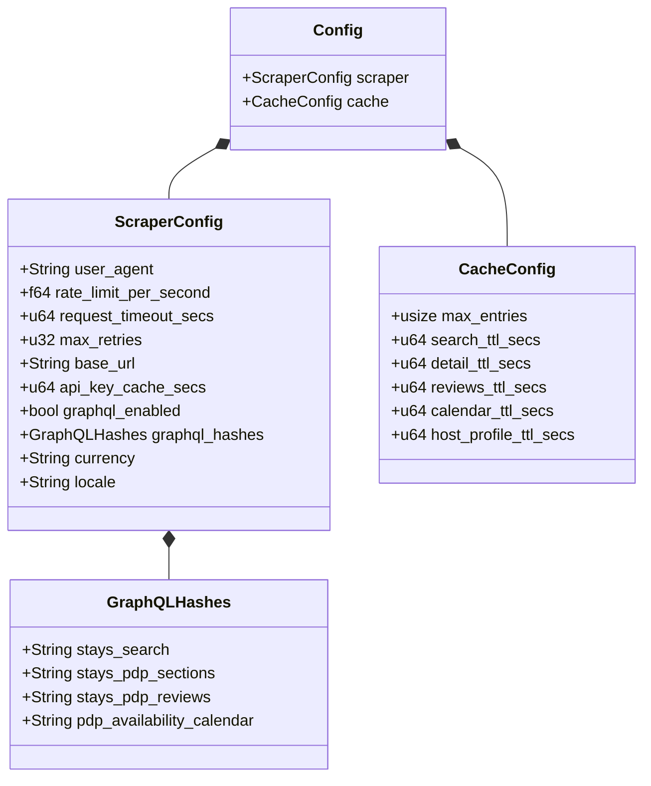

# ⚙️ Configuration

YAML-based configuration loaded at startup from `config.yaml`. All fields have sensible defaults — the config file is optional.

## 📋 Config Structure


```mermaid
classDiagram
    class Config {
        +ScraperConfig scraper
        +CacheConfig cache
    }

    class ScraperConfig {
        +String user_agent
        +f64 rate_limit_per_second
        +u64 request_timeout_secs
        +u32 max_retries
        +String base_url
        +u64 api_key_cache_secs
        +bool graphql_enabled
        +GraphQLHashes graphql_hashes
        +String currency
        +String locale
    }

    class CacheConfig {
        +usize max_entries
        +u64 search_ttl_secs
        +u64 detail_ttl_secs
        +u64 reviews_ttl_secs
        +u64 calendar_ttl_secs
        +u64 host_profile_ttl_secs
    }

    class GraphQLHashes {
        +String stays_search
        +String stays_pdp_sections
        +String stays_pdp_reviews
        +String pdp_availability_calendar
    }

    Config *-- ScraperConfig
    Config *-- CacheConfig
    ScraperConfig *-- GraphQLHashes
```

Both `ScraperConfig` and `CacheConfig` implement `Default`, so missing sections or fields gracefully fall back to defaults. Unknown keys are rejected (`deny_unknown_fields`), so a typo such as `rate_limit_per_sec` stops startup with an error that names the key.

## 📝 Example `config.yaml`

```yaml
scraper:
  user_agent: "Mozilla/5.0 (Macintosh; ...) Chrome/120.0.0.0 Safari/537.36"
  rate_limit_per_second: 0.5    # 1 request every 2 seconds
  request_timeout_secs: 30
  max_retries: 2
  base_url: "https://www.airbnb.com"
  graphql_enabled: true          # 🔗 Use GraphQL API as primary source
  currency: "USD"                # 💱 Pinned on every request (ISO 4217)
  locale: "en"                   # 🌐 Pinned on every request (query + Accept-Language)
  api_key_cache_secs: 86400      # 🔑 Cache API key for 24 hours
  graphql_hashes:                # #️⃣ Persisted query hashes
    stays_search: "0afc7d440ee6..."
    stays_pdp_sections: "80c7889b4b..."
    stays_pdp_reviews: "cfdc3ffbe997..."
    pdp_availability_calendar: "be60714ead0a..."

cache:
  max_entries: 500
  search_ttl_secs: 900          # 15 minutes
  detail_ttl_secs: 3600         # 1 hour
  reviews_ttl_secs: 3600        # 1 hour
  calendar_ttl_secs: 1800       # 30 minutes
  host_profile_ttl_secs: 3600   # 1 hour
```

## 🔢 Default Values

### 🕷️ Scraper

| Field | Default | Description |
|-------|---------|-------------|
| `user_agent` | Chrome 120 UA string | 🌐 HTTP `User-Agent` header sent with every request |
| `rate_limit_per_second` | `0.5` | ⏱️ Requests per second for all outbound requests combined (API-key fetch, GraphQL, HTML): 0.5 = 1 request per 2 s |
| `request_timeout_secs` | `30` | ⏳ HTTP request timeout in seconds |
| `max_retries` | `2` | 🔄 Extra attempts for 5xx/408/timeouts and for 429 with Retry-After ≤ 60 s; other 4xx are never retried |
| `base_url` | `https://www.airbnb.com` | 🌍 Airbnb base URL for all requests |
| `graphql_enabled` | `true` | 🔗 Use GraphQL API as primary data source |
| `api_key_cache_secs` | `86400` (24h) | 🔑 TTL for the auto-fetched API key |
| `currency` | `"USD"` | 💱 ISO 4217 currency sent as `currency=` on every GraphQL and HTML request; amounts printed without a symbol are labelled with it |
| `locale` | `"en"` | 🌐 Sent as `locale=` and `Accept-Language` on every request; the parsers' keywords are English |
| `graphql_hashes` | built-in hashes | #️⃣ Persisted-query hashes, one per operation; see the table below |

### #️⃣ GraphQL Hashes

| Field | Description |
|-------|-------------|
| `stays_search` | 🔍 Hash for `StaysSearch` operation (search listings) |
| `stays_pdp_sections` | 📋 Hash for `StaysPdpSections` (detail + host profile) |
| `stays_pdp_reviews` | ⭐ Hash for `StaysPdpReviewsQuery` (reviews) |
| `pdp_availability_calendar` | 📅 Hash for `PdpAvailabilityCalendar` (pricing) |

> Hashes reference Airbnb's internal **persisted queries** (defaults refreshed 2026-09). When Airbnb rotates one, the affected call fails with `Airbnb API changed for <operation>: … update scraper.graphql_hashes.<key> in config.yaml` and the server falls back to HTML scraping. See [the GraphQL adapter README](../adapters/graphql/README.md#-detecting-api-drift) for how to capture a new hash.

### 💾 Cache

| Field | Default | Description |
|-------|---------|-------------|
| `max_entries` | `500` | 📦 Maximum number of entries in the LRU cache |
| `search_ttl_secs` | `900` (15 min) | 🔍 Time-to-live for search results |
| `detail_ttl_secs` | `3600` (1 hour) | 📋 Time-to-live for listing details |
| `reviews_ttl_secs` | `3600` (1 hour) | ⭐ Time-to-live for reviews |
| `calendar_ttl_secs` | `1800` (30 min) | 📅 Time-to-live for price calendars |
| `host_profile_ttl_secs` | `3600` (1 hour) | 👤 Time-to-live for host profiles |

## 🔍 Config Loading

`application::load_app_config()` resolves the file for both binaries. `config::load_config()` then parses it with `serde-saphyr` (pure-Rust YAML 1.2 parser, no `unsafe`), normalises it (a trailing `/` is removed from `base_url`) and validates it (`Config::validate`).

Lookup order (first match wins):

1. 📌 Explicit path: `airbnb --config <path>` or the `AIRBNB_CONFIG` environment variable. The file **must exist**. A missing file is a startup error, never a silent fallback.
2. 🏠 `$XDG_CONFIG_HOME/mcp-airbnb/config.yaml` (default `~/.config/mcp-airbnb/config.yaml`)
3. 📦 `config.yaml` next to the binary
4. ⚙️ Built-in defaults

The current working directory is **not** searched: an MCP host starts the server in whatever project is open, and that project's `config.yaml` must not configure it. To use a local file, pass it explicitly (`AIRBNB_CONFIG=./config.yaml` or `airbnb -c ./config.yaml`).

Loading fails (the server exits before serving; the CLI prints the error) when the YAML does not parse, when a key is unknown, or when a value is out of range:

| Field | Accepted |
|-------|----------|
| `scraper.rate_limit_per_second` | 0.01 – 10 |
| `scraper.request_timeout_secs` | 1 – 300 |
| `scraper.max_retries` | 0 – 10 |
| `scraper.api_key_cache_secs` | 60 – 2 592 000 (30 days) |
| `scraper.base_url` | an `https://` origin: no path, query, fragment or credentials |
| `scraper.user_agent` | non-empty printable ASCII |
| `scraper.currency` | 3 ASCII letters (ISO 4217 code, e.g. `USD`) |
| `scraper.locale` | 1 – 35 chars: ASCII letters, digits, `-`, `_` (e.g. `en`, `fr-FR`) |
| `cache.max_entries` | 1 – 100 000 |
| `cache.*_ttl_secs` | 0 – 2 592 000 (30 days; 0 disables caching for that kind) |

### Removed keys

`scraper.respect_robots_txt` and `scraper.graphql_hashes.get_user_profile` never had any effect and were removed. They are still accepted so older files load, and each one logs a warning. This server does **not** consult robots.txt.
