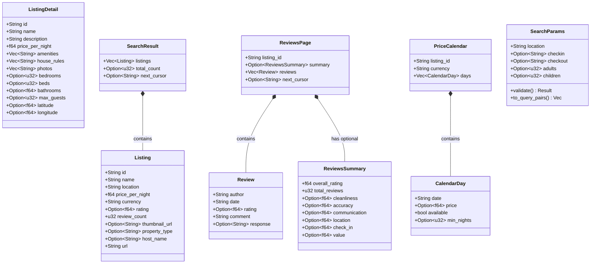

# 💎 Domain Layer

The **domain layer** contains pure data types with no I/O, no network calls, and no external side effects. It is the stable core of the hexagonal architecture — every other layer depends on it, but it depends on nothing.

## 📋 Types

### Listing Types (`listing.rs`)

| Type | Description |
|------|-------------|
| `Listing` | Search result summary — id, name, location, price, currency, rating, review count, URL |
| `ListingDetail` | Full listing — extends Listing with description, amenities, house rules, photos, coordinates, capacity |
| `SearchResult` | Paginated collection of `Listing` with optional total count and next cursor |

### Review Types (`review.rs`)

| Type | Description |
|------|-------------|
| `Review` | Individual review — author, date, optional rating, comment, optional host response |
| `ReviewsSummary` | Aggregate ratings — overall, cleanliness, accuracy, communication, location, check-in, value |
| `ReviewsPage` | Paginated reviews with optional summary and next cursor |

### Calendar Types (`calendar.rs`)

| Type | Description |
|------|-------------|
| `CalendarDay` | Single day — date, optional price, availability flag, optional min nights |
| `PriceCalendar` | Full calendar for a listing — listing ID, currency, collection of days |

### Search Parameters (`search_params.rs`)

| Type | Description |
|------|-------------|
| `SearchParams` | Validated search input — location, dates, guests, price range, property type, cursor |

`SearchParams` contains the only behavior in the domain layer:
- `validate()` — ensures location is non-empty, dates are paired, min_price ≤ max_price
- `to_query_pairs()` — converts parameters to URL query pairs

## 🗂️ Class Diagram

## 📏 Design Rules

- All types derive `Debug`, `Clone`, `Serialize`, `Deserialize`
- `Display` implementations produce human-readable markdown output
- `SearchParams` is the only type with validation behavior
- **No `async`**, no I/O, no network calls — guaranteed by design
- Types are shared across all layers via `crate::domain::*`
