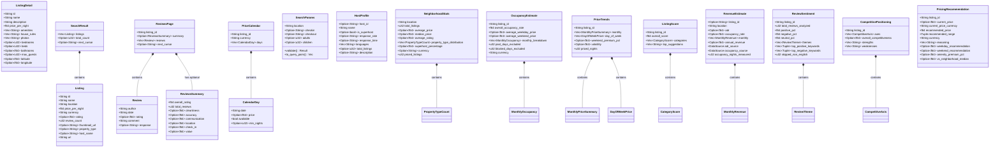

# 💎 Domain Layer

The **domain layer** contains pure data types with no I/O, no network calls, and no external side effects. It is the stable core of the hexagonal architecture — every other layer depends on it, but it depends on nothing.

## 📋 Types

### 🏠 Listing Types (`listing.rs`)

| Type | Description |
|------|-------------|
| `Listing` | Search result summary — id, name, location, nightly price (`price_per_night`; `0.0` means unknown, read it with `known_price()`), currency, rating, review count, URL |
| `ListingDetail` | Full listing — extends Listing with description, amenities, house rules, photos, coordinates, capacity; same `known_price()` rule |
| `SearchResult` | Paginated collection of `Listing` with optional total count and next cursor |

### ⭐ Review Types (`review.rs`)

| Type | Description |
|------|-------------|
| `Review` | Individual review — author, date, optional rating, comment, optional host response |
| `ReviewsSummary` | Aggregate ratings — overall, cleanliness, accuracy, communication, location, check-in, value |
| `ReviewsPage` | Paginated reviews with optional summary and next cursor |

### 📅 Calendar Types (`calendar.rs`)

| Type | Description |
|------|-------------|
| `CalendarDay` | Single day — date, optional price (Airbnb currently publishes none, so usually `None`), availability flag, min/max nights, optional `UnavailabilityReason` (`PastDate` days are excluded from occupancy) |
| `PriceCalendar` | Full calendar for a listing — listing ID, currency, days sorted by date (one per date); `contiguous_runs()` splits them at missing dates |

### 🔍 Search Parameters (`search_params.rs`)

| Type | Description |
|------|-------------|
| `SearchParams` | Validated search input — location, dates, guests, price range, property type, cursor |

Pure behaviour in the domain layer:
- ✅ `SearchParams::validate()` / `validate_at(today)` — location required (at most 200 characters, no control characters, at least one letter or digit); dates paired, exactly `YYYY-MM-DD`, check-in from yesterday (UTC) up to 730 days ahead, checkout after checkin, at most 365 nights; at least one adult when dates are given, guest counts within `limits`; `min_price ≤ max_price`; a supported `property_type`; the cursor is at most 1024 characters. Out-of-range input is an error, never clamped.
- 🔗 `SearchParams::to_query_pairs()` / `cache_key()` — URL query pairs, and a cache key made of every field that changes the response
- 🆔 `listing_id::validate_listing_id()` — digits, no leading zero, at most 20 digits (`LISTING_ID_PATTERN`)
- 📏 `limits` — the shared input limits (months 1-12, review pages 1-20, compare 2-10 ids or 2-100 listings, market 2-5 locations, …) used by the MCP schemas and the CLI
- 💲 `Listing::known_price()` / `ListingDetail::known_price()` — `Some(p)` only for a finite, positive price
- 📅 `PriceCalendar::classify_past_days(today)` — marks days before `today` as `UnavailabilityReason::PastDate`, which occupancy and revenue ignore
- 📊 `analytics::compute_*` — the analytics listed below

### 📊 Analytics Types (`analytics.rs`)

#### 📡 Data Tool Types

| Type | Description |
|------|-------------|
| `HostProfile` | 👤 Host info — name, superhost status, response rate/time, languages, bio, listing count |
| `NeighborhoodStats` | 📊 Area stats — average/median price, rating, property type distribution, superhost % |
| `PropertyTypeCount` | Property type with count and percentage |
| `OccupancyEstimate` | 📈 Occupancy (future nights, upper bound) — overall rate, weekday/weekend avg prices, monthly breakdown |
| `MonthlyOccupancy` | Per-month occupancy rate, days, and average price |

#### 🧠 Analytical Tool Types

| Type | Description |
|------|-------------|
| `ListingComparison` | 🔄 Single listing in a comparison — price/rating percentiles and ranking |
| `ComparisonSummary` | 🔄 Aggregated comparison stats (avg price, avg rating, price range) |
| `CompareListingsResult` | 🔄 Full comparison result with listings, summary, and location |
| `MonthlyPriceSummary` | 📉 Monthly average price with min/max, available days, and occupancy |
| `DayOfWeekPrice` | 📉 Average price by day of week |
| `PriceTrends` | 📉 Seasonal pricing — monthly averages, weekend premium, volatility, peak/off-peak |
| `CalendarGap` | 🕳️ Single 1-3 night gap between unavailable nights, with start/end dates, duration, min-stay check and nightly prices when published |
| `GapFinderResult` | 🕳️ Full gap analysis: gaps, min-stay suggestion, revenue only when nightly prices are published |
| `MonthlyRevenue` | 💵 Projected revenue for a single month |
| `RevenueEstimate` | 💵 Full revenue projection — ADR, occupancy, monthly/annual revenue, neighborhood comparison |
| `CategoryScore` | 🏆 Score for a single category (0-100) with label and suggestions |
| `ListingScore` | 🏆 Full quality audit (0-100) across 6 categories with improvement tips |
| `AmenityGap` | 🧩 Single missing amenity with adoption percentage in neighborhood |
| `AmenityAnalysis` | 🧩 Full amenity comparison — missing, unique, and shared amenities vs competitors |
| `MarketSnapshot` | 🗺️ Stats for a single market in a comparison |
| `MarketComparison` | 🗺️ Side-by-side comparison of 2-5 markets |
| `PortfolioProperty` | 📂 Single property in a host's portfolio |
| `HostPortfolio` | 📂 The host's listings found on one search page of the listing's city, how they were matched, avg rating, price stats in the data currency |
| `ReviewTheme` | 💬 Review theme with mention count, positive/negative counts, sample quotes |
| `ReviewSentiment` | 💬 Full sentiment analysis — positive/negative/neutral percentages, themes, keywords |
| `CompetitiveAxis` | 🎯 Single competitive axis with listing value, neighborhood avg, percentile, assessment |
| `CompetitivePositioning` | 🎯 Percentile ranks vs comparable listings (price, rating, amenities, reviews), overall competitiveness (0-100) over the ranked axes, strengths, weaknesses |
| `PricingRecommendation` | 💲 Optimal pricing — recommended price, range, weekday/weekend split, reasoning, amenity premium |

### 🧮 Compute Functions

Analytics provides **pure compute functions** (no I/O, no async) that transform domain types:

#### 📡 Data Tool Compute

- 📊 `compute_neighborhood_stats(location, listings)` → `NeighborhoodStats`
- 📈 `compute_occupancy_estimate(listing_id, calendar)` → `OccupancyEstimate` (future nights only: past and host-blocked days excluded)

#### 🧠 Analytical Tool Compute

- 🔄 `compute_compare_listings(listings, details)` → `CompareListingsResult`
- 📉 `compute_price_trends(listing_id, calendar)` → `PriceTrends`
- 🕳️ `compute_gap_finder(listing_id, calendar)` → `GapFinderResult`
- 💵 `compute_revenue_estimate(id, location, listing, calendar, neighborhood)` → `Result<RevenueEstimate>`
- 🏆 `compute_listing_score(detail, neighborhood)` → `ListingScore`
- 🧩 `compute_amenity_analysis(detail, neighbors)` → `AmenityAnalysis`
- 🗺️ `compute_market_comparison(stats)` → `MarketComparison`
- 📂 `compute_host_portfolio(anchor, search_location, candidates)` → `HostPortfolio`
- 💬 `compute_review_sentiment(listing_id, reviews)` → `ReviewSentiment`
- 🎯 `compute_competitive_positioning(detail, comparables, occupancy, amenities)` → `CompetitivePositioning`
- 💲 `compute_optimal_pricing(detail, neighborhood, trends, amenities)` → `Result<PricingRecommendation>`

## 🗂️ Class Diagram

```mermaid
classDiagram
    class Listing {
        +String id
        +String name
        +String location
        +f64 price_per_night
        +String currency
        +Option~f64~ rating
        +u32 review_count
        +Option~String~ thumbnail_url
        +Option~String~ property_type
        +Option~String~ host_name
        +String url
    }

    class ListingDetail {
        +String id
        +String name
        +String description
        +f64 price_per_night
        +Vec~String~ amenities
        +Vec~String~ house_rules
        +Vec~String~ photos
        +Option~u32~ bedrooms
        +Option~u32~ beds
        +Option~f64~ bathrooms
        +Option~u32~ max_guests
        +Option~f64~ latitude
        +Option~f64~ longitude
    }

    class SearchResult {
        +Vec~Listing~ listings
        +Option~u32~ total_count
        +Option~String~ next_cursor
    }

    class Review {
        +String author
        +String date
        +Option~f64~ rating
        +String comment
        +Option~String~ response
    }

    class ReviewsSummary {
        +f64 overall_rating
        +u32 total_reviews
        +Option~f64~ cleanliness
        +Option~f64~ accuracy
        +Option~f64~ communication
        +Option~f64~ location
        +Option~f64~ check_in
        +Option~f64~ value
    }

    class ReviewsPage {
        +String listing_id
        +Option~ReviewsSummary~ summary
        +Vec~Review~ reviews
        +Option~String~ next_cursor
    }

    class CalendarDay {
        +String date
        +Option~f64~ price
        +bool available
        +Option~u32~ min_nights
    }

    class PriceCalendar {
        +String listing_id
        +String currency
        +Vec~CalendarDay~ days
    }

    class SearchParams {
        +String location
        +Option~String~ checkin
        +Option~String~ checkout
        +Option~u32~ adults
        +Option~u32~ children
        +validate() Result
        +to_query_pairs() Vec
    }

    class HostProfile {
        +Option~String~ host_id
        +String name
        +Option~bool~ is_superhost
        +Option~String~ response_rate
        +Option~String~ response_time
        +Vec~String~ languages
        +Option~u32~ total_listings
        +Option~String~ description
    }

    class NeighborhoodStats {
        +String location
        +u32 total_listings
        +Option~f64~ average_price
        +Option~f64~ median_price
        +Option~f64~ average_rating
        +Vec~PropertyTypeCount~ property_type_distribution
        +Option~f64~ superhost_percentage
        +Option~String~ currency
        +u32 priced_listings
    }

    class OccupancyEstimate {
        +String listing_id
        +f64 overall_occupancy_rate
        +Option~f64~ average_weekday_price
        +Option~f64~ average_weekend_price
        +Vec~MonthlyOccupancy~ monthly_breakdown
        +u32 past_days_excluded
        +u32 blocked_days_excluded
        +String currency
    }

    class PriceTrends {
        +String listing_id
        +Vec~MonthlyPriceSummary~ monthly
        +Vec~DayOfWeekPrice~ day_of_week
        +Option~f64~ weekend_premium_pct
        +Option~f64~ volatility
        +u32 priced_nights
    }

    class ListingScore {
        +String listing_id
        +f64 overall_score
        +Vec~CategoryScore~ categories
        +Vec~String~ top_suggestions
    }

    class RevenueEstimate {
        +Option~String~ listing_id
        +String location
        +Option~f64~ adr
        +Option~f64~ occupancy_rate
        +Vec~MonthlyRevenue~ monthly
        +Option~f64~ annual_revenue
        +DataSource adr_source
        +DataSource occupancy_source
        +u32 occupancy_nights_measured
    }

    class ReviewSentiment {
        +String listing_id
        +u32 total_reviews_analyzed
        +f64 positive_pct
        +f64 negative_pct
        +f64 neutral_pct
        +Vec~ReviewTheme~ themes
        +Vec~Tuple~ top_positive_keywords
        +Vec~Tuple~ top_negative_keywords
        +u32 skipped_non_english
    }

    class CompetitivePositioning {
        +String listing_id
        +Vec~CompetitiveAxis~ axes
        +Option~f64~ overall_competitiveness
        +Vec~String~ strengths
        +Vec~String~ weaknesses
    }

    class PricingRecommendation {
        +String listing_id
        +Option~f64~ current_price
        +String current_price_currency
        +f64 recommended_price
        +Tuple recommended_range
        +String currency
        +Vec~String~ reasoning
        +Option~f64~ weekday_recommendation
        +Option~f64~ weekend_recommendation
        +Option~f64~ amenity_premium_pct
        +Option~f64~ vs_neighborhood_median
    }

    SearchResult *-- Listing : contains
    ReviewsPage *-- Review : contains
    ReviewsPage *-- ReviewsSummary : has optional
    PriceCalendar *-- CalendarDay : contains
    NeighborhoodStats *-- PropertyTypeCount : contains
    OccupancyEstimate *-- MonthlyOccupancy : contains
    PriceTrends *-- MonthlyPriceSummary : contains
    PriceTrends *-- DayOfWeekPrice : contains
    ListingScore *-- CategoryScore : contains
    RevenueEstimate *-- MonthlyRevenue : contains
    ReviewSentiment *-- ReviewTheme : contains
    CompetitivePositioning *-- CompetitiveAxis : contains
```

## 📏 Design Rules

- ✅ All types derive `Debug`, `Clone`, `Serialize`, `Deserialize`
- 📝 `Display` implementations produce human-readable markdown output
- 🔍 `SearchParams` is the only type with validation behavior
- 🧮 `analytics.rs` contains 13 pure compute functions — no async, no I/O
- 🚫 **No `async`**, no I/O, no network calls — guaranteed by design
- 🔗 Types are shared across all layers via `crate::domain::*`
