# 💎 Domain Layer

The **domain layer** contains pure data types with no I/O, no network calls, and no external side effects. It is the stable core of the hexagonal architecture — every other layer depends on it, but it depends on nothing.

## 📋 Types

### 🏠 Listing Types (`listing.rs`)

| Type | Description |
|------|-------------|
| `Listing` | Search result summary — id, name, location, price, currency, rating, review count, URL |
| `ListingDetail` | Full listing — extends Listing with description, amenities, house rules, photos, coordinates, capacity |
| `SearchResult` | Paginated collection of `Listing` with optional total count and next cursor |

### ⭐ Review Types (`review.rs`)

| Type | Description |
|------|-------------|
| `Review` | Individual review — author, date, optional rating, comment, optional host response |
| `ReviewsSummary` | Aggregate ratings — overall, cleanliness, accuracy, communication, location, check-in, value |
| `ReviewsPage` | Paginated reviews with optional summary and next cursor |

### 📅 Calendar Types (`calendar.rs`)

| Type | Description |
|------|-------------|
| `CalendarDay` | Single day — date, optional price, availability flag, optional min nights |
| `PriceCalendar` | Full calendar for a listing — listing ID, currency, collection of days |

### 🔍 Search Parameters (`search_params.rs`)

| Type | Description |
|------|-------------|
| `SearchParams` | Validated search input — location, dates, guests, price range, property type, cursor |

`SearchParams` contains the only behavior in the domain layer:
- ✅ `validate()` — ensures location is non-empty, dates are paired, min_price ≤ max_price
- 🔗 `to_query_pairs()` — converts parameters to URL query pairs

### 📊 Analytics Types (`analytics.rs`)

| Type | Description |
|------|-------------|
| `HostProfile` | 👤 Host info — name, superhost status, response rate/time, languages, bio, listing count |
| `NeighborhoodStats` | 📊 Area stats — average/median price, rating, property type distribution, superhost % |
| `PropertyTypeCount` | Property type with count and percentage |
| `OccupancyEstimate` | 📈 Occupancy — overall rate, weekday/weekend avg prices, monthly breakdown |
| `MonthlyOccupancy` | Per-month occupancy rate, days, and average price |

Analytics also provides **compute functions** (pure logic, no I/O):
- 📊 `compute_neighborhood_stats(listings, location)` → `NeighborhoodStats`
- 📈 `compute_occupancy_estimate(calendar)` → `OccupancyEstimate`

## 🗂️ Class Diagram

```mermaid
classDiagram
    class Listing {
        +String id
        +String name
        +String location
        +f64 price_per_night
        +String currency
        +Option~f64~ rating
        +u32 review_count
        +Option~String~ thumbnail_url
        +Option~String~ property_type
        +Option~String~ host_name
        +String url
    }

    class ListingDetail {
        +String id
        +String name
        +String description
        +f64 price_per_night
        +Vec~String~ amenities
        +Vec~String~ house_rules
        +Vec~String~ photos
        +Option~u32~ bedrooms
        +Option~u32~ beds
        +Option~f64~ bathrooms
        +Option~u32~ max_guests
        +Option~f64~ latitude
        +Option~f64~ longitude
    }

    class SearchResult {
        +Vec~Listing~ listings
        +Option~u32~ total_count
        +Option~String~ next_cursor
    }

    class Review {
        +String author
        +String date
        +Option~f64~ rating
        +String comment
        +Option~String~ response
    }

    class ReviewsSummary {
        +f64 overall_rating
        +u32 total_reviews
        +Option~f64~ cleanliness
        +Option~f64~ accuracy
        +Option~f64~ communication
        +Option~f64~ location
        +Option~f64~ check_in
        +Option~f64~ value
    }

    class ReviewsPage {
        +String listing_id
        +Option~ReviewsSummary~ summary
        +Vec~Review~ reviews
        +Option~String~ next_cursor
    }

    class CalendarDay {
        +String date
        +Option~f64~ price
        +bool available
        +Option~u32~ min_nights
    }

    class PriceCalendar {
        +String listing_id
        +String currency
        +Vec~CalendarDay~ days
    }

    class SearchParams {
        +String location
        +Option~String~ checkin
        +Option~String~ checkout
        +Option~u32~ adults
        +Option~u32~ children
        +validate() Result
        +to_query_pairs() Vec
    }

    class HostProfile {
        +Option~String~ host_id
        +String name
        +Option~bool~ is_superhost
        +Option~String~ response_rate
        +Option~String~ response_time
        +Vec~String~ languages
        +Option~u32~ total_listings
        +Option~String~ description
    }

    class NeighborhoodStats {
        +String location
        +u32 total_listings
        +Option~f64~ average_price
        +Option~f64~ median_price
        +Option~f64~ average_rating
        +Vec~PropertyTypeCount~ property_type_distribution
        +Option~f64~ superhost_percentage
    }

    class OccupancyEstimate {
        +String listing_id
        +f64 overall_occupancy_rate
        +Option~f64~ average_weekday_price
        +Option~f64~ average_weekend_price
        +Vec~MonthlyOccupancy~ monthly_breakdown
    }

    SearchResult *-- Listing : contains
    ReviewsPage *-- Review : contains
    ReviewsPage *-- ReviewsSummary : has optional
    PriceCalendar *-- CalendarDay : contains
    NeighborhoodStats *-- PropertyTypeCount : contains
    OccupancyEstimate *-- MonthlyOccupancy : contains
```

## 📏 Design Rules

- ✅ All types derive `Debug`, `Clone`, `Serialize`, `Deserialize`
- 📝 `Display` implementations produce human-readable markdown output
- 🔍 `SearchParams` is the only type with validation behavior
- 🧮 `analytics.rs` contains pure compute functions (`compute_neighborhood_stats`, `compute_occupancy_estimate`)
- 🚫 **No `async`**, no I/O, no network calls — guaranteed by design
- 🔗 Types are shared across all layers via `crate::domain::*`
