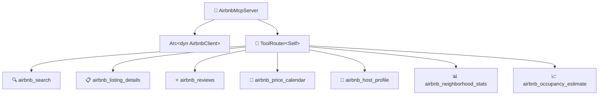

# 📡 MCP Protocol Layer

The **MCP layer** exposes domain capabilities as [Model Context Protocol](https://modelcontextprotocol.io/) tools over stdio using the `rmcp` 0.16 SDK. It is a thin interface layer — all business logic lives in the adapters and domain.

## 🛠️ Server

### `AirbnbMcpServer`

The main server struct, defined in `server.rs`. It uses rmcp macros:

- **`#[tool_router]`** on the `impl` block — registers all 7 tool methods
- **`#[tool(...)]`** on each method — defines tool name, description, and annotations
- **`#[tool_handler]`** on the `ServerHandler` impl — provides server info and capabilities

The server holds an `Arc<dyn AirbnbClient>`, allowing dependency injection of any `AirbnbClient` implementation.

## 🔧 Tool Parameter Types

| Struct | Tool | Key Fields |
|--------|------|------------|
| `SearchToolParams` | 🔍 `airbnb_search` | `location`, `checkin`, `checkout`, `adults`, `children`, `infants`, `pets`, `min_price`, `max_price`, `property_type`, `cursor` |
| `DetailToolParams` | 📋 `airbnb_listing_details` | `id` |
| `ReviewsToolParams` | ⭐ `airbnb_reviews` | `id`, `cursor` |
| `CalendarToolParams` | 📅 `airbnb_price_calendar` | `id`, `months` |
| `HostProfileToolParams` | 👤 `airbnb_host_profile` | `id` |
| `NeighborhoodStatsToolParams` | 📊 `airbnb_neighborhood_stats` | `location`, `checkin`, `checkout`, `property_type` |
| `OccupancyEstimateToolParams` | 📈 `airbnb_occupancy_estimate` | `id`, `months` |

All parameter types derive `Debug`, `Deserialize`, and `JsonSchema` (for MCP schema generation via `schemars`).

## 📋 Tools

| Tool | Description | Annotations |
|------|-------------|-------------|
| 🔍 `airbnb_search` | Search listings by location, dates, and guest count | `read_only_hint = true, open_world_hint = true` |
| 📋 `airbnb_listing_details` | Get full details for a specific listing | `read_only_hint = true, open_world_hint = true` |
| ⭐ `airbnb_reviews` | Get paginated reviews with ratings summary | `read_only_hint = true, open_world_hint = true` |
| 📅 `airbnb_price_calendar` | Get price and availability calendar (1–12 months) | `read_only_hint = true, open_world_hint = true` |
| 👤 `airbnb_host_profile` | Get host profile (superhost, response rate, languages, bio) | `read_only_hint = true, open_world_hint = true` |
| 📊 `airbnb_neighborhood_stats` | Get aggregated area stats (prices, ratings, property types) | `read_only_hint = true, open_world_hint = true` |
| 📈 `airbnb_occupancy_estimate` | Estimate occupancy rate, weekday/weekend prices | `read_only_hint = true, open_world_hint = true` |

All tools return `CallToolResult::success` with formatted text content on success, or `CallToolResult::error` on failure (errors are tool-level, not protocol-level).

## 🔌 Protocol Details

- 📡 **Transport**: stdio (`stdin`/`stdout`)
- 🔄 **Protocol**: JSON-RPC (MCP specification)
- 📝 **Logging**: All tracing output goes to `stderr` — `stdout` is strictly reserved for MCP JSON-RPC messages
- 🔧 **Capabilities**: Tools only (no resources, no prompts)
- 🏷️ **Version**: `ProtocolVersion::LATEST`

## 📝 Response Format

Each tool formats its output as human-readable markdown-like text:

| Tool | Format |
|------|--------|
| 🔍 **Search** | Numbered list with name, ID, location, price, rating, URL |
| 📋 **Detail** | Heading with name, followed by fields, description, amenities, house rules |
| ⭐ **Reviews** | Summary ratings, followed by individual reviews with author, date, rating, comment |
| 📅 **Calendar** | Tabular format with date, price, availability, and minimum nights columns |
| 👤 **Host** | Profile card with name, superhost badge, response rate, languages, bio |
| 📊 **Neighborhood** | Area stats with average/median prices, rating, property type distribution |
| 📈 **Occupancy** | Overall rate, weekday vs weekend prices, monthly breakdown table |
