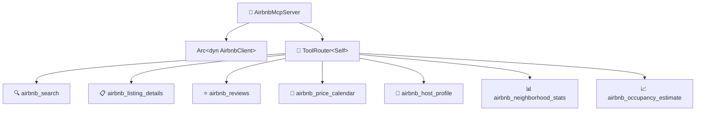

# 📡 MCP Protocol Layer

The **MCP layer** exposes domain capabilities as [Model Context Protocol](https://modelcontextprotocol.io/) tools over stdio using the `rmcp` 0.16 SDK. It is a thin interface layer — all business logic lives in the adapters and domain.

## 🛠️ Server

### `AirbnbMcpServer`

The main server struct, defined in `server.rs`. It uses rmcp macros:

- **`#[tool_router]`** on the `impl` block — registers all 7 tool methods
- **`#[tool(...)]`** on each method — defines tool name, description, and annotations
- **`#[tool_handler]`** on the `ServerHandler` impl — provides server info and capabilities

The server holds an `Arc<dyn AirbnbClient>`, allowing dependency injection of any `AirbnbClient` implementation.



## 🤖 AI-Facing Documentation

The server sends structured metadata to AI assistants during the MCP handshake. This is what makes AI understand what this server can do:

### 📋 Instructions (sent once per session)

The `instructions` field provides workflow guidance and tool relationships:

```
Airbnb MCP server for searching and analyzing short-term rental listings.

## Workflow
Start with airbnb_search to find listings by location. Each result includes a listing ID
you can use with other tools:
- airbnb_listing_details: full description, amenities, house rules, photos, capacity
- airbnb_reviews: guest ratings and comments (paginated via cursor)
- airbnb_price_calendar: daily prices and availability for 1-12 months
- airbnb_host_profile: host bio, superhost status, response rate, languages
- airbnb_occupancy_estimate: occupancy rate, weekday vs weekend pricing, monthly breakdown

For market analysis without a specific listing, use airbnb_neighborhood_stats with a location
to get average/median prices, ratings distribution, and property type breakdown.

## Tips
- Combine airbnb_price_calendar + airbnb_neighborhood_stats to evaluate if a listing is
  competitively priced.
- Use airbnb_search with property_type filter to compare similar listings.
- All prices shown are what the traveler sees on Airbnb (before service fees).
- Pagination: pass the cursor from a previous response to get the next page.
```

### 🔧 Tool Descriptions (guide AI tool selection)

Each description explains **what** the tool does and **when** to use it:

| Tool | AI-Facing Description |
|------|----------------------|
| 🔍 `airbnb_search` | Search Airbnb listings by location, dates, and guest count. Returns a list of available listings with prices, ratings, and links. **Use this as the starting point** to discover listings and get their IDs for other tools. |
| 📋 `airbnb_listing_details` | Get detailed information about a specific Airbnb listing including description, amenities, house rules, photos, and host info. **Requires a listing ID** from airbnb_search. |
| ⭐ `airbnb_reviews` | Get reviews for an Airbnb listing including ratings summary, individual reviews with comments, and pagination support. **Requires a listing ID.** Use cursor from previous response to load more reviews. |
| 📅 `airbnb_price_calendar` | Get price and availability calendar showing daily prices, availability status, and minimum night requirements. **Useful for analyzing seasonal pricing** and finding available dates. |
| 👤 `airbnb_host_profile` | Get detailed host profile including superhost status, response rate, languages, bio, and listing count. **Requires a listing ID** to identify the host. |
| 📊 `airbnb_neighborhood_stats` | Get aggregated statistics for a neighborhood: average/median prices, ratings, property type distribution, and superhost percentage. **Use for market analysis** — does not require a listing ID, only a location. |
| 📈 `airbnb_occupancy_estimate` | Estimate occupancy rate, average prices (weekday vs weekend), and monthly breakdown based on calendar data. **Useful for hosts** evaluating rental income potential. |

### ❌ Actionable Error Messages

Error messages guide AI self-correction:

| Tool | Error Pattern |
|------|--------------|
| 🔍 Search | `"Search failed: {error}. Try broadening your search criteria or check the location spelling."` |
| 📋 Detail | `"Failed for ID '{id}': {error}. Verify the listing ID — use airbnb_search to find valid IDs."` |
| ⭐ Reviews | `"Failed for listing '{id}': {error}. The listing may have no reviews yet."` |
| 📅 Calendar | `"Failed for listing '{id}': {error}. The listing may be unlisted or the calendar unavailable."` |
| 👤 Host | `"Failed for listing '{id}': {error}. Try airbnb_listing_details instead for basic host info."` |
| 📊 Neighborhood | `"Failed for '{location}': {error}. Try a broader location name or check spelling."` |
| 📈 Occupancy | `"Failed for listing '{id}': {error}. This requires calendar data — verify the listing ID."` |

## 🔧 Tool Parameter Types

| Struct | Tool | Key Fields |
|--------|------|------------|
| `SearchToolParams` | 🔍 `airbnb_search` | `location`, `checkin`, `checkout`, `adults`, `children`, `infants`, `pets`, `min_price`, `max_price`, `property_type`, `cursor` |
| `DetailToolParams` | 📋 `airbnb_listing_details` | `id` |
| `ReviewsToolParams` | ⭐ `airbnb_reviews` | `id`, `cursor` |
| `CalendarToolParams` | 📅 `airbnb_price_calendar` | `id`, `months` |
| `HostProfileToolParams` | 👤 `airbnb_host_profile` | `id` |
| `NeighborhoodStatsToolParams` | 📊 `airbnb_neighborhood_stats` | `location`, `checkin`, `checkout`, `property_type` |
| `OccupancyEstimateToolParams` | 📈 `airbnb_occupancy_estimate` | `id`, `months` |

All parameter types derive `Debug`, `Deserialize`, and `JsonSchema` (for MCP schema generation via `schemars`). The `///` doc comments on each field become JSON Schema descriptions that AI assistants see.

## 🔌 Protocol Details

- 📡 **Transport**: stdio (`stdin`/`stdout`)
- 🔄 **Protocol**: JSON-RPC (MCP specification)
- 📝 **Logging**: All tracing output goes to `stderr` — `stdout` is strictly reserved for MCP JSON-RPC messages
- 🔧 **Capabilities**: Tools only (no resources, no prompts)
- 🏷️ **Version**: `ProtocolVersion::LATEST`
- 🔒 **Annotations**: All tools marked `read_only_hint = true, open_world_hint = true`

## 📝 Response Format

Each tool formats its output as human-readable markdown-like text:

| Tool | Format |
|------|--------|
| 🔍 **Search** | Numbered list with name, ID, location, price, rating, URL |
| 📋 **Detail** | Heading with name, followed by fields, description, amenities, house rules |
| ⭐ **Reviews** | Summary ratings, followed by individual reviews with author, date, rating, comment |
| 📅 **Calendar** | Tabular format with date, price, availability, and minimum nights columns |
| 👤 **Host** | Profile card with name, superhost badge, response rate, languages, bio |
| 📊 **Neighborhood** | Area stats with average/median prices, rating, property type distribution |
| 📈 **Occupancy** | Overall rate, weekday vs weekend prices, monthly breakdown table |
