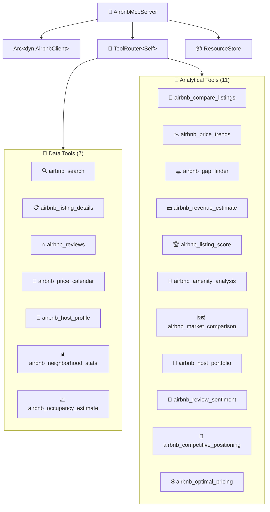

# 📡 MCP Protocol Layer

The **MCP layer** exposes domain capabilities as [Model Context Protocol](https://modelcontextprotocol.io/) tools over stdio using the `rmcp` 1.4 SDK. It is a thin interface layer — all business logic lives in the adapters and domain.

## 🛠️ Server

### `AirbnbMcpServer`

The main server struct, defined in `server.rs`. It uses rmcp macros:

- **`#[tool_router]`** on the `impl` block — registers all 18 tool methods
- **`#[tool(...)]`** on each method — defines tool name, description, and annotations
- **`#[tool_handler]`** on the `ServerHandler` impl — provides server info and capabilities

The server holds an `Arc<dyn AirbnbClient>`, allowing dependency injection of any `AirbnbClient` implementation.


```mermaid
flowchart TD
    Server["📡 AirbnbMcpServer"]
    Server --> Client["Arc&lt;dyn AirbnbClient&gt;"]
    Server --> Router["🔧 ToolRouter&lt;Self&gt;"]
    Server --> Resources["📦 ResourceStore"]

    subgraph Data["📡 Data Tools (7)"]
        S["🔍 airbnb_search"]
        D["📋 airbnb_listing_details"]
        R["⭐ airbnb_reviews"]
        C["📅 airbnb_price_calendar"]
        H["👤 airbnb_host_profile"]
        N["📊 airbnb_neighborhood_stats"]
        O["📈 airbnb_occupancy_estimate"]
    end

    subgraph Analytical["🧠 Analytical Tools (11)"]
        CMP["🔄 airbnb_compare_listings"]
        PT["📉 airbnb_price_trends"]
        GF["🕳️ airbnb_gap_finder"]
        RE["💵 airbnb_revenue_estimate"]
        LS["🏆 airbnb_listing_score"]
        AA["🧩 airbnb_amenity_analysis"]
        MC["🗺️ airbnb_market_comparison"]
        HP["📂 airbnb_host_portfolio"]
        RS["💬 airbnb_review_sentiment"]
        CP["🎯 airbnb_competitive_positioning"]
        OP["💲 airbnb_optimal_pricing"]
    end

    Router --> Data
    Router --> Analytical
```

## 🤖 AI-Facing Documentation

The server sends structured metadata to AI assistants during the MCP handshake. This is what makes AI understand what this server can do:

### 📋 Instructions (sent once per session)

The `instructions` field provides workflow guidance and tool relationships:

```
Airbnb MCP server for searching and analyzing short-term rental listings.

## Data Tools
Start with airbnb_search to find listings by location. Each result includes a listing ID
you can use with other tools:
- airbnb_listing_details: full description, amenities, house rules, photos, capacity
- airbnb_reviews: guest ratings and comments (paginated via cursor)
- airbnb_price_calendar: daily prices and availability for 1-12 months
- airbnb_host_profile: host bio, superhost status, response rate, languages
- airbnb_occupancy_estimate: occupancy rate, weekday vs weekend pricing, monthly breakdown
- airbnb_neighborhood_stats: area-level avg/median prices, ratings, property types

## Analytical Tools
- airbnb_compare_listings: compare 2-100+ listings side-by-side with percentile rankings
- airbnb_price_trends: seasonal pricing analysis (peak/off-peak, weekend premium, volatility)
- airbnb_gap_finder: detect orphan nights and booking gaps with lost revenue estimate
- airbnb_revenue_estimate: project ADR, occupancy, monthly/annual revenue
- airbnb_listing_score: quality audit (0-100) with improvement suggestions
- airbnb_amenity_analysis: missing popular amenities vs neighborhood competition
- airbnb_market_comparison: compare 2-5 neighborhoods side-by-side
- airbnb_host_portfolio: analyze a host's full property portfolio
- airbnb_review_sentiment: keyword-based sentiment analysis of guest reviews
- airbnb_competitive_positioning: 5-axis competitive score vs neighborhood
- airbnb_optimal_pricing: data-driven pricing recommendation with reasoning

## Resources
Data fetched by tools is cached as MCP resources. Use resource URIs to reference previously fetched data without re-scraping.

## Tips
- Use airbnb_compare_listings with a location to analyze an entire market (up to 100 listings).
- Use airbnb_listing_score + airbnb_amenity_analysis for a complete listing audit.
- Use airbnb_revenue_estimate to evaluate investment potential.
- Pagination: pass the cursor from a previous response to get the next page.
```

### 🔧 Tool Descriptions (guide AI tool selection)

Each description explains **what** the tool does and **when** to use it:

#### 📡 Data Tools

| Tool | AI-Facing Description |
|------|----------------------|
| 🔍 `airbnb_search` | Search Airbnb listings by location, dates, and guest count. Returns a list of available listings with prices, ratings, and links. **Use this as the starting point** to discover listings and get their IDs for other tools. |
| 📋 `airbnb_listing_details` | Get detailed information about a specific Airbnb listing including description, amenities, house rules, photos, and host info. **Requires a listing ID** from airbnb_search. |
| ⭐ `airbnb_reviews` | Get reviews for an Airbnb listing including ratings summary, individual reviews with comments, and pagination support. **Requires a listing ID.** Use cursor from previous response to load more reviews. |
| 📅 `airbnb_price_calendar` | Get price and availability calendar showing daily prices, availability status, and minimum night requirements. **Useful for analyzing seasonal pricing** and finding available dates. |
| 👤 `airbnb_host_profile` | Get detailed host profile including superhost status, response rate, languages, bio, and listing count. **Requires a listing ID** to identify the host. |
| 📊 `airbnb_neighborhood_stats` | Get aggregated statistics for a neighborhood: average/median prices, ratings, property type distribution, and superhost percentage. **Use for market analysis** — does not require a listing ID, only a location. |
| 📈 `airbnb_occupancy_estimate` | Estimate occupancy rate, average prices (weekday vs weekend), and monthly breakdown based on calendar data. **Useful for hosts** evaluating rental income potential. |

#### 🧠 Analytical Tools

| Tool | AI-Facing Description |
|------|----------------------|
| 🔄 `airbnb_compare_listings` | Compare 2-100+ Airbnb listings side-by-side with price percentiles, ratings, and market summary. Provide listing IDs for detailed comparison (2-10), OR a location for market-scale comparison (up to 100 listings). |
| 📉 `airbnb_price_trends` | Analyze seasonal price trends: monthly averages, weekend vs weekday premiums, price volatility, peak/off-peak months, and day-of-week breakdown. Based on calendar data. |
| 🕳️ `airbnb_gap_finder` | Detect booking gaps and orphan nights (1-3 night gaps between reservations). Shows potential lost revenue and suggests minimum stay adjustments. Essential for occupancy optimization. |
| 💵 `airbnb_revenue_estimate` | Estimate projected revenue: ADR, occupancy rate, monthly and annual revenue projections, and comparison vs neighborhood average. Provide a listing ID or just a location. |
| 🏆 `airbnb_listing_score` | Score a listing's quality (0-100) across 6 categories: photos, description, amenities, reviews, host profile, and pricing vs market. Provides actionable improvement suggestions. |
| 🧩 `airbnb_amenity_analysis` | Compare a listing's amenities against neighborhood competition. Identifies missing popular amenities and highlights unique ones. Helps optimize listings to match or beat competitors. |
| 🗺️ `airbnb_market_comparison` | Compare 2-5 Airbnb markets side-by-side: average/median prices, ratings, superhost percentage, and dominant property types. Ideal for deciding where to invest or list a property. |
| 📂 `airbnb_host_portfolio` | Analyze a host's full portfolio: all their properties, average rating, pricing strategy, total reviews, and geographic distribution. Useful for competitive intelligence. |
| 💬 `airbnb_review_sentiment` | Analyze guest review sentiment: positive/negative/neutral breakdown, recurring themes (cleanliness, location, communication, amenities, value), and top keywords. Helps identify strengths and weaknesses from guest feedback. |
| 🎯 `airbnb_competitive_positioning` | Evaluate a listing's competitive position across 5 axes: price value, rating, amenity count, review volume, and occupancy. Returns percentile rankings, overall competitiveness score (0-100), strengths, and weaknesses vs the neighborhood. |
| 💲 `airbnb_optimal_pricing` | Suggest optimal pricing based on neighborhood comparables, seasonal trends, rating premium, and amenity analysis. Returns recommended price, range, weekday/weekend split, and detailed reasoning. |

### ❌ Actionable Error Messages

Error messages guide AI self-correction:

#### 📡 Data Tools

| Tool | Error Pattern |
|------|--------------|
| 🔍 Search | `"Search failed: {error}. Try broadening your search criteria or check the location spelling."` |
| 📋 Detail | `"Failed for ID '{id}': {error}. Verify the listing ID — use airbnb_search to find valid IDs."` |
| ⭐ Reviews | `"Failed for listing '{id}': {error}. The listing may have no reviews yet."` |
| 📅 Calendar | `"Failed for listing '{id}': {error}. The listing may be unlisted or the calendar unavailable."` |
| 👤 Host | `"Failed for listing '{id}': {error}. Try airbnb_listing_details instead for basic host info."` |
| 📊 Neighborhood | `"Failed for '{location}': {error}. Try a broader location name or check spelling."` |
| 📈 Occupancy | `"Failed for listing '{id}': {error}. This requires calendar data — verify the listing ID."` |

#### 🧠 Analytical Tools

| Tool | Error Pattern |
|------|--------------|
| 🔄 Compare | `"Provide either ids or location"` / `"Need at least 2 listings to compare."` |
| 📉 Price Trends | `"Failed to get price data for listing '{id}': {error}"` |
| 🕳️ Gap Finder | `"Failed to get calendar for listing '{id}': {error}"` |
| 💵 Revenue | `"Provide either id or location for revenue estimation."` |
| 🏆 Score | `"Failed to get listing '{id}': {error}"` |
| 🧩 Amenity | `"Failed to get listing '{id}': {error}"` |
| 🗺️ Market | `"Provide at least 2 locations to compare."` / `"Failed to get stats for '{location}': {error}"` |
| 📂 Portfolio | `"Failed to get listing '{id}': {error}"` |
| 💬 Sentiment | `"Failed to get reviews for listing '{id}': {error}"` |
| 🎯 Positioning | `"Failed to get listing '{id}': {error}"` / `"Failed to get neighborhood stats for '{location}': {error}"` |
| 💲 Pricing | `"Failed to get listing '{id}': {error}"` |

## 🔧 Tool Parameter Types

### 📡 Data Tools

| Struct | Tool | Key Fields |
|--------|------|------------|
| `SearchToolParams` | 🔍 `airbnb_search` | `location`, `checkin`, `checkout`, `adults`, `children`, `infants`, `pets`, `min_price`, `max_price`, `property_type`, `cursor` |
| `DetailToolParams` | 📋 `airbnb_listing_details` | `id` |
| `ReviewsToolParams` | ⭐ `airbnb_reviews` | `id`, `cursor` |
| `CalendarToolParams` | 📅 `airbnb_price_calendar` | `id`, `months` |
| `HostProfileToolParams` | 👤 `airbnb_host_profile` | `id` |
| `NeighborhoodStatsToolParams` | 📊 `airbnb_neighborhood_stats` | `location`, `checkin`, `checkout`, `property_type` |
| `OccupancyEstimateToolParams` | 📈 `airbnb_occupancy_estimate` | `id`, `months` |

### 🧠 Analytical Tools

| Struct | Tool | Key Fields |
|--------|------|------------|
| `CompareListingsToolParams` | 🔄 `airbnb_compare_listings` | `ids`, `location`, `max_listings`, `checkin`, `checkout`, `property_type` |
| `PriceTrendsToolParams` | 📉 `airbnb_price_trends` | `id`, `months` |
| `GapFinderToolParams` | 🕳️ `airbnb_gap_finder` | `id`, `months` |
| `RevenueEstimateToolParams` | 💵 `airbnb_revenue_estimate` | `id`, `location`, `months` |
| `ListingScoreToolParams` | 🏆 `airbnb_listing_score` | `id` |
| `AmenityAnalysisToolParams` | 🧩 `airbnb_amenity_analysis` | `id`, `location` |
| `MarketComparisonToolParams` | 🗺️ `airbnb_market_comparison` | `locations`, `checkin`, `checkout`, `property_type` |
| `HostPortfolioToolParams` | 📂 `airbnb_host_portfolio` | `id` |
| `ReviewSentimentToolParams` | 💬 `airbnb_review_sentiment` | `id`, `max_pages` |
| `CompetitivePositioningToolParams` | 🎯 `airbnb_competitive_positioning` | `id`, `location` |
| `OptimalPricingToolParams` | 💲 `airbnb_optimal_pricing` | `id`, `location` |

All parameter types derive `Debug`, `Deserialize`, and `JsonSchema` (for MCP schema generation via `schemars`). The `///` doc comments on each field become JSON Schema descriptions that AI assistants see.

## 📦 MCP Resources

The server exposes 18 resource templates. Data fetched by tools is automatically cached in a thread-safe `ResourceStore` and served as MCP resources.

#### 📡 Data Resources

| Resource | URI Pattern | Source Tool |
|----------|------------|-------------|
| Listing Details | `airbnb://listing/{id}` | `airbnb_listing_details` |
| Price Calendar | `airbnb://listing/{id}/calendar` | `airbnb_price_calendar` |
| Reviews | `airbnb://listing/{id}/reviews` | `airbnb_reviews` |
| Host Profile | `airbnb://listing/{id}/host` | `airbnb_host_profile` |
| Occupancy Estimate | `airbnb://listing/{id}/occupancy` | `airbnb_occupancy_estimate` |
| Search Results | `airbnb://search/{location}` | `airbnb_search` |
| Neighborhood Stats | `airbnb://neighborhood/{location}` | `airbnb_neighborhood_stats` |

#### 🧠 Analytical Resources

| Resource | URI Pattern | Source Tool |
|----------|------------|-------------|
| Comparison | `airbnb://analysis/compare/{key}` | `airbnb_compare_listings` |
| Price Trends | `airbnb://analysis/price-trends/{id}` | `airbnb_price_trends` |
| Booking Gaps | `airbnb://analysis/gaps/{id}` | `airbnb_gap_finder` |
| Revenue Estimate | `airbnb://analysis/revenue/{key}` | `airbnb_revenue_estimate` |
| Listing Score | `airbnb://analysis/score/{id}` | `airbnb_listing_score` |
| Amenity Analysis | `airbnb://analysis/amenities/{id}` | `airbnb_amenity_analysis` |
| Market Comparison | `airbnb://analysis/market/{key}` | `airbnb_market_comparison` |
| Host Portfolio | `airbnb://analysis/portfolio/{id}` | `airbnb_host_portfolio` |
| Review Sentiment | `airbnb://analysis/sentiment/{id}` | `airbnb_review_sentiment` |
| Competitive Positioning | `airbnb://analysis/positioning/{id}` | `airbnb_competitive_positioning` |
| Optimal Pricing | `airbnb://analysis/pricing/{id}` | `airbnb_optimal_pricing` |

## 🔌 Protocol Details

- 📡 **Transport**: stdio (`stdin`/`stdout`)
- 🔄 **Protocol**: JSON-RPC (MCP specification)
- 📝 **Logging**: All tracing output goes to `stderr` — `stdout` is strictly reserved for MCP JSON-RPC messages
- 🔧 **Capabilities**: Tools (18) + Resources (18 templates)
- 🏷️ **Version**: `ProtocolVersion::LATEST`
- 🔒 **Annotations**: All tools marked `read_only_hint = true, open_world_hint = true`

## 📝 Response Format

Each tool formats its output as human-readable markdown-like text:

### 📡 Data Tools

| Tool | Format |
|------|--------|
| 🔍 **Search** | Numbered list with name, ID, location, price, rating, URL |
| 📋 **Detail** | Heading with name, followed by fields, description, amenities, house rules |
| ⭐ **Reviews** | Summary ratings, followed by individual reviews with author, date, rating, comment |
| 📅 **Calendar** | Tabular format with date, price, availability, and minimum nights columns |
| 👤 **Host** | Profile card with name, superhost badge, response rate, languages, bio |
| 📊 **Neighborhood** | Area stats with average/median prices, rating, property type distribution |
| 📈 **Occupancy** | Overall rate, weekday vs weekend prices, monthly breakdown table |

### 🧠 Analytical Tools

| Tool | Format |
|------|--------|
| 🔄 **Compare** | Ranking table with price/rating percentiles and market summary |
| 📉 **Price Trends** | Monthly averages, weekend/weekday breakdown, volatility metrics |
| 🕳️ **Gap Finder** | List of gaps with dates, duration, and lost revenue estimate |
| 💵 **Revenue** | ADR, occupancy rate, monthly projections, neighborhood comparison |
| 🏆 **Score** | Overall score (0-100), category breakdowns, improvement suggestions |
| 🧩 **Amenity** | Missing/unique amenities vs neighborhood, adoption percentages |
| 🗺️ **Market** | Side-by-side neighborhood stats with price/rating/superhost comparisons |
| 📂 **Portfolio** | Host overview, property list, rating/pricing strategy summary |
| 💬 **Sentiment** | Positive/negative/neutral breakdown, themes, top keywords |
| 🎯 **Positioning** | 5-axis radar with percentiles, overall score, strengths/weaknesses |
| 💲 **Pricing** | Recommended price, range, weekday/weekend split, reasoning factors |
