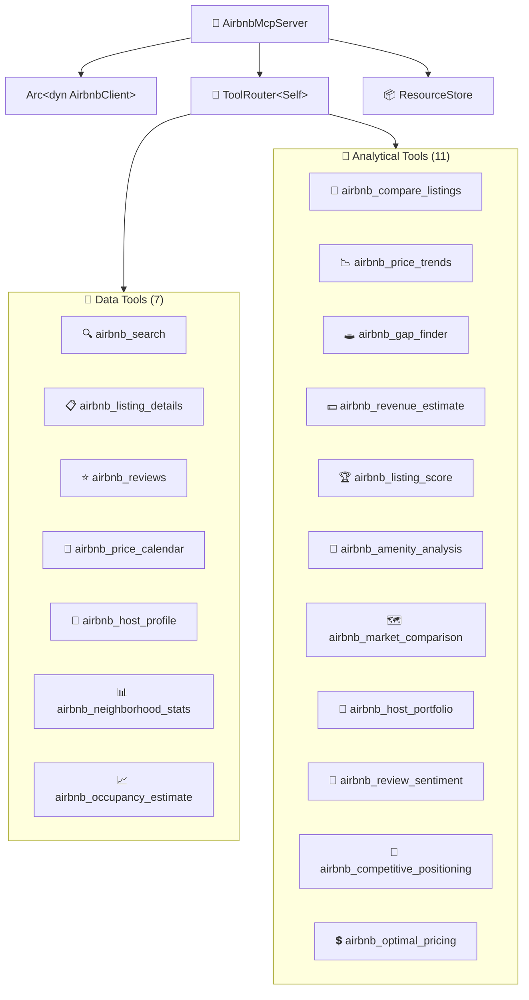

# 📡 MCP Protocol Layer

The **MCP layer** exposes domain capabilities as [Model Context Protocol](https://modelcontextprotocol.io/) tools over stdio using the `rmcp` 1.4 SDK. It is a thin interface layer: handlers check their input (`check_input!`, limits from `src/domain/limits.rs`), call `AirbnbClient` (data tools) or `application::analytical_handlers` (analytical tools, the same functions as the CLI), and end with `finish`, which fences scraped text, stores the resource and announces new URIs.

## 🛠️ Server

### `AirbnbMcpServer`

The main server struct, defined in `server.rs`. It uses rmcp macros:

- **`#[tool_router]`** on the `impl` block — registers all 18 tool methods
- **`#[tool(...)]`** on each method — defines tool name, description, and annotations
- **`#[tool_handler]`** on the `ServerHandler` impl — provides server info and capabilities

The server holds an `Arc<dyn AirbnbClient>`, allowing dependency injection of any `AirbnbClient` implementation.

```mermaid
flowchart TD
    Server["📡 AirbnbMcpServer"]
    Server --> Client["Arc&lt;dyn AirbnbClient&gt;"]
    Server --> Router["🔧 ToolRouter&lt;Self&gt;"]
    Server --> Resources["📦 ResourceStore"]

    subgraph Data["📡 Data Tools (7)"]
        S["🔍 airbnb_search"]
        D["📋 airbnb_listing_details"]
        R["⭐ airbnb_reviews"]
        C["📅 airbnb_price_calendar"]
        H["👤 airbnb_host_profile"]
        N["📊 airbnb_neighborhood_stats"]
        O["📈 airbnb_occupancy_estimate"]
    end

    subgraph Analytical["🧠 Analytical Tools (11)"]
        CMP["🔄 airbnb_compare_listings"]
        PT["📉 airbnb_price_trends"]
        GF["🕳️ airbnb_gap_finder"]
        RE["💵 airbnb_revenue_estimate"]
        LS["🏆 airbnb_listing_score"]
        AA["🧩 airbnb_amenity_analysis"]
        MC["🗺️ airbnb_market_comparison"]
        HP["📂 airbnb_host_portfolio"]
        RS["💬 airbnb_review_sentiment"]
        CP["🎯 airbnb_competitive_positioning"]
        OP["💲 airbnb_optimal_pricing"]
    end

    Router --> Data
    Router --> Analytical
```

## 🤖 AI-Facing Documentation

What an AI assistant sees comes from three places in `server.rs`. They are the single source of truth; this README does not copy them, so it cannot drift from them:

- **Instructions** — the `instructions` string set in `ServerHandler::get_info`, sent once per session: the workflow (start with `airbnb_search`), what each tool is for, resources, the untrusted-content rule, tips.
- **Tool descriptions** — the `description` of each `#[tool(...)]` attribute: what the tool does and when to use it.
- **Parameter schemas** — the `///` doc comments and `#[schemars(...)]` ranges on the `*ToolParams` structs become each tool's JSON Schema, with the limits of `src/domain/limits.rs`.

### ❌ Errors

Every failure is a tool result with `isError: true`, and nothing is stored for it. Invalid input is rejected before any request (`check_input!`): the message names the field and the accepted range, and nothing is clamped. Upstream failures name the listing id or location and suggest the next step (for example "use airbnb_search to find valid IDs"). Upstream format drift reads `Airbnb API changed for <operation>: …`. No tool returns made-up numbers on failure.

### 🛡️ Untrusted content

Every successful result, and the resource stored with it, wraps the scraped text between `<<<BEGIN UNTRUSTED AIRBNB DATA>>>` and `<<<END UNTRUSTED AIRBNB DATA>>>` (`finish` → `fence_untrusted`). Listing names, descriptions, reviews and host bios are written by third parties; the instructions tell the model to read them as data, never as instructions.

### 🔧 Tools

| Tool | Kind | Purpose |
|------|------|---------|
| 🔍 `airbnb_search` | data | Find listings by location, dates, guests; the entry point for listing ids |
| 📋 `airbnb_listing_details` | data | Description, amenities, house rules, photos, host summary |
| ⭐ `airbnb_reviews` | data | Paginated reviews + rating summary |
| 📅 `airbnb_price_calendar` | data | Availability and minimum stays for 1-12 months |
| 👤 `airbnb_host_profile` | data | Host profile |
| 📊 `airbnb_neighborhood_stats` | data | Area prices, ratings, property types |
| 📈 `airbnb_occupancy_estimate` | data | Occupancy from availability (past dates excluded) |
| 🔄 `airbnb_compare_listings` | analytical | Side-by-side comparison with percentiles |
| 📉 `airbnb_price_trends` | analytical | Seasonal pricing |
| 🕳️ `airbnb_gap_finder` | analytical | Orphan nights and gaps |
| 💵 `airbnb_revenue_estimate` | analytical | ADR, occupancy and revenue projection |
| 🏆 `airbnb_listing_score` | analytical | Quality audit 0-100 |
| 🧩 `airbnb_amenity_analysis` | analytical | Missing and unique amenities vs neighbours |
| 🗺️ `airbnb_market_comparison` | analytical | 2-5 markets side by side |
| 📂 `airbnb_host_portfolio` | analytical | The host's other listings |
| 💬 `airbnb_review_sentiment` | analytical | Keyword sentiment and themes |
| 🎯 `airbnb_competitive_positioning` | analytical | Percentile ranks vs comparable listings (price, rating, amenities, reviews) |
| 💲 `airbnb_optimal_pricing` | analytical | Price recommendation with reasoning |

## 🔧 Tool Parameter Types

### 📡 Data Tools

| Struct | Tool | Key Fields |
|--------|------|------------|
| `SearchToolParams` | 🔍 `airbnb_search` | `location`, `checkin`, `checkout`, `adults`, `children`, `infants`, `pets`, `min_price`, `max_price`, `property_type`, `cursor` |
| `DetailToolParams` | 📋 `airbnb_listing_details` | `id` |
| `ReviewsToolParams` | ⭐ `airbnb_reviews` | `id`, `cursor` |
| `CalendarToolParams` | 📅 `airbnb_price_calendar` | `id`, `months` |
| `HostProfileToolParams` | 👤 `airbnb_host_profile` | `id` |
| `NeighborhoodStatsToolParams` | 📊 `airbnb_neighborhood_stats` | `location`, `checkin`, `checkout`, `property_type` |
| `OccupancyEstimateToolParams` | 📈 `airbnb_occupancy_estimate` | `id`, `months` |

### 🧠 Analytical Tools

| Struct | Tool | Key Fields |
|--------|------|------------|
| `CompareListingsToolParams` | 🔄 `airbnb_compare_listings` | `ids`, `location`, `max_listings`, `checkin`, `checkout`, `property_type` |
| `PriceTrendsToolParams` | 📉 `airbnb_price_trends` | `id`, `months` |
| `GapFinderToolParams` | 🕳️ `airbnb_gap_finder` | `id`, `months` |
| `RevenueEstimateToolParams` | 💵 `airbnb_revenue_estimate` | `id`, `location`, `months` |
| `ListingScoreToolParams` | 🏆 `airbnb_listing_score` | `id` |
| `AmenityAnalysisToolParams` | 🧩 `airbnb_amenity_analysis` | `id`, `location` |
| `MarketComparisonToolParams` | 🗺️ `airbnb_market_comparison` | `locations`, `checkin`, `checkout`, `property_type` |
| `HostPortfolioToolParams` | 📂 `airbnb_host_portfolio` | `id` |
| `ReviewSentimentToolParams` | 💬 `airbnb_review_sentiment` | `id`, `max_pages` |
| `CompetitivePositioningToolParams` | 🎯 `airbnb_competitive_positioning` | `id`, `location` |
| `OptimalPricingToolParams` | 💲 `airbnb_optimal_pricing` | `id`, `location`, `months` |

All parameter types derive `Debug`, `Deserialize`, and `JsonSchema` (for MCP schema generation via `schemars`) and carry `#[serde(deny_unknown_fields)]`, so a misspelled argument is refused. Ranges, lengths and the listing-id pattern are declared with `#[schemars(range(..))]` / `#[schemars(length(..))]` / `#[schemars(pattern(..))]` from the constants in `src/domain/limits.rs`. The `///` doc comments on each field become JSON Schema descriptions that AI assistants see.

## 📦 MCP Resources

The store is bounded: 256 entries and 8 MiB in total, one hour per entry, least recently used out first. `resources/list` returns pages of 100 URIs. The server advertises `listChanged` and sends `notifications/resources/list_changed` when a tool call adds a new URI. Contents are `text/plain`.

#### 📡 Data Resources

| Resource | URI Template | Source Tool |
|---|---|---|
| Listing Details | `airbnb://listing/{id}` | `airbnb_listing_details` |
| Price Calendar | `airbnb://listing/{id}/calendar{?months}` | `airbnb_price_calendar` |
| Reviews | `airbnb://listing/{id}/reviews{?cursor}` | `airbnb_reviews` |
| Host Profile | `airbnb://listing/{id}/host` | `airbnb_host_profile` |
| Occupancy Estimate | `airbnb://listing/{id}/occupancy{?months}` | `airbnb_occupancy_estimate` |
| Search Results | `airbnb://search/{location}{?checkin,checkout,adults,children,infants,pets,min_price,max_price,property_type,cursor}` | `airbnb_search` |
| Neighborhood Stats | `airbnb://neighborhood/{location}{?checkin,checkout,property_type}` | `airbnb_neighborhood_stats` |

#### 🧠 Analytical Resources

| Resource | URI Template | Source Tool |
|---|---|---|
| Comparison | `airbnb://analysis/compare{?ids,location,max_listings,checkin,checkout,property_type}` | `airbnb_compare_listings` |
| Price Trends | `airbnb://analysis/price-trends/{id}{?months}` | `airbnb_price_trends` |
| Booking Gaps | `airbnb://analysis/gaps/{id}{?months}` | `airbnb_gap_finder` |
| Revenue Estimate | `airbnb://analysis/revenue{?id,location,months}` | `airbnb_revenue_estimate` |
| Listing Score | `airbnb://analysis/score/{id}` | `airbnb_listing_score` |
| Amenity Analysis | `airbnb://analysis/amenities/{id}{?location}` | `airbnb_amenity_analysis` |
| Market Comparison | `airbnb://analysis/market/{locations}{?checkin,checkout,property_type}` | `airbnb_market_comparison` |
| Host Portfolio | `airbnb://analysis/portfolio/{id}` | `airbnb_host_portfolio` |
| Review Sentiment | `airbnb://analysis/sentiment/{id}{?max_pages}` | `airbnb_review_sentiment` |
| Competitive Positioning | `airbnb://analysis/positioning/{id}{?location}` | `airbnb_competitive_positioning` |
| Optimal Pricing | `airbnb://analysis/pricing/{id}{?location,months}` | `airbnb_optimal_pricing` |

## 🔌 Protocol Details

- 📡 **Transport**: stdio (`stdin`/`stdout`)
- 🔄 **Protocol**: JSON-RPC (MCP specification)
- 📝 **Logging**: All tracing output goes to `stderr` — `stdout` is strictly reserved for MCP JSON-RPC messages
- 🔧 **Capabilities**: Tools (18) + Resources (18 templates, listChanged)
- 🏷️ **Version**: `ProtocolVersion::LATEST`
- 🔒 **Annotations**: All tools marked `read_only_hint = true, open_world_hint = true`

## 📝 Response Format

Each tool formats its output as human-readable markdown-like text:

### 📡 Data Tools

| Tool | Format |
|------|--------|
| 🔍 **Search** | Numbered list with name, ID, location, price, rating, URL |
| 📋 **Detail** | Heading with name, followed by fields, description, amenities, house rules |
| ⭐ **Reviews** | Summary ratings, followed by individual reviews with author, date, rating, comment |
| 📅 **Calendar** | Tabular format with date, price, availability, and minimum nights columns |
| 👤 **Host** | Profile card with name, superhost badge, response rate, languages, bio |
| 📊 **Neighborhood** | Area stats with average/median prices, rating, property type distribution |
| 📈 **Occupancy** | Occupancy rate (an upper bound; past days excluded), weekday vs weekend prices when Airbnb publishes them, monthly breakdown table |

### 🧠 Analytical Tools

| Tool | Format |
|------|--------|
| 🔄 **Compare** | Ranking table with price/rating percentiles and market summary |
| 📉 **Price Trends** | Monthly averages, weekend/weekday breakdown, volatility metrics; when Airbnb publishes no nightly price, a "not published" notice plus availability instead of price figures |
| 🕳️ **Gap Finder** | 1-3 night gaps between unavailable nights, min-stay check, revenue only when nightly prices are published |
| 💵 **Revenue** | ADR, occupancy rate, monthly projections, neighborhood comparison; each input labelled measured or assumed (ADR proxy, occupancy nights measured) |
| 🏆 **Score** | Overall score (0-100), category breakdowns, improvement suggestions |
| 🧩 **Amenity** | Missing/unique amenities vs neighborhood, adoption percentages |
| 🗺️ **Market** | Side-by-side neighborhood stats with price/rating/superhost comparisons |
| 📂 **Portfolio** | Host overview, property list, rating/pricing strategy summary |
| 💬 **Sentiment** | Positive/negative/neutral breakdown, themes, top keywords |
| 🎯 **Positioning** | Percentile ranks per axis (price, rating, amenities, reviews; occupancy shown but not ranked), overall score over the ranked axes, strengths/weaknesses |
| 💲 **Pricing** | Recommended price, range, weekday/weekend split, reasoning factors |
