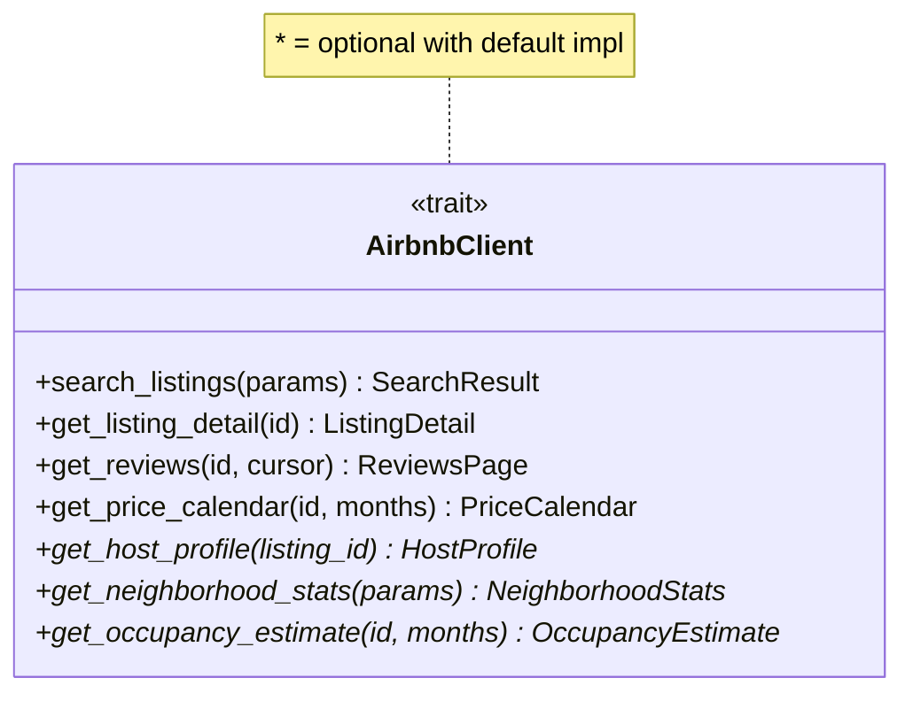
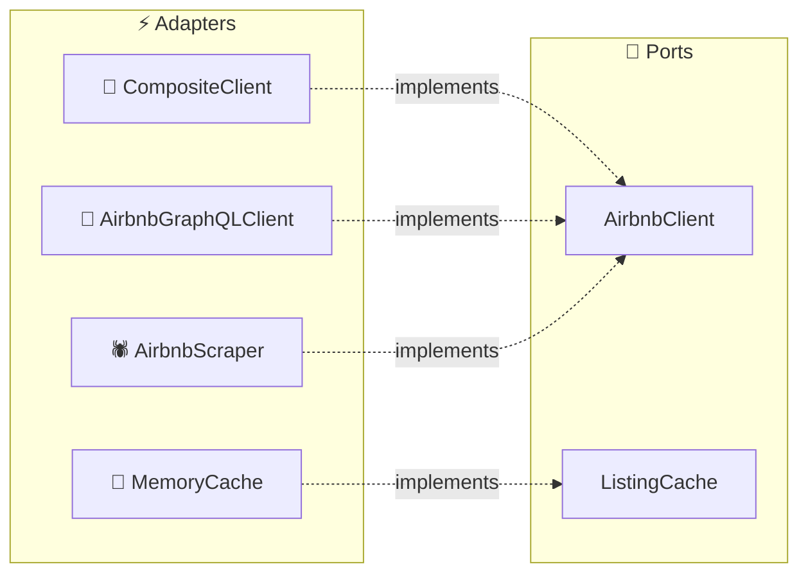

# 🔌 Ports Layer

The **ports layer** defines trait boundaries between the domain core and the outside world. Ports declare **what** the system needs without specifying **how** it's achieved — the adapters provide the concrete implementations.

## 🎯 Traits

### `AirbnbClient` (`airbnb_client.rs`)

The primary outbound port for fetching Airbnb data. Has **4 required methods** and **3 optional methods** with default implementations.

```rust
#[async_trait]
pub trait AirbnbClient: Send + Sync {
    // 🔴 Required — must be implemented by all adapters
    async fn search_listings(&self, params: &SearchParams) -> Result<SearchResult>;
    async fn get_listing_detail(&self, id: &str) -> Result<ListingDetail>;
    async fn get_reviews(&self, id: &str, cursor: Option<&str>) -> Result<ReviewsPage>;
    async fn get_price_calendar(&self, id: &str, months: u32) -> Result<PriceCalendar>;

    // 🟡 Optional — default returns Parse error ("not implemented")
    async fn get_host_profile(&self, listing_id: &str) -> Result<HostProfile>;
    async fn get_neighborhood_stats(&self, params: &SearchParams) -> Result<NeighborhoodStats>;
    async fn get_occupancy_estimate(&self, id: &str, months: u32) -> Result<OccupancyEstimate>;
}
```



### `ListingCache` (`cache.rs`)

Outbound port for caching serialized data with TTL.

```rust
pub trait ListingCache: Send + Sync {
    fn get(&self, key: &str) -> Option<String>;
    fn set(&self, key: &str, value: &str, ttl: Duration);
}
```

## 🔗 Port → Adapter Mapping



| Port | Adapter | Location | Notes |
|------|---------|----------|-------|
| `AirbnbClient` | 🔀 `CompositeClient` | `adapters/composite.rs` | GraphQL + Scraper with auto-fallback |
| `AirbnbClient` | 🔗 `AirbnbGraphQLClient` | `adapters/graphql/client.rs` | Primary — GraphQL API |
| `AirbnbClient` | 🕷️ `AirbnbScraper` | `adapters/scraper/client.rs` | Fallback — HTML scraping |
| `ListingCache` | 💾 `MemoryCache` | `adapters/cache/memory_cache.rs` | LRU with TTL |

## 🎨 Design Principles

- ✅ **Domain types only** — Ports use `SearchResult`, `ListingDetail`, `ReviewsPage`, `PriceCalendar`, `HostProfile`, `NeighborhoodStats`, `OccupancyEstimate` from the domain layer. No adapter-specific types leak through.
- ⚡ **`AirbnbClient` is async** — Uses `async_trait` because fetching data involves network I/O.
- 🔒 **`ListingCache` is synchronous** — Cache operations are fast (in-memory LRU behind `RwLock`), no async overhead needed.
- 🧵 **`Send + Sync` bounds** — Both traits require thread safety for sharing across tokio tasks via `Arc<dyn T>`.
- ❌ **Error type** — Both use `crate::error::Result<T>` (alias for `Result<T, AirbnbError>`).
- 🟡 **Optional methods** — `get_host_profile`, `get_neighborhood_stats`, and `get_occupancy_estimate` have default implementations that return `AirbnbError::Parse` — adapters can override them.
