# 🧪 Tests

Integration and unit tests for the mcp-airbnb server.

## 📂 Files

| File | Scope | Description |
|------|-------|-------------|
| `mcp_server_test.rs` | 📡 MCP layer | Tests all 7 MCP tools via the server interface |
| `scraper_test.rs` | 🕷️ Scraper | Tests HTML parsing and scraping logic |
| `fixtures/` | 📁 Test data | HTML fixtures for parser tests |

## 🏛️ Test Architecture

```mermaid
flowchart TD
    Tests["🧪 Integration Tests"]
    Tests --> MockClient["🎭 MockAirbnbClient<br/>(from test_helpers.rs)"]
    MockClient --> Server["📡 AirbnbMcpServer"]
    Server --> Tools["🔧 Tool methods"]
```



## 🎭 Mock Infrastructure

Tests use `MockAirbnbClient` from `src/test_helpers.rs`, which implements `AirbnbClient` with configurable behavior via closures:

- `.with_search(|params| ...)` — 🔍 Mock search results
- `.with_detail(|id| ...)` — 📋 Mock listing details
- `.with_reviews(|id, cursor| ...)` — ⭐ Mock reviews
- `.with_calendar(|id, months| ...)` — 📅 Mock calendar
- `.with_host_profile(|id| ...)` — 👤 Mock host profiles
- `.with_neighborhood(|params| ...)` — 📊 Mock neighborhood stats
- `.with_occupancy(|id, months| ...)` — 📈 Mock occupancy estimates

## ▶️ Running Tests

```bash
cargo test                     # 🧪 Run all tests
cargo test --test mcp_server   # 📡 MCP tests only
cargo test --test scraper      # 🕷️ Scraper tests only
cargo test -- --nocapture      # 📝 Show output
```
