# 🧪 Tests

Integration and unit tests for the mcp-airbnb server.

## 📂 Files

| File | Scope | Description |
|------|-------|-------------|
| `mcp_server_test.rs` | 📡 MCP layer | Tests MCP server: tool registration, instructions, capabilities |
| `scraper_test.rs` | 🕷️ Scraper | Tests HTML parsing and scraping logic |
| `graphql_test.rs` | 🔗 GraphQL | Tests GraphQL JSON response parsers |
| `analytical_tools_test.rs` | 🧠 Analytics | Tests all 11 analytical tools with mock data |
| `functional_verification_test.rs` | 🔄 End-to-end | Full workflow verification tests |
| `proptest_tests.rs` | 🎲 Property | Property-based tests using proptest |
| `fixtures/` | 📁 Test data | HTML fixtures for parser tests |

## 🏛️ Test Architecture

```mermaid
flowchart TD
    Tests["🧪 Integration Tests"]
    Tests --> MockClient["🎭 MockAirbnbClient<br/>(from test_helpers.rs)"]
    MockClient --> Server["📡 AirbnbMcpServer"]
    Server --> Tools["🔧 18 Tool methods"]
```



> There are also 40+ inline unit tests in `src/mcp/server.rs` that test all 18 tools (7 data + 11 analytical) with mock clients.

## 🎭 Mock Infrastructure

Tests use `MockAirbnbClient` from `src/test_helpers.rs`, which implements `AirbnbClient` with configurable behavior via closures:

- `.with_search(|params| ...)` — 🔍 Mock search results
- `.with_detail(|id| ...)` — 📋 Mock listing details
- `.with_reviews(|id, cursor| ...)` — ⭐ Mock reviews
- `.with_calendar(|id, months| ...)` — 📅 Mock calendar
- `.with_host_profile(|id| ...)` — 👤 Mock host profiles
- `.with_neighborhood(|params| ...)` — 📊 Mock neighborhood stats
- `.with_occupancy(|id, months| ...)` — 📈 Mock occupancy estimates

## 🎲 Fuzzing

8 fuzz targets are available in the `fuzz/` directory, covering both HTML scraper and GraphQL parsers:

| Fuzz Target | Parser |
|-------------|--------|
| `fuzz_search_parser` | 🕷️ HTML search parser |
| `fuzz_detail_parser` | 🕷️ HTML detail parser |
| `fuzz_calendar_parser` | 🕷️ HTML calendar parser |
| `fuzz_review_parser` | 🕷️ HTML review parser |
| `fuzz_graphql_search` | 🔗 GraphQL search parser |
| `fuzz_graphql_detail` | 🔗 GraphQL detail parser |
| `fuzz_graphql_review` | 🔗 GraphQL review parser |
| `fuzz_graphql_host` | 🔗 GraphQL host parser |

## ▶️ Running Tests

```bash
cargo test                     # 🧪 Run all tests
cargo test --test mcp_server   # 📡 MCP tests only
cargo test --test scraper      # 🕷️ Scraper tests only
cargo test --test graphql      # 🔗 GraphQL tests only
cargo test --test analytical   # 🧠 Analytical tests only
cargo test --test proptest     # 🎲 Property-based tests
cargo test -- --nocapture      # 📝 Show output

# Fuzzing (requires nightly)
cargo +nightly fuzz run fuzz_search_parser
```
